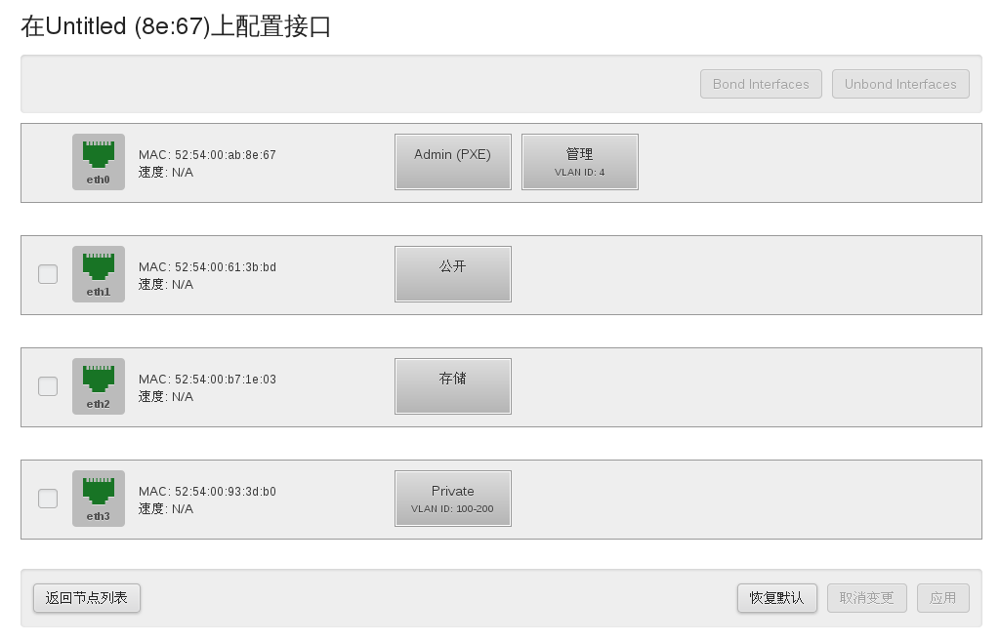
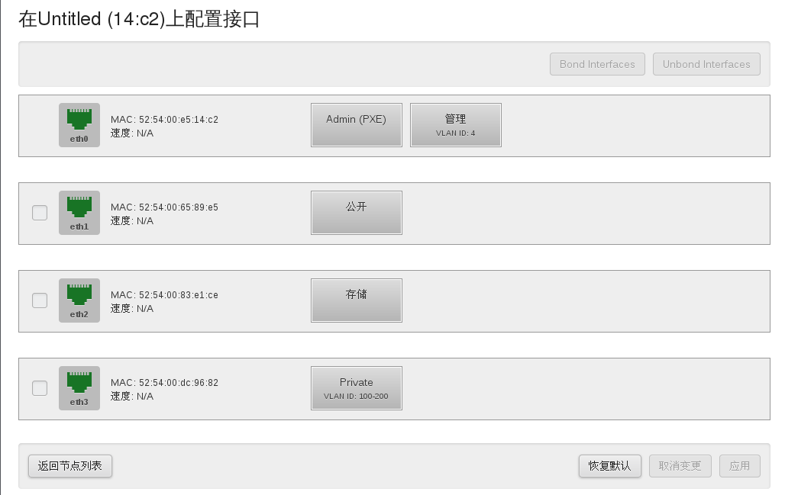
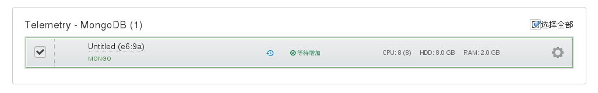

# 配置节点网卡

发现并增加所有节点后，需要配置各节点的网卡角色。

## Controller节点

* 勾选全部**Controller节点**，点击**网络配置**按钮。

  

 > ###### 注意
 > Controller节点需要连接“Admin(PXE)”、“Private”、”管理“、”存储“、”公开“网络。

* 配置网卡角色，如下图所示。

  

## Compute节点

* 勾选全部**Compute节点**，点击**网络配置**按钮。

  
 > ###### 注意
 > Compute节点需要连接“Admin(PXE)”、“Private”、”管理“、”存储“、”公开“网络。

* 配置网卡角色，如下图所示。

  

## Mongo节点

* 勾选全部**Mongo节点**，点击**网络配置**按钮。

  
 > ###### 注意
 > Mongo节点需要连接“Admin(PXE)”、“Private”、”管理“、”存储“、”公开“网络。

* 配置网卡角色，如下图所示。

  

## Ceph-osd节点

* 勾选全部**Ceph-osd节点**，点击**网络配置**按钮。

  
 > ###### 注意
 > Ceph-osd节点需要连接“Admin(PXE)”、“Private”、”管理“、”存储“、”公开“网络。

* 配置网卡角色，如下图所示。

  
