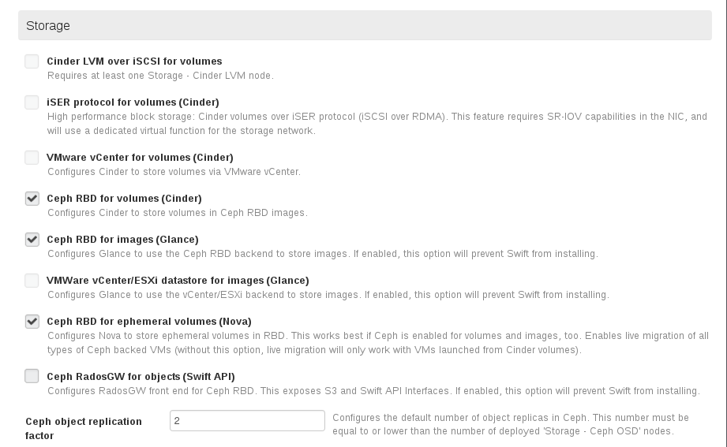
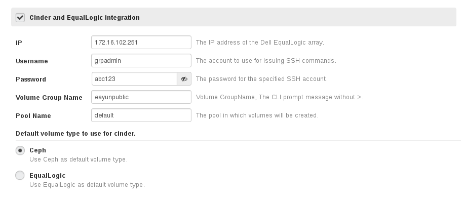

# 基本配置

在**设置**面板，配置新环境基本配置。

## 配置OpenStack帐号

* 设置OpenStack环境管理员帐号/密码，如下图所示。

 

## 配置附加组件

* EayunStack环境需要选中Ceilometer，如下图所示。

 

## 通用配置

* 保存OpenStack各服务的Debug消息，如下图所示。

 

* 使用KVM作为底层Hypervisor，如下图所示。

 

* scheduler driver，使用默认配置，如下图所示。

 

* 添加访问各节点的SSH公钥，可置空，如下图所示。

 

* Disable generic offload on physical nics，如下图所示。

 

## 配置内核参数

* 配置内核参数，如下图所示。

 

## mellanox neutron components

* 使用默认值，如下图所示

 

## 配置日志服务器

* 配置日志服务器，将所有OpenStack节点的日志保存到指定日志服务器中，此处配置的日志服务器必须能够接收外部日志，如下图所示。

 

## 配置VLAN

* 使用默认配置，如下图所示。

 

## 配置公网

* 将指定SSH公钥保存到所有节点，环境部署完成后，可使用公钥对应的SSH私钥访问节点，如下图所示。

 

## 配置存储

* 配置存储，如下图所示。

 

## 配置Eqlx存储

* 配置Eqlx服务器相关参数，如下图所示。

 

## 配置Zabbix

* 配置Zabbix帐号，EayunStack未使用Zabbix，此处保持默认值，如下图所示。

 

## 配置Provision方式

* 配置OpenStack节点操作系统安装方式，使用默认值，如下图所示。

 

## 配置DNS服务器

* 配置OpenStack节点DNS服务器，可指定多个，以“，”分隔，如下图所示。

 

## 配置NTP服务器

* 配置OpenStack节点NTP服务器，可指定多个，以“，”分隔，如下图所示。

 

## 保存设置

