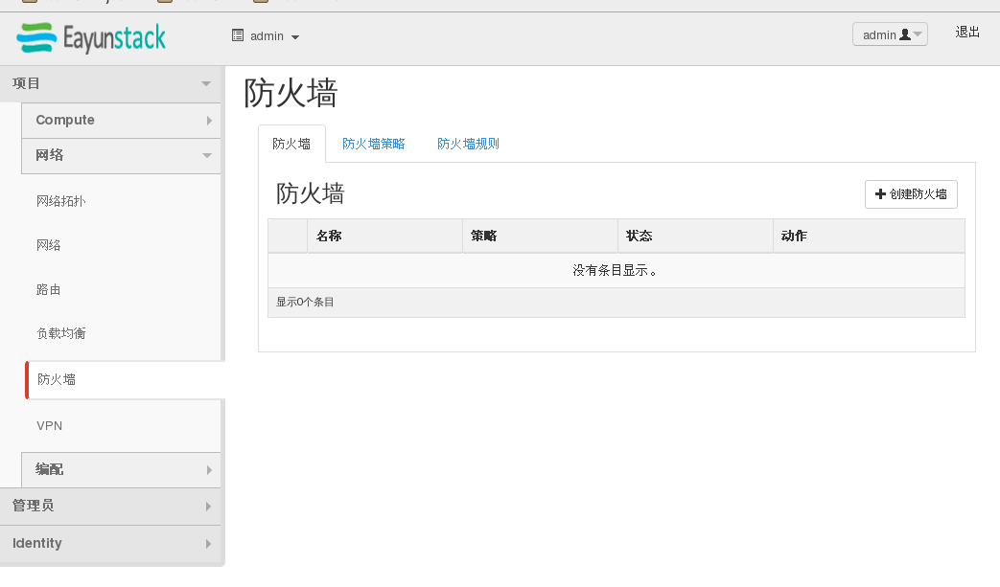
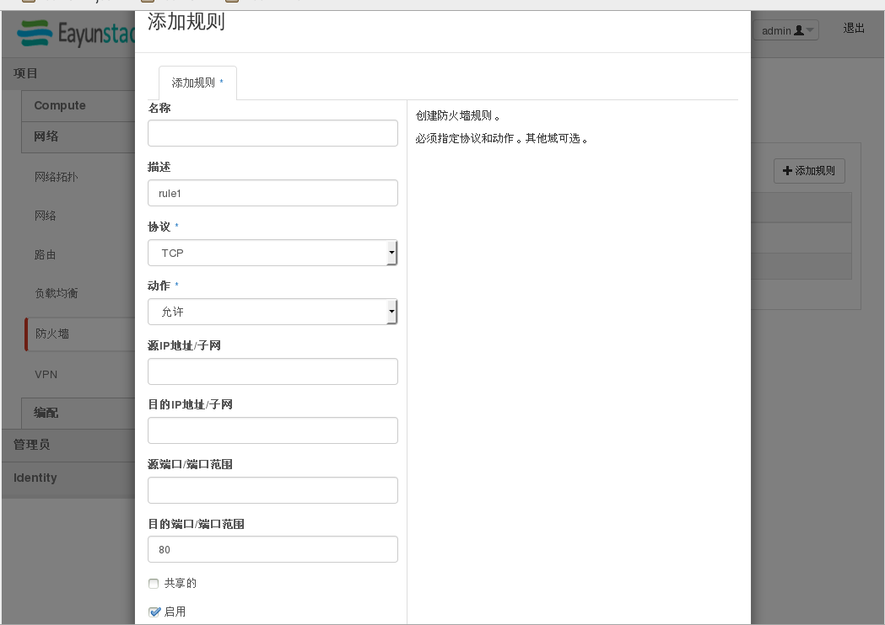
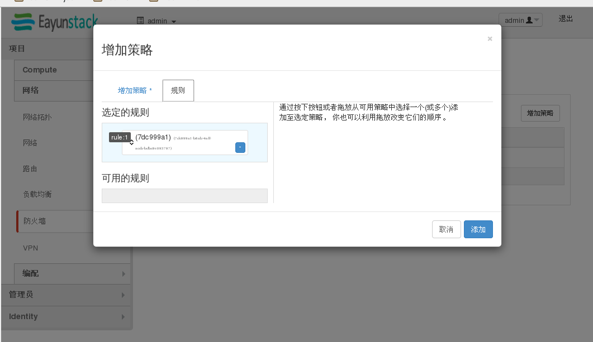
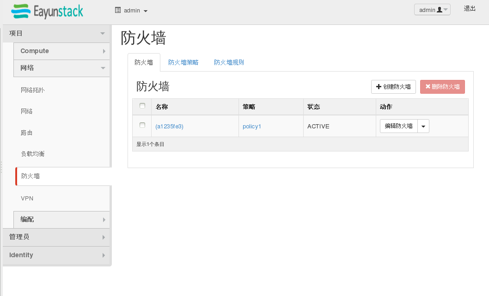

# FWaaS使用例子

# FWaaS使用例子——图形化界面
防火墙创建界面：



1.
规则创建：


2.
策略创建：


3.
防火墙创建：


将策略绑定到防火墙中
# FWaaS使用例子——命令行

1.
创建防火墙规则：
```
 neutron firewall-rule-create --protocol tcp --destination-port 80 --action allow
Created a new firewall_rule:
+------------------------+--------------------------------------+
| Field                  | Value                                |
+------------------------+--------------------------------------+
| action                 | allow                                |
| description            |                                      |
| destination_ip_address |                                      |
| destination_port       | 80                                   |
| enabled                | True                                 |
| firewall_policy_id     |                                      |
| id                     | 9d5cd686-c429-4d2b-9e27-3eb15c87dcd7 |
| ip_version             | 4                                    |
| name                   |                                      |
| position               |                                      |
| protocol               | tcp                                  |
| shared                 | False                                |
| source_ip_address      |                                      |
| source_port            |                                      |
| tenant_id              | b2b0b598549d4231a501664ea7495d7c     |
+------------------------+--------------------------------------+

```

2.
创建防火墙策略
```
 neutron firewall-policy-create --firewall-rules "9d5cd686-c429-4d2b-9e27-3eb15c87dcd7" policy1
 Created a new firewall_policy:
+----------------+--------------------------------------+
| Field          | Value                                |
+----------------+--------------------------------------+
| audited        | False                                |
| description    |                                      |
| firewall_rules | 9d5cd686-c429-4d2b-9e27-3eb15c87dcd7 |
| id             | dcf04283-64b8-4582-840a-452be1818026 |
| name           | policy1                              |
| shared         | False                                |
| tenant_id      | b2b0b598549d4231a501664ea7495d7c     |
+----------------+--------------------------------------+

```


3.
创建防火墙：
```
neutron firewall-create dcf04283-64b8-4582-840a-452be1818026
Created a new firewall:
+--------------------+--------------------------------------+
| Field              | Value                                |
+--------------------+--------------------------------------+
| admin_state_up     | True                                 |
| description        |                                      |
| firewall_policy_id | dcf04283-64b8-4582-840a-452be1818026 |
| id                 | a1235fe3-fab9-43cd-adb5-7586621657e1 |
| name               |                                      |
| status             | PENDING_CREATE                       |
| tenant_id          | b2b0b598549d4231a501664ea7495d7c     |
+--------------------+--------------------------------------+

```

4.
查看防火墙状态，状态active即表示创建成功
```
 neutron firewall-show a1235fe3-fab9-43cd-adb5-7586621657e1
+--------------------+--------------------------------------+
| Field              | Value                                |
+--------------------+--------------------------------------+
| admin_state_up     | True                                 |
| description        |                                      |
| firewall_policy_id | dcf04283-64b8-4582-840a-452be1818026 |
| id                 | a1235fe3-fab9-43cd-adb5-7586621657e1 |
| name               |                                      |
| status             | ACTIVE                               |
| tenant_id          | b2b0b598549d4231a501664ea7495d7c     |
+--------------------+--------------------------------------+
```

5.
删除防火墙：
```
neutron firewall-delete a1235fe3-fab9-43cd-adb5-7586621657e1

Deleted firewall: a1235fe3-fab9-43cd-adb5-7586621657e1

```


