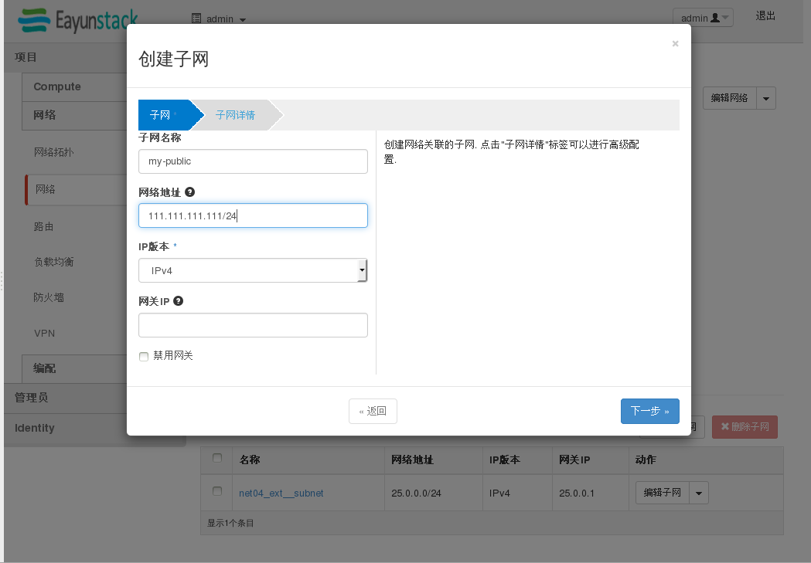

# 简单示例


# 简单示例——图形化界面
1.在公网环境下添加子网





创建成功：


2.实例绑定浮动IP

(在网外的地址池当中，所有的地址都是同等的，随机分配)


# 简单示例——命令行
1.创建IP
命令：`neutron subnet-create NAME --allocation-pool start=START_IP,end=END_IP --gateway GATEWAYIP NETWORKNAME CIDR`

示例：

```
neutron subnet-create --allocation-pool start=10.1.101.80,end=10.1.101.100 --gateway 10.1.101.254 net04_ext 10.1.101.0/24 --enable_dhcp=False
Created a new subnet:
+-------------------+-------------------------------------------------+
| Field             | Value                                           |
+-------------------+-------------------------------------------------+
| allocation_pools  | {"start": "10.1.101.80", "end": "10.1.101.100"} |
| cidr              | 10.1.101.0/24                                   |
| dns_nameservers   |                                                 |
| enable_dhcp       | False                                           |
| gateway_ip        | 10.1.101.254                                    |
| host_routes       |                                                 |
| id                | 8d10696f-215c-430c-8789-6e3c8407f628            |
| ip_version        | 4                                               |
| ipv6_address_mode |                                                 |
| ipv6_ra_mode      |                                                 |
| name              |                                                 |
| network_id        | efff48ea-d2d9-4194-9e6e-02b692b3c159            |
| tenant_id         | b2b0b598549d4231a501664ea7495d7c                |
+-------------------+-------------------------------------------------+

```


2.使用固定地址创路由

命令：`neutron router-gateway-set router-id external-network-id external-fixed-ip`

示例：

```
neutron router-gateway-set d712c0c0-4301-45c0-9d40-cb9e6d5a0c08 efff48ea-d2d9-4194-9e6e-02b692b3c159 --external-fixed-ip 10.1.101.85
Set gateway for router d712c0c0-4301-45c0-9d40-cb9e6d5a0c08
```

执行`neutron router-list'
```
| d712c0c0-4301-45c0-9d40-cb9e6d5a0c08 | router02      | {"network_id": "efff48ea-d2d9-4194-9e6e-02b692b3c159", "enable_snat": true, "external_fixed_ips": [{"subnet_id": "8d10696f-215c-430c-8789-6e3c8407f628", "ip_address": "10.1.101.85"}]} | False       | False |

```

可以看到已经绑定成功

3.
将浮动IP绑定到对应的实例上

命令：neutron floatingip-create --port-id ID --fixed-ip-address IP --floating-ip-address IP NETWORK_ID

示例：

```
 neutron floatingip-create --port-id 799fb795-27ed-4e30-8a4c-f82c204cf995 --fixed-ip-address 192.168.201.108 --floating-ip-address 10.1.101.83 efff48ea-d2d9-4194-9e6e-02b692b3c159
Created a new floatingip:
+---------------------+--------------------------------------+
| Field               | Value                                |
+---------------------+--------------------------------------+
| fixed_ip_address    | 192.168.201.108                      |
| floating_ip_address | 10.1.101.83                          |
| floating_network_id | efff48ea-d2d9-4194-9e6e-02b692b3c159 |
| id                  | 64f2717f-37b7-4ad5-9376-9e9313065036 |
| port_id             | 799fb795-27ed-4e30-8a4c-f82c204cf995 |
| router_id           | 4bafb176-fcea-4512-9813-a302569c23fb |
| status              | DOWN                                 |
| tenant_id           | b2b0b598549d4231a501664ea7495d7c     |
+---------------------+--------------------------------------+

```


