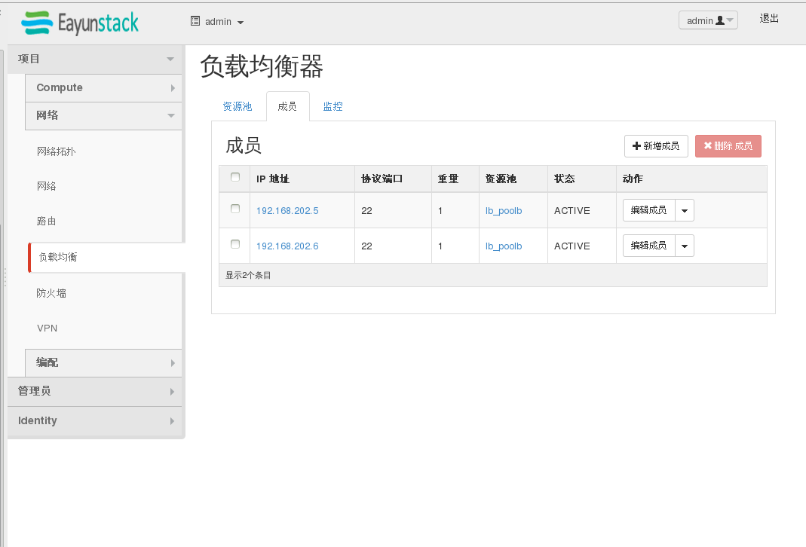

# LBaaS的简单使用

# LBaaS的简单使用————图形化界面

1.
创建资源池:


2.
创建VIP:


3.
创建成功后资源池状态为ACTIVE:


4.
创建资源池中的成员，member：

一般在资源池中创建多个主机用于负载均衡，负载均衡在openstack neutron当中总共有三种方式

假设供负载均衡的主机有两台A，B。权重分别是2，1

a.round_robin,轮询调度。负载均衡按照A，A，B的方式循环

b.least_connection,连接数最少。B上连接数乘2和A做比较哪个连接数少，负载均衡走那里

c.source_ip,根据源IP。对源IP做hash然后mod3，余数是1或者2选A，余数为0选B

一般选择第一种方式

5.
成功添加了两个组成员：

权重在不填写的情况下默认为1


6.
添加监控：

一般监控pool与member连接是否正常采用PING

# LBaaS的简单使用————命令行

1.
创建资源池：
获取网络ID：`neutron subnet-list`

create a pool:
```
 neutron lb-pool-create --lb-method ROUND_ROBIN --name pool2 --protocol TCP --subnet-id 954d3aa5-ef98-490f-aa39-4c816e4b2890
Created a new pool:
+------------------------+--------------------------------------+
| Field                  | Value                                |
+------------------------+--------------------------------------+
| admin_state_up         | True                                 |
| description            |                                      |
| health_monitors        |                                      |
| health_monitors_status |                                      |
| id                     | 90fc9b3f-2d5d-4860-b211-b7a93db08260 |
| lb_method              | ROUND_ROBIN                          |
| members                |                                      |
| name                   | pool2                                |
| protocol               | TCP                                  |
| provider               | haproxy                              |
| status                 | PENDING_CREATE                       |
| status_description     |                                      |
| subnet_id              | 954d3aa5-ef98-490f-aa39-4c816e4b2890 |
| tenant_id              | b2b0b598549d4231a501664ea7495d7c     |
| vip_id                 |                                      |
+------------------------+--------------------------------------+

```

2.
创建VIP

```
 neutron lb-vip-create --name vip2 --protocol-port 22 --protocol TCP --subnet-id 954d3aa5-ef98-490f-aa39-4c816e4b2890 90fc9b3f-2d5d-4860-b211-b7a93db08260
Created a new vip:
+---------------------+--------------------------------------+
| Field               | Value                                |
+---------------------+--------------------------------------+
| address             | 192.168.202.7                        |
| admin_state_up      | True                                 |
| connection_limit    | -1                                   |
| description         |                                      |
| id                  | 0011236b-be0b-4d6e-a62e-4e5d0cd3eeba |
| name                | vip2                                 |
| pool_id             | 90fc9b3f-2d5d-4860-b211-b7a93db08260 |
| port_id             | 67a3256a-4bdc-495f-ac9a-60dfd282c14a |
| protocol            | TCP                                  |
| protocol_port       | 22                                   |
| session_persistence |                                      |
| status              | PENDING_CREATE                       |
| status_description  |                                      |
| subnet_id           | 954d3aa5-ef98-490f-aa39-4c816e4b2890 |
| tenant_id           | b2b0b598549d4231a501664ea7495d7c     |
+---------------------+--------------------------------------+

```
注意在未指定VIP的IP地址时系统会为VIP自动分配一个

3.
创建资源池成员

获取主机的IP，执行命令`nova list`

创建一个资源池成员

```
# neutron lb-member-create --address 192.168.202.6 --protocol-port 22 90fc9b3f-2d5d-4860-b211-b7a93db08260
Created a new member:
+--------------------+--------------------------------------+
| Field              | Value                                |
+--------------------+--------------------------------------+
| address            | 192.168.202.6                        |
| admin_state_up     | True                                 |
| id                 | 0c14a5fd-45f7-4a7d-a971-21850f4f6d5a |
| pool_id            | 90fc9b3f-2d5d-4860-b211-b7a93db08260 |
| protocol_port      | 22                                   |
| status             | PENDING_CREATE                       |
| status_description |                                      |
| tenant_id          | b2b0b598549d4231a501664ea7495d7c     |
| weight             | 1                                    |
+--------------------+--------------------------------------+

```

要创建其他的资源池成员使用的命令一致

4.
创建监控：

```
neutron lb-healthmonitor-create --delay 3 --type PING --max-retries 3 --timeout 3
Created a new health_monitor:
+----------------+--------------------------------------+
| Field          | Value                                |
+----------------+--------------------------------------+
| admin_state_up | True                                 |
| delay          | 3                                    |
| id             | 373850bd-9d36-41ac-b4c2-2843f14e6cf1 |
| max_retries    | 3                                    |
| pools          |                                      |
| tenant_id      | b2b0b598549d4231a501664ea7495d7c     |
| timeout        | 3                                    |
| type           | PING                                 |
+----------------+--------------------------------------+

```

将监控与资源池绑定

```
neutron lb-healthmonitor-associate 373850bd-9d36-41ac-b4c2-2843f14e6cf1 90fc9b3f-2d5d-4860-b211-b7a93db08260
Associated health monitor 373850bd-9d36-41ac-b4c2-2843f14e6cf1

```

