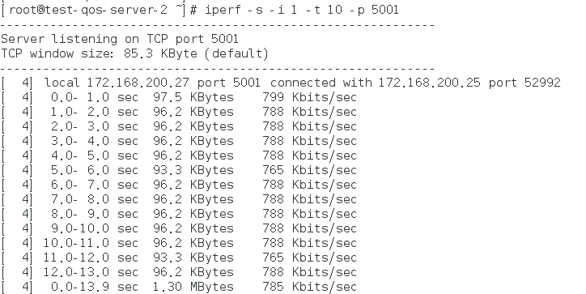
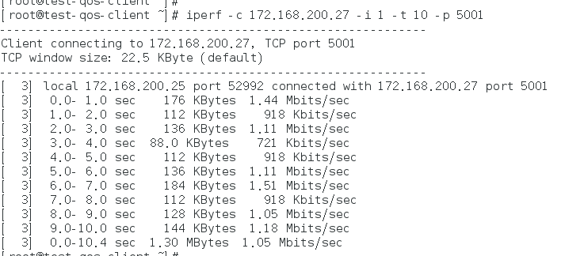

# QoS简单测试


##测试场景说明

以将QoS绑定在虚拟机的neutron 端口，测试同一个内网之间的两台虚拟机为例


加在同一个内网的两虚拟机，一个作为server，一个作为client进行测试。将QoS绑定在server端，使QoS在server端的进方向发挥作用，及整个的测试过程client端对server发出测试，在流量包进入server的过程进行QoS匹配，匹配成功的filter按照指定流量传输。测试过程，将filter的匹配为server端的tcp
协议的5001端口，匹配成功后子队列给出的带宽大约为800kbp/s，即本场景中的测试结果会在server端显现。


##测试工具

创建好QoS之后就是测试其性能(采用iperf作为网络性能测试工具)

总共两种测试情况，是根据QoS绑定的类型不同而确定的

a)、
若QoS绑定路由，则测试需要不在同一个宿主机上的两台虚拟机一个作为性能测试的server，一个做client

b)、
若QoS绑定端口，则测试需在两个相同内网的两个虚拟机上做性能测试，一个做server，一个做client

测试工具安装

1）若系统集成有，则直接使用yum install iperf安装

2）若系统没有，则依次执行命令，安装iperf(以linux为例，其他安装方式详见：<code>https://iperf.fr/</code>)


```
 wget https://iperf.fr/download/iperf_2.0.2/iperf_2.0.2-4_amd64
```

```
chmod +x iperf_2.0.2-4_amd64
```

```
sudo mv iperf_2.0.2-4_amd64 /usr/bin/iperf
```

iperf安装成功，可以直接使用iperf工具


##测试QoS

1.
登录任一controller节点创建QoS

1）
创建QoS，执行命令：
```
neutron eayun-qos-create --name test-qos-server-1 --target-type port --target-id 0a7d330d-5949-400c-a9d9-0da6b5a0a6c3 ingress 1024000 102400
create a new qos:
+--------------------+--------------------------------------+
| Field              | Value                                |
+--------------------+--------------------------------------+
| burst              |                                      |
| cburst             |                                      |
| default_queue_id   | b305cfdc-98de-4cec-bafd-e8b965a869bd |
| description        |                                      |
| direction          | ingress                               |
| id                 | 36bbd6f7-0682-4bb5-a9a4-39978b78be6b |
| name               | test-qos-server-1                    |
| qos_queues         | 69deac59-6e16-451d-83ff-756c94e6de60 |
|                    | b305cfdc-98de-4cec-bafd-e8b965a869bd |
| rate               | 1024000                              |
| target_id          | 0a7d330d-5949-400c-a9d9-0da6b5a0a6c3 |
| target_type        | port                                 |
| tenant_id          | 3846bfe69b4a49948b8056d5f9c76859     |
| unattached_filters |                                      |
+--------------------+--------------------------------------+


```

新建的QoS匹配上iperf server的neutron port

2)创建queue
创建parent-queue
```
neutron eayun-qos-queue-create --prio 0 36bbd6f7-0682-4bb5-a9a4-39978b78be6b 614400
Created a new qos_queue:
+------------------+--------------------------------------+
| Field            | Value                                |
+------------------+--------------------------------------+
| attached_filters |                                      |
| burst            |                                      |
| cburst           |                                      |
| ceil             |                                      |
| id               | 69deac59-6e16-451d-83ff-756c94e6de60 |
| parent_id        |                                      |
| prio             | 1                                    |
| qos_id           | 36bbd6f7-0682-4bb5-a9a4-39978b78be6b |
| rate             | 614400                               |
| subqueues        | 732464f5-f4c9-4d8e-b327-2e02a159f2d2 |
|                  | ba4fe297-89dd-48f1-9de0-c2ef6433f40c |
| tenant_id        | 3846bfe69b4a49948b8056d5f9c76859     |
+------------------+--------------------------------------+


```

创建queue的子队列：
```
neutron eayun-qos-queue-create --parent 69deac59-6e16-451d-83ff-756c94e6de60 --prio 0 36bbd6f7-0682-4bb5-a9a4-39978b78be6b 102400
Created a new qos_queue:
+------------------+--------------------------------------+
| Field            | Value                                |
+------------------+--------------------------------------+
| attached_filters | 940ad573-2240-4848-913b-1462122f803d |
| burst            |                                      |
| cburst           |                                      |
| ceil             |                                      |
| id               | ba4fe297-89dd-48f1-9de0-c2ef6433f40c |
| parent_id        | 69deac59-6e16-451d-83ff-756c94e6de60 |
| prio             | 0                                    |
| qos_id           | 36bbd6f7-0682-4bb5-a9a4-39978b78be6b |
| rate             | 102400                               |
| subqueues        |                                      |
| tenant_id        | 3846bfe69b4a49948b8056d5f9c76859     |
+------------------+--------------------------------------+

```


3)
创建过滤器针对，需要测试的流量过滤，测试TCP协议的5001端口，将iperf服务端作为目的地址，示例为：
```
neutron eayun-qos-filter-create --queue ba4fe297-89dd-48f1-9de0-c2ef6433f40c --protocol 6 --dst-port 5001 --dst-addr 172.168.200.27/22 36bbd6f7-0682-4bb5-a9a4-39978b78be6b 202
Created a new qos_filter:
+-----------+--------------------------------------+
| Field     | Value                                |
+-----------+--------------------------------------+
| dst_addr  | 172.168.200.27/22                    |
| dst_port  | 5001                                 |
| id        | 940ad573-2240-4848-913b-1462122f803d |
| prio      | 202                                  |
| protocol  | 6                                    |
| qos_id    | 36bbd6f7-0682-4bb5-a9a4-39978b78be6b |
| queue_id  | ba4fe297-89dd-48f1-9de0-c2ef6433f40c |
| src_addr  |                                      |
| src_port  |                                      |
| tenant_id | 3846bfe69b4a49948b8056d5f9c76859     |
+-----------+--------------------------------------+

```

2.
在虚拟机上进行测试：

a)

在iperf的服务端执行命令：
```
iperf -s -i 1 -t 10 -p 5001
```

参数说明

1)
<code>-s</code>表示开启服务端服务

2)
<code>-i</code>缩短报告时间

3)
<code>-t</code>拉长时长

4)
<code>-p</code>指定监听端口

其他参数请参考wiki[(https://oa.eayun.cn/wiki/doku.php?id=eayunstack:neutron:%E7%BD%91%E7%BB%9C%E6%80%A7%E8%83%BD%E6%B5%8B%E8%AF%95%E5%B7%A5%E5%85%B7)]

b)

在iperf客户端执行命令：
```
iperf -c 172.168.200.27 -i 1 -t 10 -p 5001
```

参时说明：

1)
<code>-c</code>表示客户端

2)
<code>HOST</code>，表示服务端的IP地址

3）
<code>-i</code>缩短报告时间

4)
<code>-t</code>拉长时长

5)
<code>-p</code>指定监听端口

其他参数请参考wiki[(https://oa.eayun.cn/wiki/doku.php?id=eayunstack:neutron:%E7%BD%91%E7%BB%9C%E6%80%A7%E8%83%BD%E6%B5%8B%E8%AF%95%E5%B7%A5%E5%85%B7)]

c)

得到测试结果为：
服务端：



客户端：




可以看到已经成匹配了过滤器而过滤器器走了其所在的子队列给出的带宽，所以测试成功

