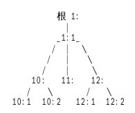

# QoS简单创建
#####QoS创建的流程为：

QoS创建----->QoS队列创建------>QoS过滤器创建

最终流量包在过滤器的规则中匹配

#####流量包实际匹配的流程为：
例如这样一个QoS



数据包在根队列处入队和出队，走过流量匹配过程为<code>1:->1:1->12:->12:2</code>最终进入过滤器

每个过滤器都在各个叶子节点上或者直接在QoS上

##QoS绑定在路由器或者虚拟机端口

QoS的限速功能只能针对路由器或者虚拟机限速，即流量包会通过的地方


|QoS绑定类型  | target-type参数 | target-id参数 | 测试环境 |
| ----------- | --------------- | ------------- | -------- |
| 路由器 | router | 执行命令<code>neutron router-show ROUTE-NAME</code>找到对应的路由器id | 不在同一个宿主机上的两台虚拟机之间做测试 |
| 虚拟机 | port | 执行命令<code>neutron port-list</code>找到对应的虚拟机的neutron id | 在同一个内网的两台虚拟机之间测试 |


##创建QoS

###一、绑定虚拟机

实例：

```
neutron eayun-qos-create --name test-qos-port --target-type port --target-id f3ab7c9f-6182-43f4-ba3e-5662b396137f egress 102400 20480
Created a new qos:
+--------------------+--------------------------------------+
| Field              | Value                                |
+--------------------+--------------------------------------+
| burst              |                                      |
| cburst             |                                      |
| default_queue_id   | 9d891bd0-9868-4aa7-92b6-bdd731ab4a69 |
| description        |                                      |
| direction          | egress                               |
| id                 | 25ed775a-e1c5-4a7a-ad58-11cc90534898 |
| name               | test-qos-port                        |
| qos_queues         | 9d891bd0-9868-4aa7-92b6-bdd731ab4a69 |
| rate               | 102400                               |
| target_id          | f3ab7c9f-6182-43f4-ba3e-5662b396137f |
| target_type        | port                                 |
| tenant_id          | 3846bfe69b4a49948b8056d5f9c76859     |
| unattached_filters |                                      |
+--------------------+--------------------------------------+

```


###二、绑定路由器

实例：
```
neutron eayun-qos-create --name test-qos-router --target-type router --target-id 721a68b0-19ee-46d6-9b52-3ff1452fa8af egress 1024000 102400
Created a new qos:
+--------------------+--------------------------------------+
| Field              | Value                                |
+--------------------+--------------------------------------+
| burst              |                                      |
| cburst             |                                      |
| default_queue_id   | 582b0632-9bc0-48b4-ad5f-774c239e4da3 |
| description        |                                      |
| direction          | egress                               |
| id                 | 6f1d370d-f54b-4eb8-8337-1604b11b06b3 |
| name               | test-qos-router                      |
| qos_queues         | 582b0632-9bc0-48b4-ad5f-774c239e4da3 |
| rate               | 1024000                              |
| target_id          | 721a68b0-19ee-46d6-9b52-3ff1452fa8af |
| target_type        | router                               |
| tenant_id          | 3846bfe69b4a49948b8056d5f9c76859     |
| unattached_filters |                                      |
+--------------------+--------------------------------------+
```


####参数说明：

1)<code>--name</code>是可选选项，填写你需要名字

2)<code>--target-type</code>是可选选项，指的是需要绑定的类型，可以是router或者port(注意：若绑定的是router，测试需要在两个不同宿主机上的两台虚拟机之间进行测试；若绑定的是虚拟机port则需要在同一个内网中的两台虚拟机之间进行测试)

3）<code>--target-id</code>填写需绑定的id ，如果绑定路由器则直接是router id;若绑定虚拟机则是虚拟机端口的neutron id

4)<code>DIRECTION</code>是必须选项，ingress或者egress，输入或者输出

5)<code>RATE</code>是必须选项，QoS总带宽大小

6)<code>DEFAULT_RATE</code>是必须选项，QoS默认队列的带宽大小

注意其他可选选项使用命令查看<code>neutron eayun-qos-create -h</code>


##QoS队列创建

队列的创建与QoS绑定的是路由还是虚拟机无关都是相同的创建及应用方式

名词解释

根队列：直接在QoS下创建的队列就是根队列

父队列：有子队列的队列为父队列，即其下还有队列存在的情况

子队列：有父队列的队列为子队列


####一、创建QoS下的父队列：


```
neutron eayun-qos-queue-create 25ed775a-e1c5-4a7a-ad58-11cc90534898 20480 --prio 0
Created a new qos_queue:
+------------------+--------------------------------------+
| Field            | Value                                |
+------------------+--------------------------------------+
| attached_filters |                                      |
| burst            |                                      |
| cburst           |                                      |
| ceil             |                                      |
| id               | 87301017-9f16-4d18-815b-6e1434dc6455 |
| parent_id        |                                      |
| prio             | 0                                    |
| qos_id           | 25ed775a-e1c5-4a7a-ad58-11cc90534898 |
| rate             | 20480                                |
| subqueues        |                                      |
| tenant_id        | 3846bfe69b4a49948b8056d5f9c76859     |
+------------------+--------------------------------------+

```


####参数说明：

1)<code>--prio</code>可选选项，指定队列优先级，优先级只能从0到7，数字越小越优先，不设置默认优先级为7

2)<code>QOS-ID</code>，必须选项，该QoS Queue所属的QoS的ID

3)<code>RATE</code>，该队列保证的带宽大小


其他可选选项使用命令<code>
neutron eayun-qos-queue-create -h</code>查看


####二、创建父队列下的子队列

创建子队列的意义：子队列可以共享父队列的带宽，使有限的带宽发挥出更多的作用。

```
 neutron eayun-qos-queue-create --parent 87301017-9f16-4d18-815b-6e1434dc6455 --prio 1 25ed775a-e1c5-4a7a-ad58-11cc90534898 10240
 Created a new qos_queue:
+------------------+--------------------------------------+
| Field            | Value                                |
+------------------+--------------------------------------+
| attached_filters |                                      |
| burst            |                                      |
| cburst           |                                      |
| ceil             |                                      |
| id               | 13805649-1a35-4b35-8bbd-35b4dc6453c3 |
| parent_id        | 87301017-9f16-4d18-815b-6e1434dc6455 |
| prio             | 1                                    |
| qos_id           | 25ed775a-e1c5-4a7a-ad58-11cc90534898 |
| rate             | 10240                                |
| subqueues        |                                      |
| tenant_id        | 3846bfe69b4a49948b8056d5f9c76859     |
+------------------+--------------------------------------+

```

####参数说明：

1)<code>--parent</code>，指定该子队列之上的父队列的ID

2)<code>--prio</code>，指定该队列优先级，从0到7，数字越小优先级越高，不设置优先级默认为7

3)<code>QOS-ID</code>，必须选项，该QoS Queue所属的QoS的ID

4)<code>RATE</code>，该队列保证的带宽大小


其他可选选项使用命令<code>
neutron eayun-qos-queue-create -h</code>查看


##创建过滤器：
过滤器的创建与QoS绑定的是路由还是虚拟机无关都是相同的创建及应用方式

过滤器只能建立在没有子队列的队列中，也就是说没有下一层的队列中，一个队列可以匹配多个过滤器，一个过滤器只能在一个队列中。

QoS本身也可以直接绑定过滤器


####实例：
创建一个可以测试tcp协议5001端口的过滤器

```
neutron eayun-qos-filter-create --queue ba4fe297-89dd-48f1-9de0-c2ef6433f40c --protocol 6 --dst-port 5001 --dst-addr 172.168.200.27/22 36bbd6f7-0682-4bb5-a9a4-39978b78be6b 202
Created a new qos_filter:
+-----------+--------------------------------------+
| Field     | Value                                |
+-----------+--------------------------------------+
| dst_addr  | 172.168.200.27/22                    |
| dst_port  | 5001                                 |
| id        | 940ad573-2240-4848-913b-1462122f803d |
| prio      | 202                                  |
| protocol  | 6                                    |
| qos_id    | 36bbd6f7-0682-4bb5-a9a4-39978b78be6b |
| queue_id  | ba4fe297-89dd-48f1-9de0-c2ef6433f40c |
| src_addr  |                                      |
| src_port  |                                      |
| tenant_id | 3846bfe69b4a49948b8056d5f9c76859     |
+-----------+--------------------------------------+


```

####参数说明：

1)<code>--queue</code>，指向该过滤器要绑定的队列的ID

2)<code>--protocol</code>，匹配的IP子协议编号，从1到255

3)<code>--src-port</code>，匹配的源端口

4)<code>--dst-port</code>，匹配的目的端口

5)<code>--src-addr</code>，匹配的源地址CIDR

6)<code>--dst-addr</code>，匹配的目的地址CIDR

7)<code>QOS</code>，该过滤器所属的QoS的ID

8)<code>PRIO</code>，该filter的优先级，数字从1-65535数字越高越优先


其他参数获取使用命令查看<code>neutron eayun-qos-filter-create -h</code>


