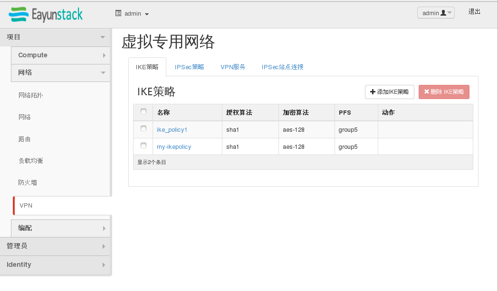
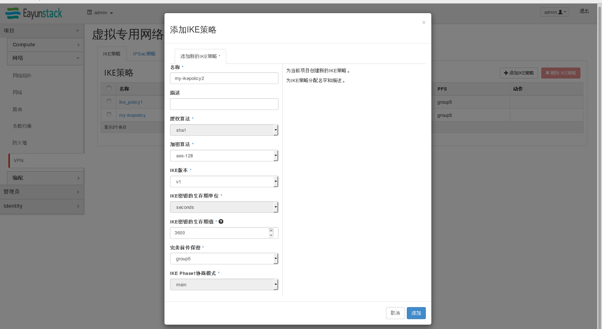
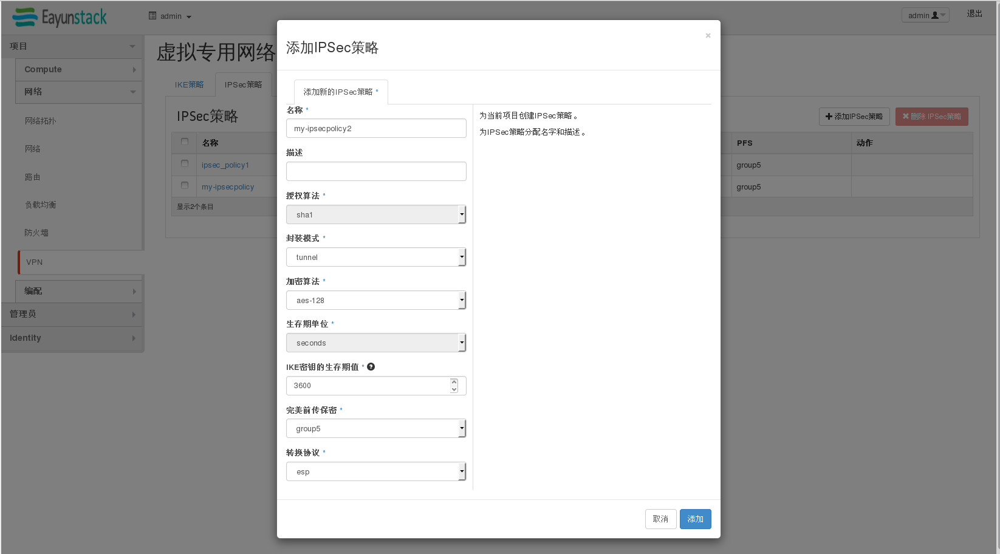
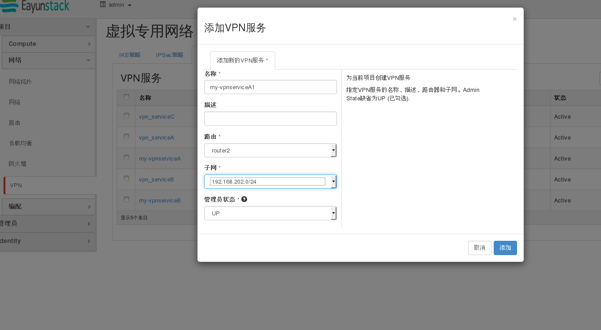
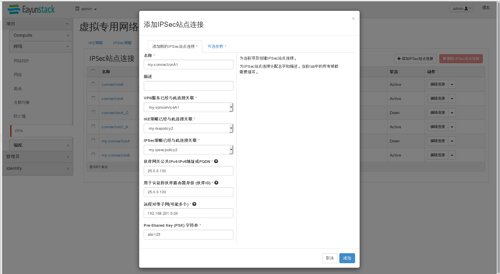
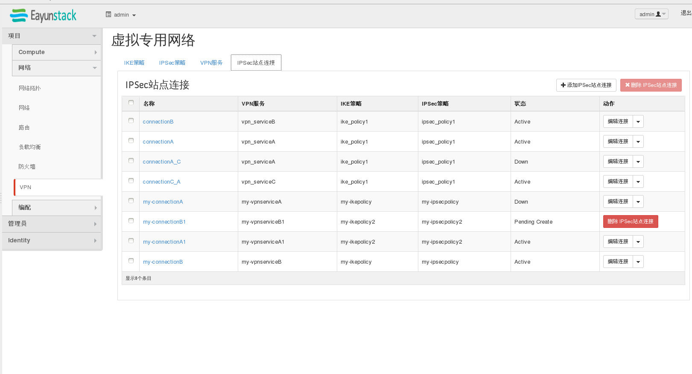

# VPNaaS简单示例

示例环境说明：

示例环境：有两个实例A，B。分别在不同的内网中A:sub_net2(192.168.202.5/24)，B:net04_subnet(192.168.201.108/24)。且A，B通过不同的路由器router2、router04和外网连接，使用VPN让A，B之间能够顺利ping通。
# VPNaaS简单示例————图形界面

1.
VPNaaS打建界面：


2.
创建ike-policy


3.
创建ipsec-policy


4.
创建vpn服务


5.
创建ipsec站点连接


6.
创建成功后站点连接显示ACTIVE


# VPNaaS简单示例————命令行
1.
创建ike policy
```
neutron vpn-ikepolicy-create my-ikepolicy
Created a new ikepolicy:
+-------------------------+--------------------------------------+
| Field                   | Value                                |
+-------------------------+--------------------------------------+
| auth_algorithm          | sha1                                 |
| description             |                                      |
| encryption_algorithm    | aes-128                              |
| id                      | f6ba6f1b-a5a4-40ba-b99e-4afcfb5f802e |
| ike_version             | v1                                   |
| lifetime                | {"units": "seconds", "value": 3600}  |
| name                    | my-ikepolicy                         |
| pfs                     | group5                               |
| phase1_negotiation_mode | main                                 |
| tenant_id               | b2b0b598549d4231a501664ea7495d7c     |
+-------------------------+--------------------------------------+

```

2.
创建ipsec policy
```
 neutron vpn-ipsecpolicy-create my-ipsecpolicy
Created a new ipsecpolicy:
+----------------------+--------------------------------------+
| Field                | Value                                |
+----------------------+--------------------------------------+
| auth_algorithm       | sha1                                 |
| description          |                                      |
| encapsulation_mode   | tunnel                               |
| encryption_algorithm | aes-128                              |
| id                   | 4cf554df-ebe5-404b-afea-1cb89e3918de |
| lifetime             | {"units": "seconds", "value": 3600}  |
| name                 | my-ipsecpolicy                       |
| pfs                  | group5                               |
| tenant_id            | b2b0b598549d4231a501664ea7495d7c     |
| transform_protocol   | esp                                  |
+----------------------+--------------------------------------+

```

3.
分别为routerA和routerB创建vpn service

a.为A创建：
```
neutron vpn-service-create --name my-vpnserviceA router2 sub_net2Created a new vpnservice:
+----------------+--------------------------------------+
| Field          | Value                                |
+----------------+--------------------------------------+
| admin_state_up | True                                 |
| description    |                                      |
| id             | 25489798-205b-4265-ad63-d2e0b676e7fa |
| name           | my-vpnserviceA                       |
| router_id      | 32dafff3-0d36-497c-8c99-c2c170d4419c |
| status         | PENDING_CREATE                       |
| subnet_id      | 954d3aa5-ef98-490f-aa39-4c816e4b2890 |
| tenant_id      | b2b0b598549d4231a501664ea7495d7c     |
+----------------+--------------------------------------+

```
b.为B创建：
```
 neutron vpn-service-create --name my-vpnserviceB router04 net04__subnet
Created a new vpnservice:
+----------------+--------------------------------------+
| Field          | Value                                |
+----------------+--------------------------------------+
| admin_state_up | True                                 |
| description    |                                      |
| id             | 7d3ca86a-79ff-4abf-90f3-6e66d44d48ac |
| name           | my-vpnserviceB                       |
| router_id      | 4bafb176-fcea-4512-9813-a302569c23fb |
| status         | PENDING_CREATE                       |
| subnet_id      | bee05cda-221f-48d7-be7e-db3da7565d2f |
| tenant_id      | b2b0b598549d4231a501664ea7495d7c     |
+----------------+--------------------------------------+

```

4.
分别为两个 vpn service 创建 ipsec site connection

a.为A创建：
```
neutron ipsec-site-connection-create --name my-connectionA --vpnservice-id 25489798-205b-4265-ad63-d2e0b676e7fa --ikepolicy-id f6ba6f1b-a5a4-40ba-b99e-4afcfb5f802e --ipsecpolicy-id 4cf554df-ebe5-404b-afea-1cb89e3918de --peer-address 25.0.0.130 --peer-id 25.0.0.130 --peer-cidr 192.168.201.0/24 --psk abc123
Created a new ipsec_site_connection:
+----------------+----------------------------------------------------+
| Field          | Value                                              |
+----------------+----------------------------------------------------+
| admin_state_up | True                                               |
| auth_mode      | psk                                                |
| description    |                                                    |
| dpd            | {"action": "hold", "interval": 30, "timeout": 120} |
| id             | c0fbc18d-b953-4865-949f-00c38f5ea9ce               |
| ikepolicy_id   | f6ba6f1b-a5a4-40ba-b99e-4afcfb5f802e               |
| initiator      | bi-directional                                     |
| ipsecpolicy_id | 4cf554df-ebe5-404b-afea-1cb89e3918de               |
| mtu            | 1500                                               |
| name           | my-connectionA                                     |
| peer_address   | 25.0.0.130                                         |
| peer_cidrs     | 192.168.201.0/24                                   |
| peer_id        | 25.0.0.130                                         |
| psk            | abc123                                             |
| route_mode     | static                                             |
| status         | PENDING_CREATE                                     |
| tenant_id      | b2b0b598549d4231a501664ea7495d7c                   |
| vpnservice_id  | 25489798-205b-4265-ad63-d2e0b676e7fa               |
+----------------+----------------------------------------------------+

```

b.为B创建：
```
neutron ipsec-site-connection-create --name my-connectionB --vpnservice-id 7d3ca86a-79ff-4abf-90f3-6e66d44d48ac --ikepolicy-id f6ba6f1b-a5a4-40ba-b99e-4afcfb5f802e --ipsecpolicy-id 4cf554df-ebe5-404b-afea-1cb89e3918de --peer-address 25.0.0.139 --peer-id 25.0.0.139 --peer-cidr 192.168.202.0/24 --psk abc123
Created a new ipsec_site_connection:
+----------------+----------------------------------------------------+
| Field          | Value                                              |
+----------------+----------------------------------------------------+
| admin_state_up | True                                               |
| auth_mode      | psk                                                |
| description    |                                                    |
| dpd            | {"action": "hold", "interval": 30, "timeout": 120} |
| id             | e7dd37dc-c515-45c6-84d1-cccff6f3dbd0               |
| ikepolicy_id   | f6ba6f1b-a5a4-40ba-b99e-4afcfb5f802e               |
| initiator      | bi-directional                                     |
| ipsecpolicy_id | 4cf554df-ebe5-404b-afea-1cb89e3918de               |
| mtu            | 1500                                               |
| name           | my-connectionB                                     |
| peer_address   | 25.0.0.139                                         |
| peer_cidrs     | 192.168.202.0/24                                   |
| peer_id        | 25.0.0.139                                         |
| psk            | abc123                                             |
| route_mode     | static                                             |
| status         | PENDING_CREATE                                     |
| tenant_id      | b2b0b598549d4231a501664ea7495d7c                   |
| vpnservice_id  | 7d3ca86a-79ff-4abf-90f3-6e66d44d48ac               |
+----------------+----------------------------------------------------+

```

将A、B之间的VPN服务启好之后，A，B之间就能通信。


