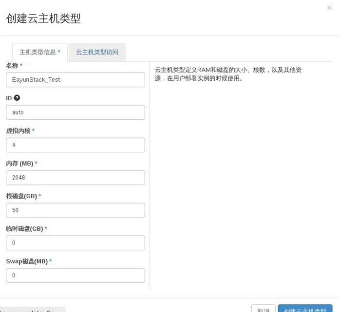

# 创建规格

### 通过Web horizon界面创建规格

 登录Web horizon界面，点击云主机类型----创建云主类型，弹出云主机类型创建界面，配置类型参数，点击创建云主机类型

* 创建规格（创建云主机类）



|名称    |填写创建云主机名称  |
|------|--------------------- |
|ID    |默认选择自动          |
|虚拟内核|云主机CPU信息       |
|内存    |云主机使用内存      |
|根磁盘  |云主机第一块盘（根磁盘），默认存储系统数据，|
|临时磁盘|云主机第二块盘，用于数据存储|
|Swap磁盘|用于swap交换空间磁盘|


* 点击云主机类型访问，列出了所有项目信息，可根据需要设置该云主机类型所属项目使用，默认不选择，所有项目都可以使用


* 查看已创建规格


### 通过命令创建规格

* 创建规格，执行如下命令

> ```nova flavor-create <FLAVOR-NAME> <FLAVOR-ID> <RAM-IN-MB> <ROOT-DISK-IN-GB> <VCPU>```


###示例
```
 nova flavor-create m1.custom 6 512 5 1
+----+-----------+-----------+------+-----------+------+-------+-------------+-----------+
| ID | Name      | Memory_MB | Disk | Ephemeral | Swap | VCPUs | RXTX_Factor | Is_Public |
+----+-----------+-----------+------+-----------+------+-------+-------------+-----------+
| 6  | m1.custom | 512       | 5    | 0         |      | 1     | 1.0         | True      |
+----+-----------+-----------+------+-----------+------+-------+-------------+-----------+

```
