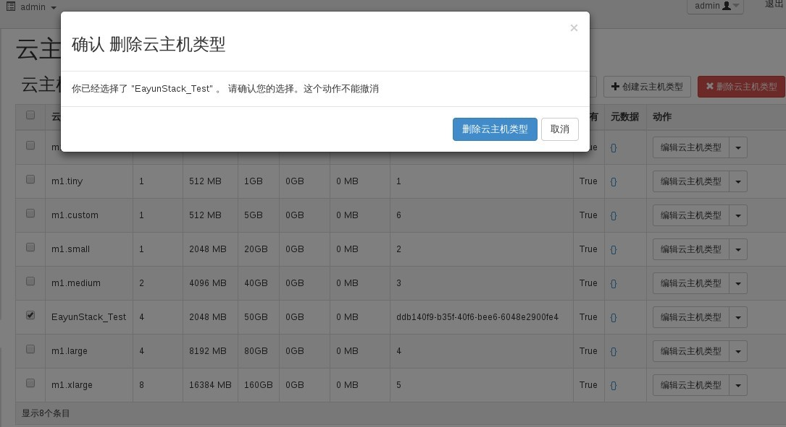

# 删除规格

### 通过Web horizon界面删除规格

* 登录Web horizo界面，云主机类型----选择云主机类型----删除云主机类型



* 删除完成后，查看云主机类型，删除的云主机类型已被删除


### 通过命令删除规格

* 删除规格，执行如下命令

> ``` nova flavor-delete <name> ```

### 示例

```
nova flavor-delete m1.custom
+----+-----------+-----------+------+-----------+------+-------+-------------+-----------+
| ID | Name      | Memory_MB | Disk | Ephemeral | Swap | VCPUs | RXTX_Factor | Is_Public |
+----+-----------+-----------+------+-----------+------+-------+-------------+-----------+
| 6  | m1.custom | 512       | 5    | 0         |      | 1     | 1.0         | True      |
+----+-----------+-----------+------+-----------+------+-------+-------------+-----------+
```

