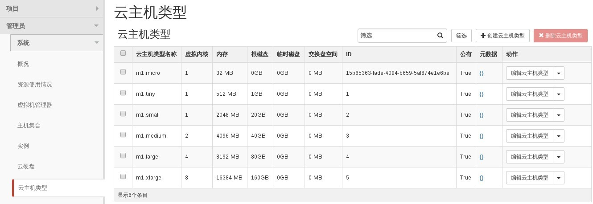

# 查看已有规格

### 通过We horizon界面查看规格

* 登录Web horizon界面，点击```云主机类型```显示规格信息



云主机类型```Public 为Yes```表示所有用户都能使用

已存在的云主机类型，可以通过```编辑云主机类型```调整云主机类型信息


### 通过命令查看云主机规

* 查看云主机规格，执行如下命令

> ```nova flavor-list```

### 示例

```
nova flavor-list
+--------------------------------------+-----------+-----------+------+-----------+------+-------+-------------+-----------+
| ID                                   | Name      | Memory_MB | Disk | Ephemeral | Swap | VCPUs | RXTX_Factor | Is_Public |
+--------------------------------------+-----------+-----------+------+-----------+------+-------+-------------+-----------+
| 1                                    | m1.tiny   | 512       | 1    | 0         |      | 1     | 1.0         | True      |
| 15b65363-fade-4094-b659-5af874e1e6be | m1.micro  | 32        | 0    | 0         |      | 1     | 1.0         | True      |
| 2                                    | m1.small  | 2048      | 20   | 0         |      | 1     | 1.0         | True      |
| 3                                    | m1.medium | 4096      | 40   | 0         |      | 2     | 1.0         | True      |
| 4                                    | m1.large  | 8192      | 80   | 0         |      | 4     | 1.0         | True      |
| 5                                    | m1.xlarge | 16384     | 160  | 0         |      | 8     | 1.0         | True      |
+--------------------------------------+-----------+-----------+------+-----------+------+-------+-------------+-----------+

```
