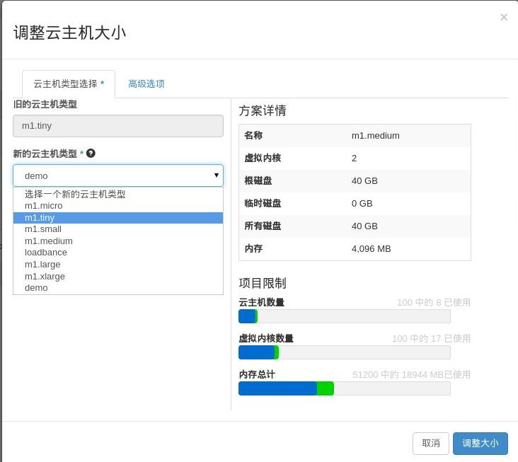
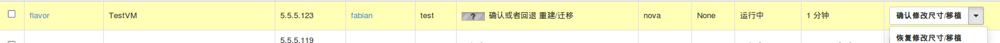

# 调整云主机规格

### 通过Web horizon界面创建规格

 登录Web horizon界面，点击项目----实例，在对应实例的动作栏选择调整云主机大小，弹出调整云主机大小界面，在新的云主机类型栏选择相应的一个规格即可。

* 调整云主机大小



选择调整云主机大小

* 云主机规格确认


选择确认修改/移植

云主机规格调整完成

* 云主机规格



选择恢复修改/移植

云主机规格调整回退至云主机原始规格

### 通过命令调整云主机规格

调整云主机规格分为两步：1、resize 调整云主机规格; 2、确认调整云主机规格，两个步骤执行顺序不能错误

* 云主机规格调整，执行如下命令

> ``` nova resize  <server>  Name or ID of server.
                   <flavor>  Name or ID of new flavor.
	  Optional arguments:
	    --poll    Report the server resize progress until it completes.```
备注：在进行resize规格调整之前，必须确认需要调整的云主机名称或ID，新flavor（规格）名称或ID

* 确认云主机规格调整，执行如下命令

> ``` nova resize-confirm <server> ``` server为调整规格云主机名称或ID

### 示例

> resize 调整云主机规格

```
[root@node-5 ](controller)# nova resize 421dbb41-58b5-4c92-ab19-e4c2b154eafa 38c7184e-0a69-48a3-a1c6-962a5f62de45 --poll

Server resizing... 100% complete
Finished

```

> confirm 确认云主机规格调整

```
[root@node-5 ](controller)# nova resize-confirm 421dbb41-58b5-4c92-ab19-e4c2b154eafa

```

### 通过命令退回云主机规格调整

当云主机进行规格resize 调整后，confirm确认调整云主机规格前，可进行规格调整后回退到云主机原始规格

* 云主机退回规格调整

> ``` nova resize-revert <server> ``` server为调整规格云主机名称或ID

### 示例

> revert 回退云主机规格调整

```
[root@node-5 ](controller)# nova resize-revert cd619f10-e202-4f88-9817-35b787e01325

```

执行以上命令后，云主机规格回退到云主机原始规格状态


`备注：以上云主机规格调整后，进入操作系统能够发现调整后的规格配置，系统分区调整需要根据操作系统进行resize分区调整`
