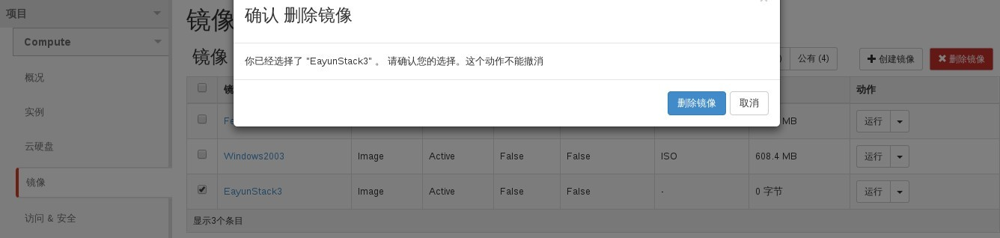

# 删除模板

### 通过Web horizon界面删除模版

* 登录Web horizon界面，选择镜像，选中需要删除，点击删除镜像




### 通过命令模版

* 删除模版，执行如下命令

> ```glance image-delete NAME```

### 示例

```
glance image-list
+--------------------------------------+---------------------+-------------+------------------+------------+--------+
| ID                                   | Name                | Disk Format | Container Format | Size       | Status |
+--------------------------------------+---------------------+-------------+------------------+------------+--------+
| b30f6d3b-04ee-4d62-b66f-f2ee80acfa21 | centos64            | qcow2       | bare             | 1195114496 | active |
| 82bff63e-62fa-4f6d-acca-97fdd58e4759 | cirros-0.3.3-x86_64 | ami         | ami              | 13200896   | active |
| 832393e3-1676-4d28-853f-a7948d358555 | coffee_test_01      | qcow2       | bare             | 13200896   | active |
| 66bab299-da85-45d4-941f-a316f28ce66e | EayunStack_Test     | qcow2       | bare             | 13200896   | active |
| 6cc5b047-10f5-4be6-8094-0e3ae190f825 | Test                | qcow2       | ovf              | 13200896   | active |
| b3ed9a61-dd1b-4933-9f6e-9fda0801ee32 | TestVM              | qcow2       | bare             | 13167616   | active |
+--------------------------------------+---------------------+-------------+------------------+------------+--------+
```

```
# glance image-delete Test
# glance image-list
+--------------------------------------+---------------------+-------------+------------------+------------+--------+
| ID                                   | Name                | Disk Format | Container Format | Size       | Status |
+--------------------------------------+---------------------+-------------+------------------+------------+--------+
| b30f6d3b-04ee-4d62-b66f-f2ee80acfa21 | centos64            | qcow2       | bare             | 1195114496 | active |
| 82bff63e-62fa-4f6d-acca-97fdd58e4759 | cirros-0.3.3-x86_64 | ami         | ami              | 13200896   | active |
| 832393e3-1676-4d28-853f-a7948d358555 | coffee_test_01      | qcow2       | bare             | 13200896   | active |
| 66bab299-da85-45d4-941f-a316f28ce66e | EayunStack_Test     | qcow2       | bare             | 13200896   | active |
| b3ed9a61-dd1b-4933-9f6e-9fda0801ee32 | TestVM              | qcow2       | bare             | 13167616   | active |
+--------------------------------------+---------------------+-------------+------------------+------------+--------+
```

> ###### 注意
> 如果有多个模板的名字一样(原则上允许), 那么删除操作必须使用模板 ID 来指定待删除的模板
