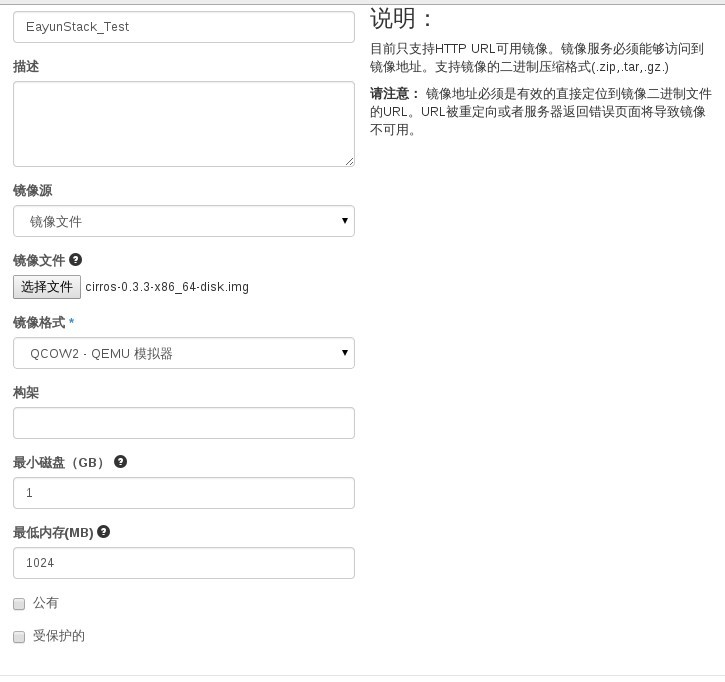

# 导入模板

> #### 重要
> 向EayunStack环境上传镜像时需要将镜像转换成**raw**格式后上传

### 通过Web horizon界面导入模版

* Web horizo界面点击镜像---创建镜像

具体的参数解释见下面的通过命令行导入模板



* 等待一段时间后，镜像创建完成


### 通过命令导入模版

> ```
glance image-create [--id <IMAGE_ID>] [--name <NAME>] [--store <STORE>]
                           [--disk-format <DISK_FORMAT>]
                           [--container-format <CONTAINER_FORMAT>]
                           [--owner <TENANT_ID>] [--size <SIZE>]
                           [--min-disk <DISK_GB>] [--min-ram <DISK_RAM>]
                           [--location <IMAGE_URL>] [--file <FILE>]
                           [--checksum <CHECKSUM>] [--copy-from <IMAGE_URL>]
                           [--is-public {True,False}]
                           [--is-protected {True,False}]
                           [--property <key=value>] [--human-readable]
                           [--progress]
```

常用的选项如下:

* ** --file ** 从该文件导入模板
* ** --name ** 导入的模板的名字
* ** --disk-format ** 待导入模板的磁盘格式, 如 qcow2, raw, iso 等, 根据实际情况选择
* ** --container-format ** 待导入模板的容器格式, 如 ami, bare等, 根据实际情况选择. 一般没有容器的话, 那么此处一般选择 bare
* ** --is-public ** 该模板是否公有
* ** --is-public ** 额外的模板属性,比如ami的模板需要设置 aki和ari属性.
* ** --min-disk ** 启动该模板需要的最小磁盘, 默认没有限制, 根据实际规格定义
* ** --min-ram ** 启动该模板需要的最小内存, 默认没有限制, 根据实际规格定义

### 示例

```
glance image-create --name=Test --disk-format=qcow2 --container-format=ovf --file=cirros-0.3.3-x86_64-disk.img --is-public=False
+------------------+--------------------------------------+
| Property         | Value                                |
+------------------+--------------------------------------+
| checksum         | 133eae9fb1c98f45894a4e60d8736619     |
| container_format | ovf                                  |
| created_at       | 2015-04-24T07:15:16                  |
| deleted          | False                                |
| deleted_at       | None                                 |
| disk_format      | qcow2                                |
| id               | 6cc5b047-10f5-4be6-8094-0e3ae190f825 |
| is_public        | False                                |
| min_disk         | 0                                    |
| min_ram          | 0                                    |
| name             | Test                                 |
| owner            | a41d5cfdc44a4a99886e9d36cc87618b     |
| protected        | False                                |
| size             | 13200896                             |
| status           | active                               |
| updated_at       | 2015-04-24T07:15:17                  |
| virtual_size     | None                                 |
+------------------+--------------------------------------+

```
