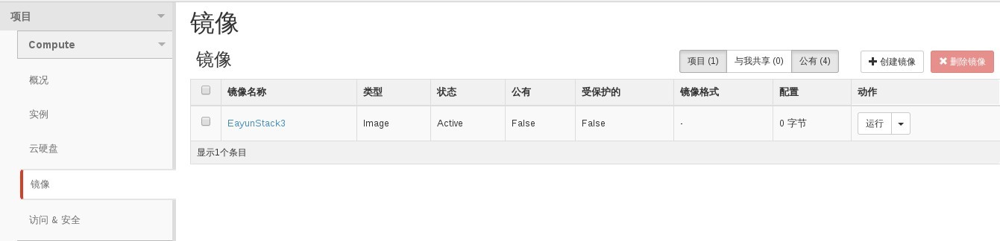
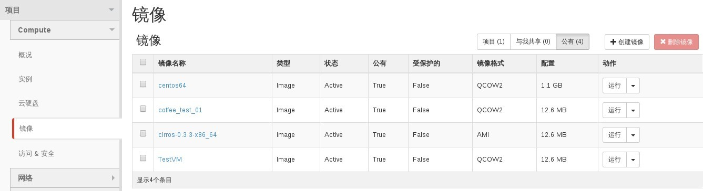
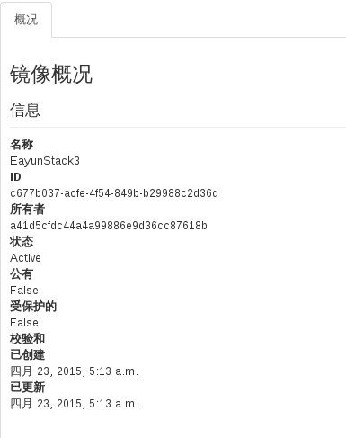
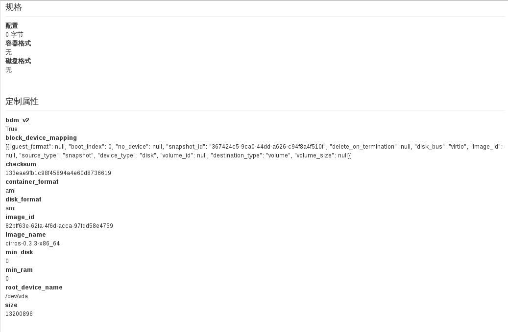

# 查看已有模板

### 通过Web horizon界面查看模版

登录进入horizon界面，点击```镜像```显示模版信息，其中分项目与公有。项目模版属于本项目专有模版，公有属于公共模版。

* 专有模版



* 公共模版



* 模版概况信息





### 通过命令查看模版

* 查看模版，执行如下命令

> ```glance image-list``` #查看模版

> ```glance image-show TestVM``` #查看模版详细信息

### 示例

* 查看模版

```
glance image-list
+--------------------------------------+---------------------+-------------+------------------+------------+--------+
| ID                                   | Name                | Disk Format | Container Format | Size       | Status |
+--------------------------------------+---------------------+-------------+------------------+------------+--------+
| b30f6d3b-04ee-4d62-b66f-f2ee80acfa21 | centos64            | qcow2       | bare             | 1195114496 | active |
| 82bff63e-62fa-4f6d-acca-97fdd58e4759 | cirros-0.3.3-x86_64 | ami         | ami              | 13200896   | active |
| 832393e3-1676-4d28-853f-a7948d358555 | coffee_test_01      | qcow2       | bare             | 13200896   | active |
| c677b037-acfe-4f54-849b-b29988c2d36d | EayunStack3         |             |                  |            | active |
| b3ed9a61-dd1b-4933-9f6e-9fda0801ee32 | TestVM              | qcow2       | bare             | 13167616   | active |
+--------------------------------------+---------------------+-------------+------------------+------------+--------+

```

* 查看模版详细信息

```
 glance image-show TestVM
+------------------------------+-------------------------------------------------+
| Property                     | Value                                           |
+------------------------------+-------------------------------------------------+
| Property 'murano_image_info' | {"title": "Murano Demo", "type": "cirros.demo"} |
| checksum                     | 64d7c1cd2b6f60c92c14662941cb7913                |
| container_format             | bare                                            |
| created_at                   | 2015-04-13T11:53:57                             |
| deleted                      | False                                           |
| disk_format                  | qcow2                                           |
| id                           | b3ed9a61-dd1b-4933-9f6e-9fda0801ee32            |
| is_public                    | True                                            |
| min_disk                     | 0                                               |
| min_ram                      | 64                                              |
| name                         | TestVM                                          |
| owner                        | f7376cdfe1804f1ab4c30c6c304bf25b                |
| protected                    | False                                           |
| size                         | 13167616                                        |
| status                       | active                                          |
| updated_at                   | 2015-04-13T11:54:44                             |
+------------------------------+-------------------------------------------------+
```

> ###### 注意
> 如果有多个模板的名字一样(原则上允许), 那么查看模板详细信息必须使用模板 ID 来指定待查看的模板
