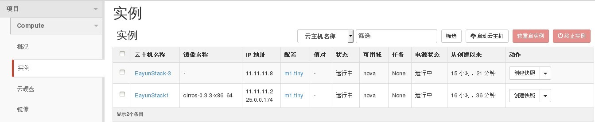
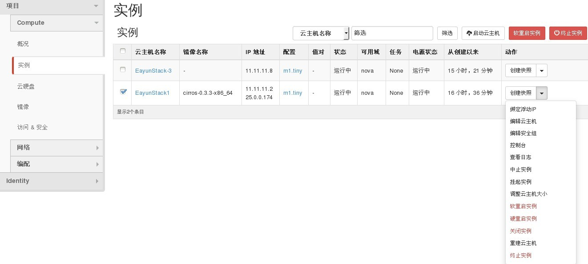
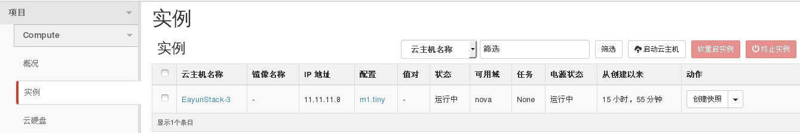

# 删除云主机


### 通过Web horizon界面删除云主机

通过登录horzion界面删除云主机，登录后选择项目----实例----选择需要删除的云主机----点击终止实例，对虚拟机进行删除操作:

* 列出云主机信息

 

* 选择云主机并进行终止云主操作

 

  可通过两种方式删除云主机：

  1.选中云主机，选择右上方```终止实例```删除云主机操作

  2.点击云主机快照旁边小三角出现终止实例，点击终止实例，删除云主机


* 等待删除操作后，在云主机信息中，被终止的云主已被删除

 


### 通过命令方式删除云主机

* 删除云主机，执行如下命令

> ``` nova delete INSTANCE```

修改云主机状态
> ```nova reset-state --active server``` (当云主机状态出现问题时，改变云主机状态）

强制删除云主机
> ```nova force-delete server``` （当云主机不能正常删除时，可采取强制删除）


### 示例如下

```
# nova list  (查看云主机信息）

+--------------------------------------+---------------------+-------------------+------------+-------------+----------------------+
| ID                                   | Name                | Status            | Task State | Power State | Networks             |
+--------------------------------------+---------------------+-------------------+------------+-------------+----------------------+
| 72eb9c31-10d0-424c-8e93-d89a3636963e | Test-1              | ACTIVE            | -          | Running     | net04=192.168.201.34 |
| 1015b3ff-7395-475b-89cf-a9d76444f39b | test-vm             | ACTIVE            | -          | Running     | net04=192.168.201.15 |
+--------------------------------------+---------------------+-------------------+------------+-------------+----------------------+

# nova delete Test-1 (执行后将删除Test-1云主机)
+--------------------------------------+---------------------+-------------------+------------+-------------+----------------------+
| 1015b3ff-7395-475b-89cf-a9d76444f39b | test-vm             | ACTIVE            | -          | Running     | net04=192.168.201.15 |
+--------------------------------------+---------------------+-------------------+------------+-------------+----------------------+
```


