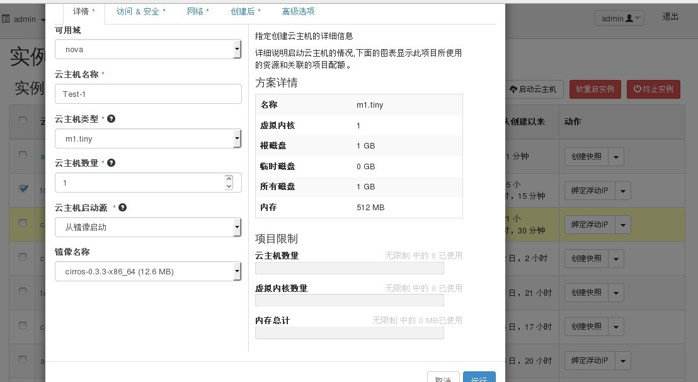
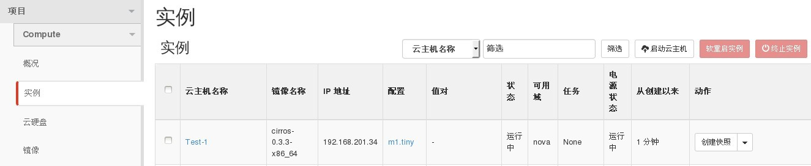

# 启动新的云主机


### 通过Web horizon界面启动新的云主机

通过登录horzion界创建云主机，登录后选择项目----实例----启动云主机（在启动云主机界面配置云主机信息)

* 点击启动云主机，配置云主机详情信息(云主机名称、云主机类型、云主机数量、云主机启动源、镜像名称）

   


* 从可用网络中选择fix网络net04，点击运行开始创建云主机(该网络为私有网络，通过dhcp获得，云主机内部可看见网络）

   

 访问&安全： 根据创建需求对云主机配置密钥

 创建后：主要为云环境中虚拟机初始化开发的初始化工具，它从各种数据源读取相关数据并据此对虚拟机进行配置。常见的配置包括：设定虚拟机的hostname、hosts文件、设定用户名密码、更新apt－get的本地缓存、调整文件系统的大小（注意不是调整分区的大小）等。

 高级选项：用于指定实例启动时高级选项（磁盘分区，配置磁盘驱动器）

* 云主机开始创建，等待一段时间后云主机创建完成

   

            (备注：创建云主机根据实际情况进行配置云主机类型，云主机镜像)

创建云主机，还可以通过指定云主机启动类型，启动类型包括如下：

|启动类型|说明  |
|--------|------|
|从镜像启动|通过glance上传的镜像文件进行启动|
|从快照启动|通过平台创建已有的快照启动一个新的云主机|
|从云硬盘启动|通过平台创建的云硬盘启动，该云硬盘在创建时必须配置启动镜像|
|从镜像启动（创建一个新卷）|该启动方式将通过镜像启动，启动的云主机存储在云硬盘上，云硬盘自动创建|
|从云硬盘快照启动（创建一个新卷）|该云硬盘快照已存在，创建时将会生成新的云硬盘作为云主机存储|


### 通过命令方式启动新的云主机

* 启动新的云主机，执行如下命令

> ```
# nova boot [--flavor <flavor>] [--image <image>] [--key-name <key-name>] [--security-groups <security-groups>] [--nic <net-id=net-uuid>] <name>
```

### 示例如下

```
# nova boot --flavor m1.tiny --image cirros-0.3.3-x86_64 --key-name test_keypair --security-groups default --nic net-id=98e535c3-5245-432e-b947-e9c041f2839c test-vm
+--------------------------------------+------------------------------------------------------------+
| Property                             | Value                                                      |
+--------------------------------------+------------------------------------------------------------+
| OS-DCF:diskConfig                    | MANUAL                                                     |
| OS-EXT-AZ:availability_zone          | nova                                                       |
| OS-EXT-SRV-ATTR:host                 | -                                                          |
| OS-EXT-SRV-ATTR:hypervisor_hostname  | -                                                          |
| OS-EXT-SRV-ATTR:instance_name        | instance-0000002c                                          |
| OS-EXT-STS:power_state               | 0                                                          |
| OS-EXT-STS:task_state                | scheduling                                                 |
| OS-EXT-STS:vm_state                  | building                                                   |
| OS-SRV-USG:launched_at               | -                                                          |
| OS-SRV-USG:terminated_at             | -                                                          |
| accessIPv4                           |                                                            |
| accessIPv6                           |                                                            |
| adminPass                            | wrME66mKq2vz                                               |
| config_drive                         |                                                            |
| created                              | 2015-04-16T05:43:45Z                                       |
| flavor                               | m1.tiny (1)                                                |
| hostId                               |                                                            |
| id                                   | 1015b3ff-7395-475b-89cf-a9d76444f39b                       |
| image                                | cirros-0.3.3-x86_64 (82bff63e-62fa-4f6d-acca-97fdd58e4759) |
| key_name                             | test_keypair                                               |
| metadata                             | {}                                                         |
| name                                 | test-vm                                                    |
| os-extended-volumes:volumes_attached | []                                                         |
| progress                             | 0                                                          |
| security_groups                      | default                                                    |
| status                               | BUILD                                                      |
| tenant_id                            | f7376cdfe1804f1ab4c30c6c304bf25b                           |
| updated                              | 2015-04-16T05:43:45Z                                       |
| user_id                              | a385d73636c84a29bbfc72a0b15d882c                           |
+--------------------------------------+------------------------------------------------------------+
```

在命令行下也可以通过从镜像、从快照启动、从云硬盘启动、从镜像启动（创建一个新卷）、从云硬盘快照启动（创建一个新卷）

在终端下可以指定云主机运行hypervisor主机

查看hypervisor

```
# nova hypervisor-list
+----+---------------------+
| ID | Hypervisor hostname |
+----+---------------------+
| 3  | node-61.eayun.com   |
+----+---------------------+

```

从云硬盘启动并指定运行云主机hypervisor为node-61.eayun.com

```
# nova boot --flavor m1.tiny --boot-volume a9a21d60-2b8c-4088-8cc7-af5a0167f3f3 --nic net-id=6b4b7a13-5048-4142-ba08-cca42a6fd1c6 --availability-zone nova:node-61.eayun.com cybing4

```
