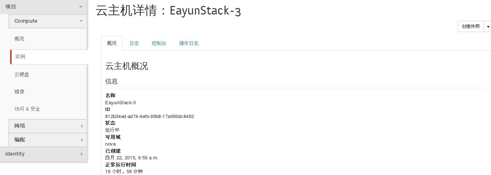
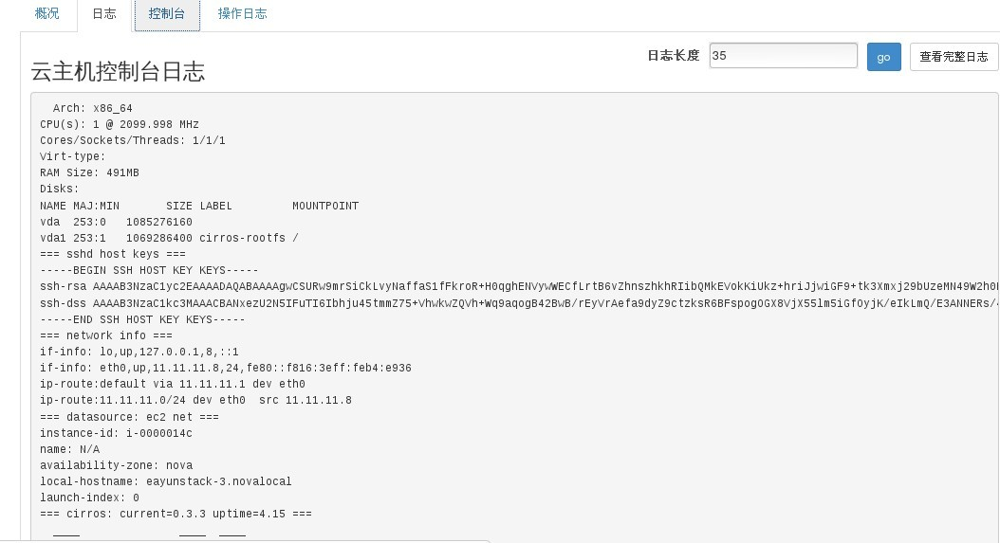
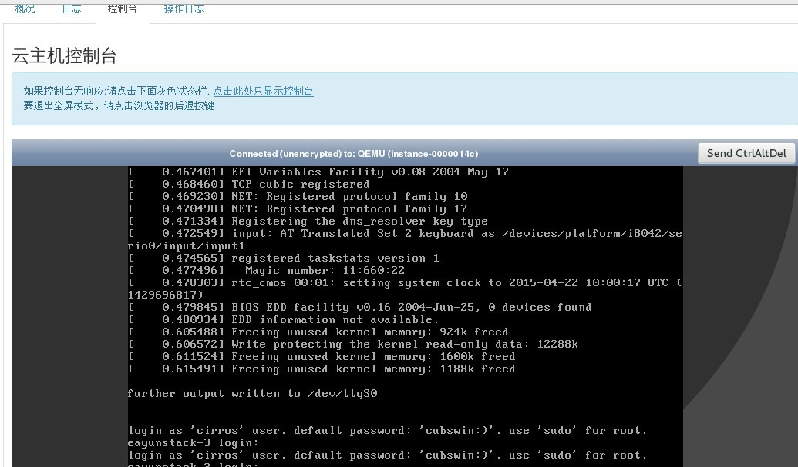
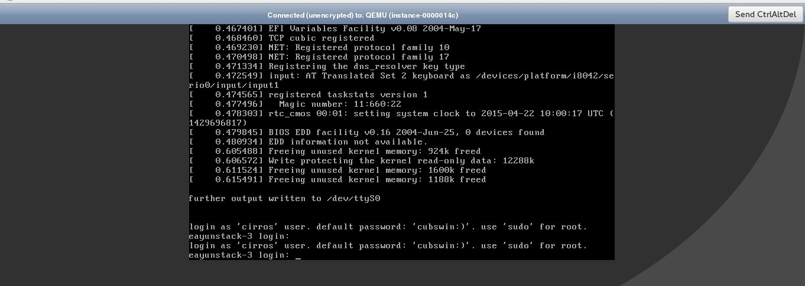
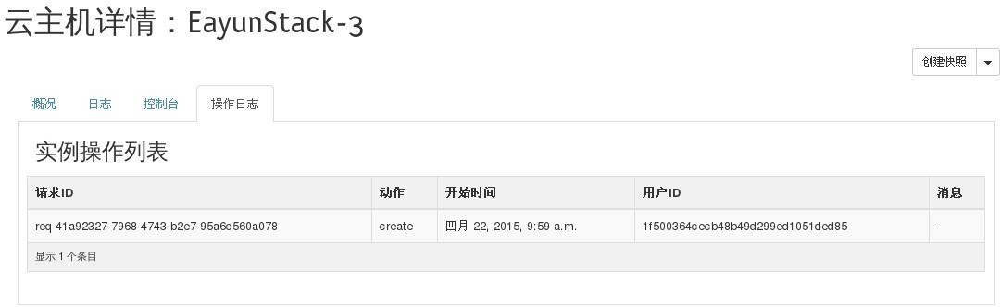

# 查看云主机详情信息

### 通过Web horizon界面查看云主机详情信息

云主详情包括概况、日志、控制台、操作日志

概括包括（云主机概况、规格、IP地址、安全组、元数据、镜像名称、云硬盘）
* 云主机概况信息（通过点击云主机名称）




* 云主机日志信息，显示云主机启动日志信息



* 云主机控制台，通过点击控制台，打开vnc控制台界面，进行虚拟机操作



> 全屏控制台



* 云主机操作日志




### 通过命令方式查看云主机详情信息

* 查看云主机详情信息，执行如下命令

> ``` nova show INSTANCE```

(INSTANCE 为nova list 中ID 或者 Name）

### 示例如下

```
# nova list
+--------------------------------------+--------------+--------+------------+-------------+-----------------------------------------+
| ID                                   | Name         | Status | Task State | Power State | Networks                                |
+--------------------------------------+--------------+--------+------------+-------------+-----------------------------------------+
| 812b34ed-ad74-4efb-96b8-17a660dc8462 | EayunStack-3 | ACTIVE | -          | Running     | EayunNetWork-Net=11.11.11.8, 25.0.0.174 |
| 3d341752-47f6-4baa-9e08-628155318c52 | EayunStack-4 | ACTIVE | -          | Running     | EayunNetWork-Net=11.11.11.12            |
| ad00aebd-6c73-48c8-ab1c-bee73da3477e | EayunStack2  | ACTIVE | -          | Running     | EayunNetWork-Net=11.11.11.11            |
+--------------------------------------+--------------+--------+------------+-------------+-----------------------------------------+
```
```
# nova show 033e9376-337e-45be-ad57-99154bd84dd6
+--------------------------------------+------------------------------------------------------------+
| Property                             | Value                                                      |
+--------------------------------------+------------------------------------------------------------+
| OS-DCF:diskConfig                    | AUTO                                                       |
| OS-EXT-AZ:availability_zone          | nova                                                       |
| OS-EXT-SRV-ATTR:host                 | node-61.eayun.com                                          |
| OS-EXT-SRV-ATTR:hypervisor_hostname  | node-61.eayun.com                                          |
| OS-EXT-SRV-ATTR:instance_name        | instance-000005cd                                          |
| OS-EXT-STS:power_state               | 4                                                          |
| OS-EXT-STS:task_state                | -                                                          |
| OS-EXT-STS:vm_state                  | stopped                                                    |
| OS-SRV-USG:launched_at               | 2015-05-20T05:49:24.000000                                 |
| OS-SRV-USG:terminated_at             | -                                                          |
| accessIPv4                           |                                                            |
| accessIPv6                           |                                                            |
| config_drive                         |                                                            |
| created                              | 2015-05-20T05:49:14Z                                       |
| flavor                               | app (e350c75e-c71f-4567-8e18-34830e59d419)                 |
| hostId                               | bcc5661a6159f72b9b3829f74441b7cd4784769bee2f19656bc076fb   |
| id                                   | 033e9376-337e-45be-ad57-99154bd84dd6                       |
| image                                | cirros-0.3.4-x86_64 (b7bc7bf6-6624-4de7-9c65-3bde82122c87) |
| key_name                             | -                                                          |
| metadata                             | {}                                                         |
| name                                 | cybing22                                                   |
| net04 network                        | 192.168.4.11                                               |
| os-extended-volumes:volumes_attached | []                                                         |
| security_groups                      | default                                                    |
| status                               | SHUTOFF                                                    |
| tenant_id                            | 96b0c3103d7f4ad38144bb2573269e0a                           |
| updated                              | 2015-05-20T07:03:22Z                                       |
| user_id                              | 90f7d9189dc141f48b9c26efc9f1330d                           |
+--------------------------------------+------------------------------------------------------------+
```


