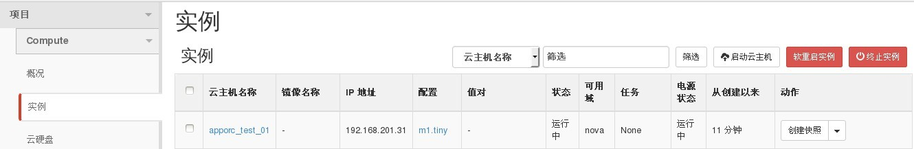
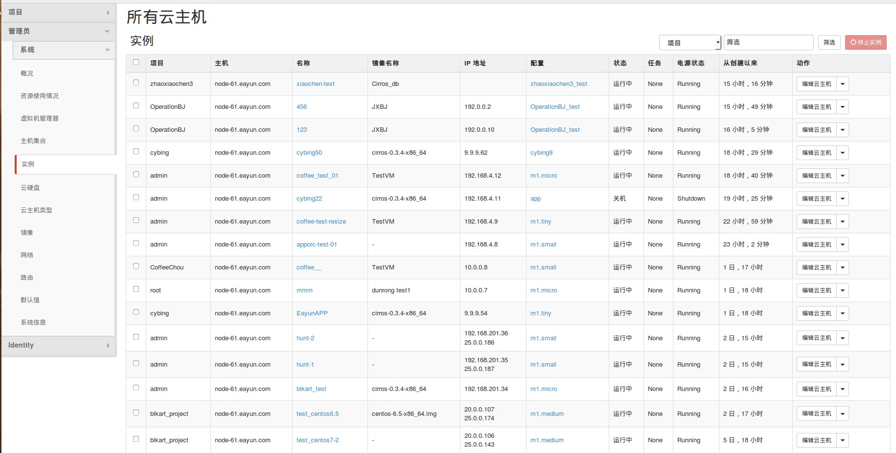

# 查看云主机列表


### 通过Web horizon界面查看云主机

通过登录horzion查看云主机信息，登录后选择项目----实例，显示实例

 

查看所有云主机信息，使用admin用户登录平台，点击管理员----系统----实例，将列出所有云主机信息,同时可查看云主机所在宿主机

 

 查看时可对云主机进行筛选查询

  

  筛选类型分为：项目、主机、名称、IP、镜像、状态进行筛选

### 通过命令查看云主机

* 查看云主机，执如下命令


> ```nova list```  （显示当前项目下云主机）
> ```nova list --all-tenant``` (显示所有项目云主机）

### 示例如下：

```
# nova list
+--------------------------------------+--------------+--------+------------+-------------+-----------------------------------------+
| ID                                   | Name         | Status | Task State | Power State | Networks                                |
+--------------------------------------+--------------+--------+------------+-------------+-----------------------------------------+
| 812b34ed-ad74-4efb-96b8-17a660dc8462 | EayunStack-3 | ACTIVE | -          | Running     | EayunNetWork-Net=11.11.11.8, 25.0.0.174 |
| 3d341752-47f6-4baa-9e08-628155318c52 | EayunStack-4 | ACTIVE | -          | Running     | EayunNetWork-Net=11.11.11.12            |
| ad00aebd-6c73-48c8-ab1c-bee73da3477e | EayunStack2  | ACTIVE | -          | Running     | EayunNetWork-Net=11.11.11.11            |
+--------------------------------------+--------------+--------+------------+-------------+-----------------------------------------+

 ```

```
# nova list --all-tenant
+--------------------------------------+--------------------+---------+------------+-------------+---------------------------------------+
| ID                                   | Name               | Status  | Task State | Power State | Networks                              |
+--------------------------------------+--------------------+---------+------------+-------------+---------------------------------------+
| 9e6b4580-66cf-4b61-b771-a1808b74b008 | 123                | ACTIVE  | -          | Running     | BJ2=192.0.0.10                        |
| 0b8e7766-3c56-4de0-9b4a-2b4c909155a9 | EayunAPP           | ACTIVE  | -          | Running     | EayunStack=9.9.9.54                   |
| 84beec4a-889b-49b4-9a9b-245e31e9dfc9 | EayunStack1        | ACTIVE  | -          | Running     | EayunStack=9.9.9.50, 25.0.0.141       |
| 8afd4964-e2a2-47b0-b079-a39591925360 | VM_douban          | ACTIVE  | -          | Running     | Private_luo=10.0.0.15                 |
| fc60ad6f-91d6-4443-874e-b3e739ef3294 | VM_luo             | ACTIVE  | -          | Running     | Private_luo=10.0.0.14                 |
| 96ed0093-9f62-426e-b49f-bca152810195 | apporc-test-01     | ACTIVE  | -          | Running     | net04=192.168.4.8                     |
| ddd7cc9d-174a-4696-ab45-8a013fe444f6 | blkart_test        | ACTIVE  | -          | Running     | net04=192.168.201.34                  |
| 585d2072-4bae-42fa-93aa-0ec3c33c6a42 | chihuimin          | ACTIVE  | -          | Running     | chihuimin=11.11.11.2                  |
| fcba8a8c-d86f-4262-870a-997a7221ef38 | chihuimin1         | ACTIVE  | -          | Running     | chihuimin=192.168.3.12                |
| 64a3804c-f3d9-42e4-8479-c3d3ef70a9a8 | coffee-test-resize | ACTIVE  | -          | Running     | net04=192.168.4.9                     |
| 36feac1d-5716-4c8b-87ed-8776b2ae9c43 | coffee__           | ACTIVE  | -          | Running     | Private_p=10.0.0.8                    |
| b123e275-2f19-4f3d-b1bf-48163d9253f7 | coffee_test_01     | ACTIVE  | -          | Running     | net04=192.168.4.12                    |
| 033e9376-337e-45be-ad57-99154bd84dd6 | cybing22           | SHUTOFF | -          | Shutdown    | net04=192.168.4.11                    |
| 95ebbd2e-1b1c-495c-9f03-712226ae4bbb | cybing50           | ACTIVE  | -          | Running     | EayunStack=9.9.9.62                   |
| 12a60b68-81ec-46d5-8d29-c1db824bf894 | hunt-1             | ACTIVE  | -          | Running     | net04=192.168.201.35, 25.0.0.187      |
| adcc6da3-ff1f-4a99-9a3f-32b0487278ea | hunt-2             | ACTIVE  | -          | Running     | net04=192.168.201.36, 25.0.0.186      |
| 79eac49a-9c43-4b98-b579-4ec20e290d11 | mmm                | ACTIVE  | -          | Running     | Private_p=10.0.0.7                    |
| 35adfcf8-2061-440c-ad4a-dc07ae5f1e25 | pnc                | ACTIVE  | -          | Running     | pinuocao=192.168.3.13                 |
| 3d28bed3-1db7-4c7d-b71b-d62c3fe44e1d | test_centos6.5     | ACTIVE  | -          | Running     | blkart_private=20.0.0.107, 25.0.0.174 |
| 8101e9f6-614a-4fd6-b916-49b48dad8f5b | test_centos7       | ACTIVE  | -          | Running     | blkart_private=20.0.0.105             |
| 2b74114b-fb6f-436b-af53-122c91eebdcd | test_centos7-2     | ACTIVE  | -          | Running     | blkart_private=20.0.0.106, 25.0.0.143 |
| 648e4d9c-8468-4bce-afe9-d909ce1cdca0 | test_ubuntu-12.04  | PAUSED  | -          | Paused      | blkart_private=20.0.0.103             |
| da3e7faa-1684-4261-9e40-4d00da34510c | vm_luo1            | ERROR   | -          | NOSTATE     | Private_luo=10.0.0.13                 |
| a73bb77b-d0fd-4409-9be6-81a1ef1f96fc | xiaochen-text      | ACTIVE  | -          | Running     | public_hfxn=192.168.1.6               |
+--------------------------------------+--------------------+---------+------------+-------------+---------------------------------------+

```

命令行可以结合系统命令进行筛选

```
# nova list --all-tenant|grep hunt-1
| 12a60b68-81ec-46d5-8d29-c1db824bf894 | hunt-1             | ACTIVE  | -          | Running     | net04=192.168.201.35, 25.0.0.187      |

```
