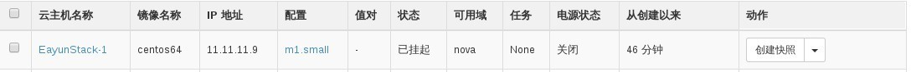

# 云主机暂停与云主机挂起

### 通过Web horizon暂停云主机

云主机暂停状态，云主机当前数据保存在内存中，暂停速度快，电源状态为暂停状态，通过点击创建快照旁边小三角```中止实例```，将云主机状态设置为暂停状态，通过```恢复实例```，恢复云主机状态


### 通过命令暂停云主机

通过nova pause暂停，nova unpause恢复云主机

* 暂停云主机，执行如下命令

> ```nova pause INSTANCENAME```

* 恢复云主机，执行如下命令

> ```nova unpause INSTANCENAME```

### 示例如下：

```
# nova pause EayunStack2
# nova list
+--------------------------------------+--------------+--------+------------+-------------+-----------------------------------------+
| ID                                   | Name         | Status | Task State | Power State | Networks                                |
+--------------------------------------+--------------+--------+------------+-------------+-----------------------------------------+
| 812b34ed-ad74-4efb-96b8-17a660dc8462 | EayunStack-3 | ACTIVE | -          | Running     | EayunNetWork-Net=11.11.11.8, 25.0.0.174 |
| 3d341752-47f6-4baa-9e08-628155318c52 | EayunStack-4 | ACTIVE | -          | Running     | EayunNetWork-Net=11.11.11.12            |
| ad00aebd-6c73-48c8-ab1c-bee73da3477e | EayunStack2  | PAUSED | -          | Paused      | EayunNetWork-Net=11.11.11.11            |
+--------------------------------------+--------------+--------+------------+-------------+-----------------------------------------+
```
```
# nova unpause EayunStack2
# nova list
+--------------------------------------+--------------+--------+------------+-------------+-----------------------------------------+
| ID                                   | Name         | Status | Task State | Power State | Networks                                |
+--------------------------------------+--------------+--------+------------+-------------+-----------------------------------------+
| 812b34ed-ad74-4efb-96b8-17a660dc8462 | EayunStack-3 | ACTIVE | -          | Running     | EayunNetWork-Net=11.11.11.8, 25.0.0.174 |
| 3d341752-47f6-4baa-9e08-628155318c52 | EayunStack-4 | ACTIVE | -          | Running     | EayunNetWork-Net=11.11.11.12            |
| ad00aebd-6c73-48c8-ab1c-bee73da3477e | EayunStack2  | ACTIVE | -          | Running     | EayunNetWork-Net=11.11.11.11            |
+--------------------------------------+--------------+--------+------------+-------------+-----------------------------------------+
```

### 通过Web horizo挂起云主机

云主机挂起状态，云主机数据保存在硬盘，速度比暂停速度慢，电源状态为关闭状态，通过点击创建快照旁边小三角```挂起实例```，云主机状态设置为挂起状态，通过```恢复实例```，恢复云主机状态



### 通过命令挂起云主机

通过nova suspend挂起云主机，nova resume恢复挂起云主机状态

* 挂起云主机，执行下面命令

> ```nova suspend INSTANCENAME```

* 恢复挂起云主机，执行如下命令

> ```nova resume INSTANCENAME```

举例如下：

```
# nova suspend EayunStack2
# nova list
+--------------------------------------+--------------+-----------+------------+-------------+-----------------------------------------+
| ID                                   | Name         | Status    | Task State | Power State | Networks                                |
+--------------------------------------+--------------+-----------+------------+-------------+-----------------------------------------+
| 812b34ed-ad74-4efb-96b8-17a660dc8462 | EayunStack-3 | ACTIVE    | -          | Running     | EayunNetWork-Net=11.11.11.8, 25.0.0.174 |
| 3d341752-47f6-4baa-9e08-628155318c52 | EayunStack-4 | ACTIVE    | -          | Running     | EayunNetWork-Net=11.11.11.12            |
| ad00aebd-6c73-48c8-ab1c-bee73da3477e | EayunStack2  | SUSPENDED | -          | Shutdown    | EayunNetWork-Net=11.11.11.11            |
+--------------------------------------+--------------+-----------+------------+-------------+-----------------------------------------+

```
```
# nova resume EayunStack2
# nova list
+--------------------------------------+--------------+--------+------------+-------------+-----------------------------------------+
| ID                                   | Name         | Status | Task State | Power State | Networks                                |
+--------------------------------------+--------------+--------+------------+-------------+-----------------------------------------+
| 812b34ed-ad74-4efb-96b8-17a660dc8462 | EayunStack-3 | ACTIVE | -          | Running     | EayunNetWork-Net=11.11.11.8, 25.0.0.174 |
| 3d341752-47f6-4baa-9e08-628155318c52 | EayunStack-4 | ACTIVE | -          | Running     | EayunNetWork-Net=11.11.11.12            |
| ad00aebd-6c73-48c8-ab1c-bee73da3477e | EayunStack2  | ACTIVE | -          | Running     | EayunNetWork-Net=11.11.11.11            |
+--------------------------------------+--------------+--------+------------+-------------+-----------------------------------------+
```


