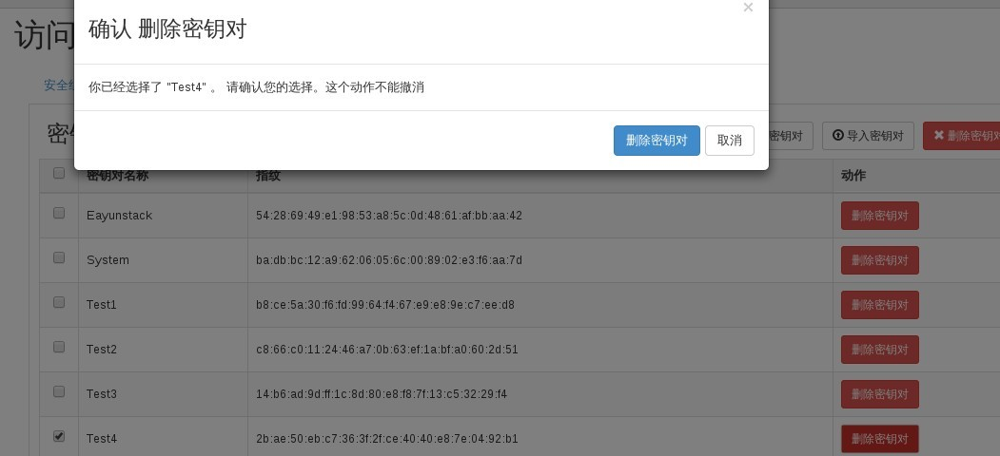
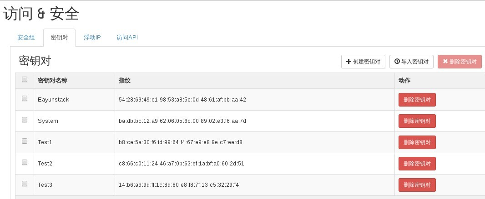

# 删除密钥

### 通过Web horizon删除密钥

* 登录Web horizon登录，点击访问/安全----密钥对----选择密钥对---删除密钥对



* 删除完成后密钥对标签中，无删除密钥对，表示删除成功




### 通过命令删除密钥对

* 删除密钥对，执行如下命令

> ```nova keypair-delete <name>```

### 示例

```
# nova keypair-delete Test3
# nova keypair-list
+------------+-------------------------------------------------+
| Name       | Fingerprint                                     |
+------------+-------------------------------------------------+
| Eayunstack | 54:28:69:49:e1:98:53:a8:5c:0d:48:61:af:bb:aa:42 |
| System     | ba:db:bc:12:a9:62:06:05:6c:00:89:02:e3:f6:aa:7d |
| Test1      | b8:ce:5a:30:f6:fd:99:64:f4:67:e9:e8:9e:c7:ee:d8 |
| Test2      | c8:66:c0:11:24:46:a7:0b:63:ef:1a:bf:a0:60:2d:51 |
+------------+-------------------------------------------------+

```
