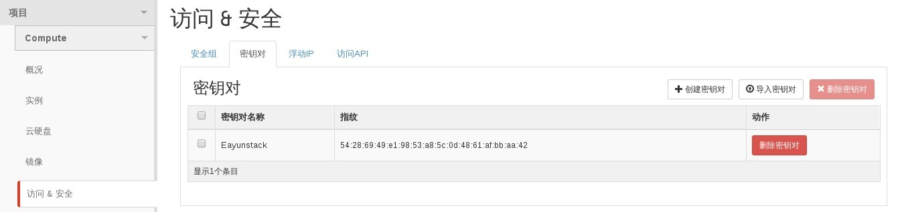

# 查看密钥

### 通过Web horizon查看密钥

* 登录Web horizon登录，点击访问/安全，密钥对，显示密钥对



### 通过命令查看密钥

* 查看密钥执行如下命令

> ```nova keypair-list```

### 示例

```
# nova keypair-list
+------------+-------------------------------------------------+
| Name       | Fingerprint                                     |
+------------+-------------------------------------------------+
| Eayunstack | 54:28:69:49:e1:98:53:a8:5c:0d:48:61:af:bb:aa:42 |
+------------+-------------------------------------------------+
```
