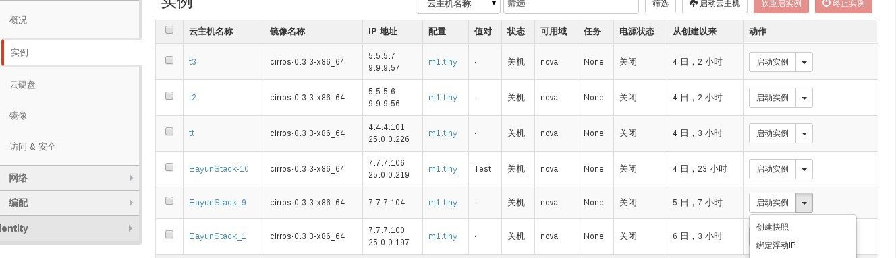
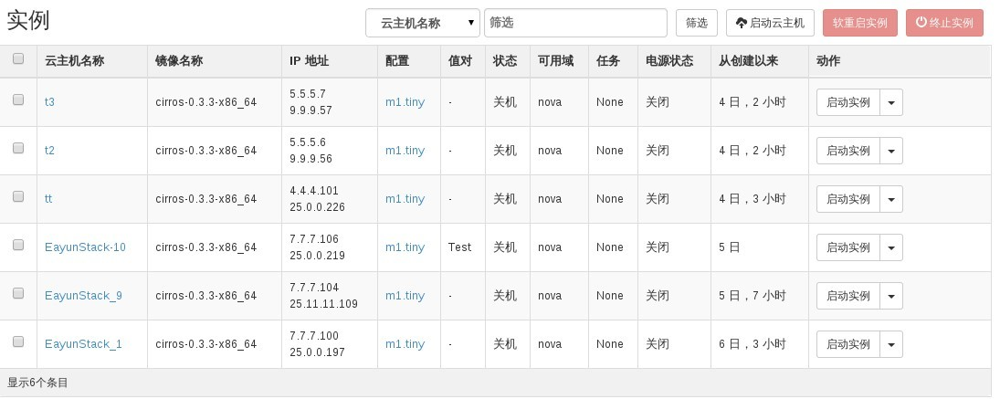
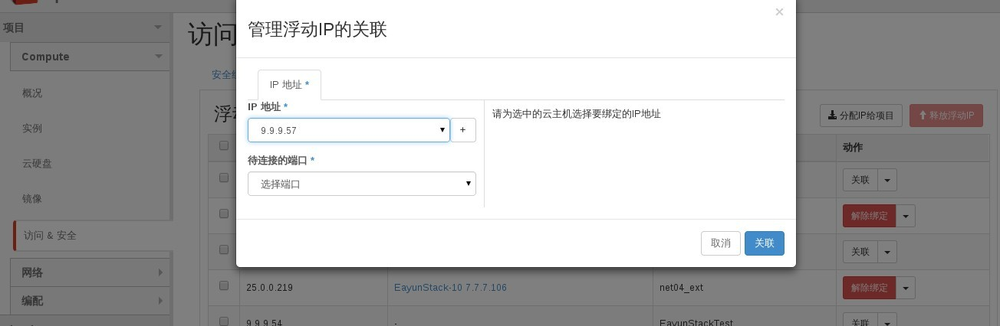

# 给云主机分配floating ip

### 通过Web horizon绑定Floating IP

为云主机分配floating ip提供两种方式分配floating ip地址

* 通过云主机绑定浮动ip地址

点击绑定浮IP



管理浮动IP地址


选择ip地址旁边“+”，分配IP地址（如果IP地址列里有IP地址就不需要分配）


IP地址从pool中分配到IP地址


选择关联IP地址，ip地址将与云主机绑定



* 通过浮动IP关联方式分配浮动ip地址



待连接的端口要选择，一个云主机作为端口进行连接

### 通过命令分配floating ip

* 分配floating ip，执行如下命令

> ```nova floating-ip-associate <server> <address>```

### 示例

```
# nova floating-ip-associate EayunStack-10 25.11.11.109
# nova list
+--------------------------------------+---------------+---------+------------+-------------+----------------------------------------+
| ID                                   | Name          | Status  | Task State | Power State | Networks                               |
+--------------------------------------+---------------+---------+------------+-------------+----------------------------------------+
| 3dbb30cf-8758-4ea3-aeab-3e07cebbb55a | EayunStack-10 | ACTIVE  | -          | Running     | EayunStack_net=7.7.7.106, 25.11.11.109 |
| 1c3fc421-1429-48ae-b18c-16c0bcb9d00d | EayunStack_1  | SHUTOFF | -          | Shutdown    | EayunStack_net=7.7.7.100, 25.0.0.197   |
| 99523d13-6589-4def-98cc-a6d0eeaa6205 | EayunStack_9  | SHUTOFF | -          | Shutdown    | EayunStack_net=7.7.7.104               |
+--------------------------------------+---------------+---------+------------+-------------+----------------------------------------+

```

