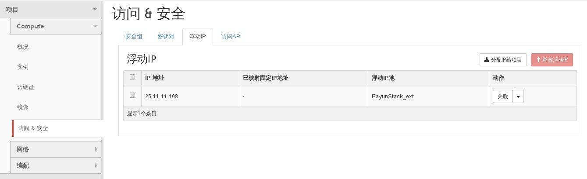

# 删除floating ip

删除floatin ip时，请遵循先对floating ip解除绑定，在进行删除操作

### 通过Web horizon删除Floating IP

* 登录Web horizon点击项目----compute-----访问&安全-----浮动IP---选择浮动IP列中的floating ip地址----释放浮动ip


* 浮动IP地址释放后，在floating IP地址中将删除浮动ip地址




### 通过命令删除floating ip

* 删除floating ip，执行如下命令

> ```nova floating-ip-delete <address>```

### 示例

* 删除floating ip地址

```
# nova floating-ip-delete 9.9.9.58
```

* 查看floating ip地址

```
# nova floating-ip-list
+------------+-----------+-----------+----------------+
| Ip         | Server Id | Fixed Ip  | Pool           |
+------------+-----------+-----------+----------------+
| 9.9.9.57   | -         | 5.5.5.7   | EayunStackTest |
| 25.0.0.197 | -         | 7.7.7.100 | net04_ext      |
| 9.9.9.51   | -         | -         | EayunStackTest |
| 25.0.0.219 | -         | 7.7.7.106 | net04_ext      |
| 9.9.9.54   | -         | -         | EayunStackTest |
| 25.0.0.220 | -         | -         | net04_ext      |
| 9.9.9.56   | -         | 5.5.5.6   | EayunStackTest |
| 25.0.0.226 | -         | 4.4.4.101 | net04_ext      |
+------------+-----------+-----------+----------------+
```
