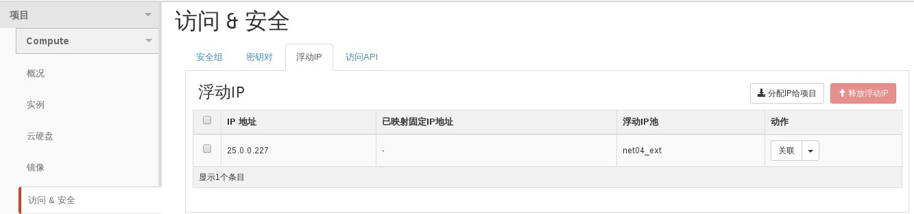

# 查看当前可用floating ip

floating ip 为云主机提供外部网络访问云主机通讯IP地址，为云主机绑定浮动IP地址后，外部网络可与云主机进行操作

### 通过Web horizon查看当前Floating IP

* 登录Web horizon点击项目----compute-----访问&安全-----浮动IP可显示当前可用floating ip地址



### 通过命令查看floating ip

* 查看floating ip，执行如下命令

> ```nova floating-ip-list```

### 示例


```
# nova floating-ip-list
+------------+-----------+-----------+----------------+
| Ip         | Server Id | Fixed Ip  | Pool           |
+------------+-----------+-----------+----------------+
| 9.9.9.57   | -         | 5.5.5.7   | EayunStackTest |
| 25.0.0.197 | -         | 7.7.7.100 | net04_ext      |
| 9.9.9.51   | -         | -         | EayunStackTest |
| 25.0.0.219 | -         | 7.7.7.106 | net04_ext      |
| 9.9.9.54   | -         | -         | EayunStackTest |
| 25.0.0.220 | -         | -         | net04_ext      |
| 9.9.9.56   | -         | 5.5.5.6   | EayunStackTest |
| 25.0.0.226 | -         | 4.4.4.101 | net04_ext      |
+------------+-----------+-----------+----------------+

```


