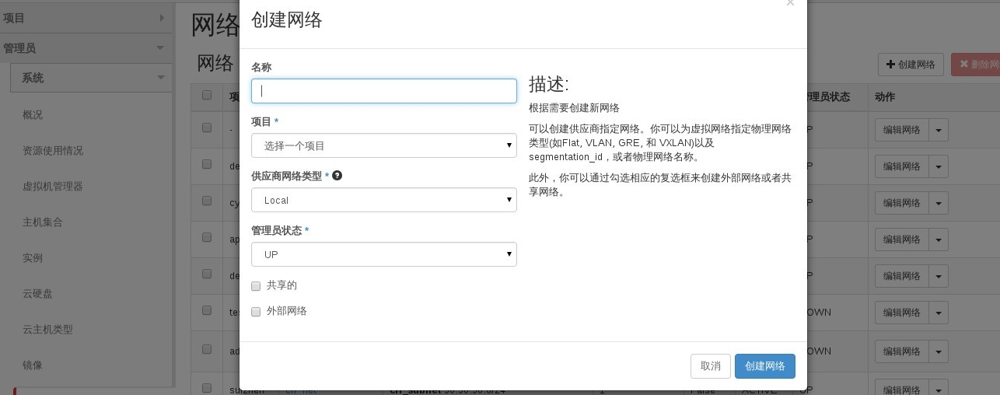
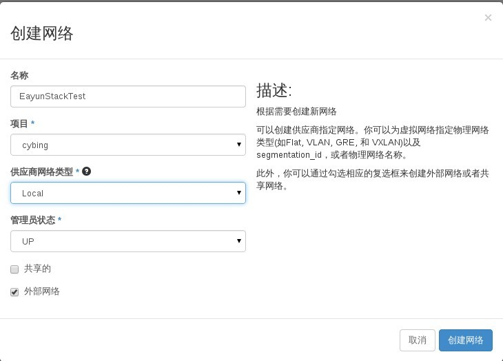
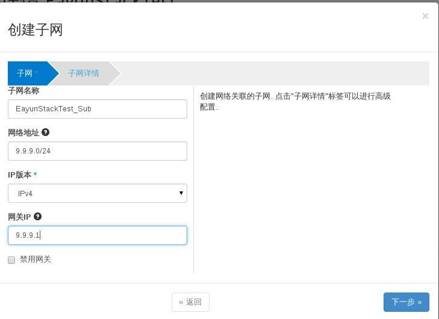
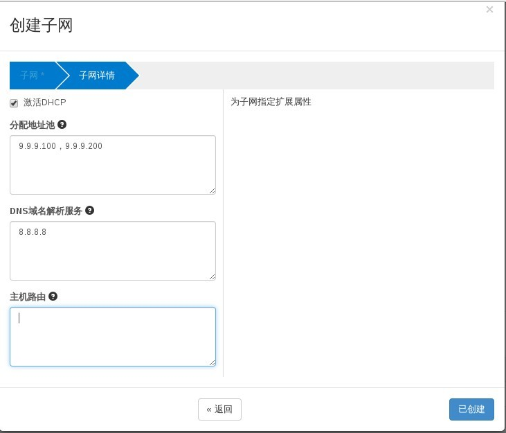

# 创建外部网络

通过外部网络，internet能很方便的接入云主机环境，默认情况下，外部接入时需要调整云主机安全组规则

`在平台中外部网络只能存在一个，但可以在外部网络下建立多个子网，来绑定云主机到不同网络，外部网络由管理员用户创建`

### 使用admin用户通过Web horizon创建外部网络

  外部网络只能在admin项目下进行创建，因此创建外部网络时需使用admin用户登录操作

* 登录Web horizon点击管理员----系统----网络----创建网络

> 填写名称、选择项目、供应商类型、勾选外部网络、点击创建网络

* 点击新建的网络，进入子网创建界面

> 填写子网名称、子网地址、网关

* 下一步，配置子网详情，配置完成后，点击创建

> 外部网络不用勾选dhcp与dns配置

* 点击已创建，创建完成

创建网络时名词说明如下：

|供应网络类型|说明|
|------------|----|
|Local       |本地节点配置的网络，能有效隔绝外部任意网络|
|Flat        |所有实例配置在相同网络，可以与主机共享，没有vlan标记与其它隔离|
|Vlan        |允许用户创建网络添加tag vlan标记|
|XVlan and GRE|支持实例间私密通信，网络路由通信在租户网络之外|

**注意：本平台在搭建时将会自动创建外部网络，因此不需要再次创建外部网络，如有特殊需要可以在外部网络下创建子网
**

