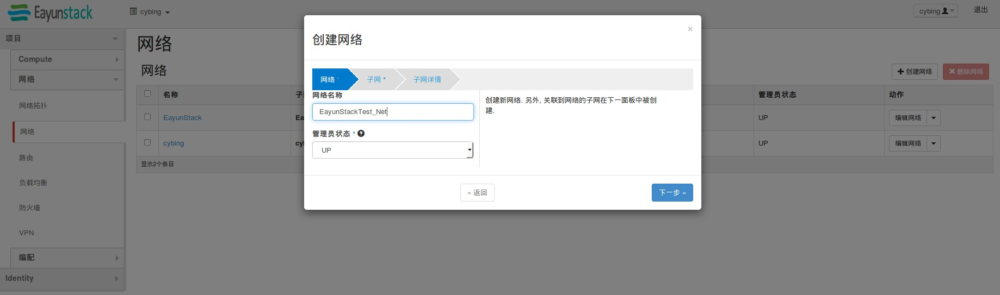
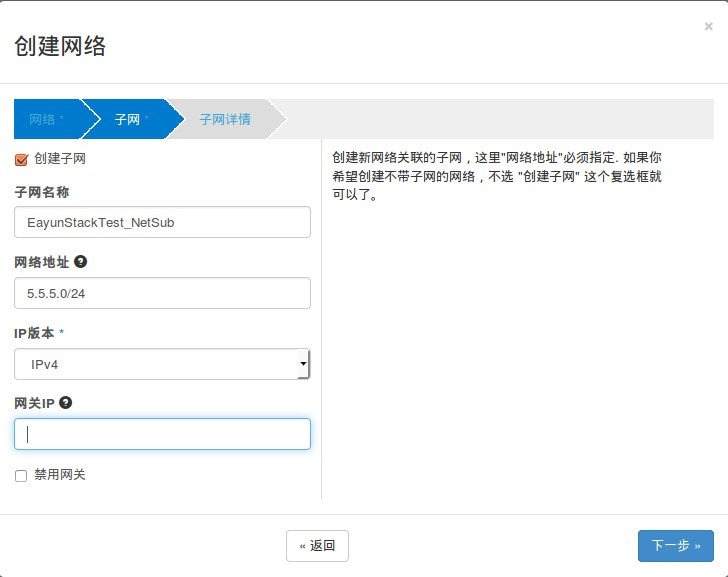

# 创建内部网络

### 通过Web horizon创建内部网络

内部网络每个租户用户都能为自己项目创建一个单独的私有网络，内部网络的dhcp地址池中IP地址将在启动云主机时去获取，获取的IP地址在云主机中能够查看。在不绑定Floating IP时云主机可以访问外部Internet网络，但Internet网络不能访问到云主机

* 使用租户用户登录Web horizon点击项目----网络---网络----创建网络

> 填写名称、管理员状态（UP）状态，点击下一步

* 创建子网，进入子网创建界面

> 根据网络规划填写子网地址，版本与网关信息不需要改变，保持默认

* 点击下一步，进入子网详情页面，填写信息

* 点击已创建，创建完成
