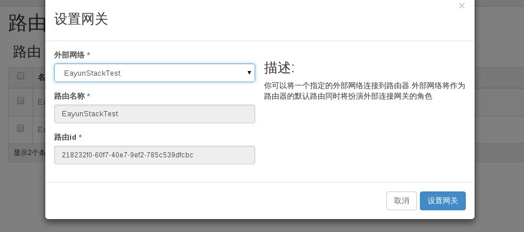
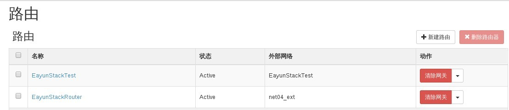
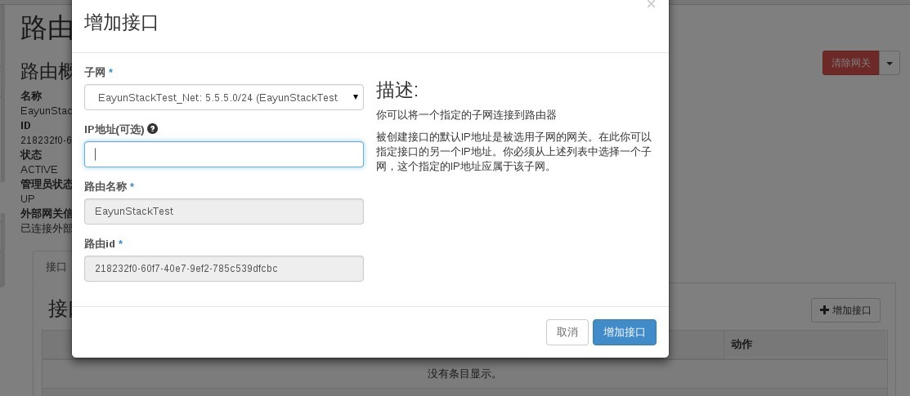
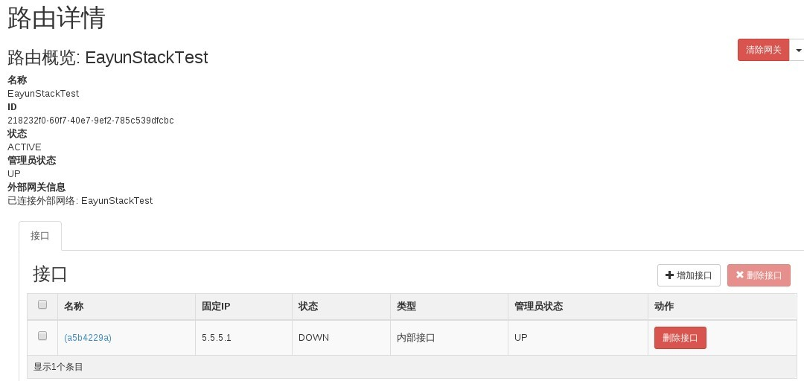
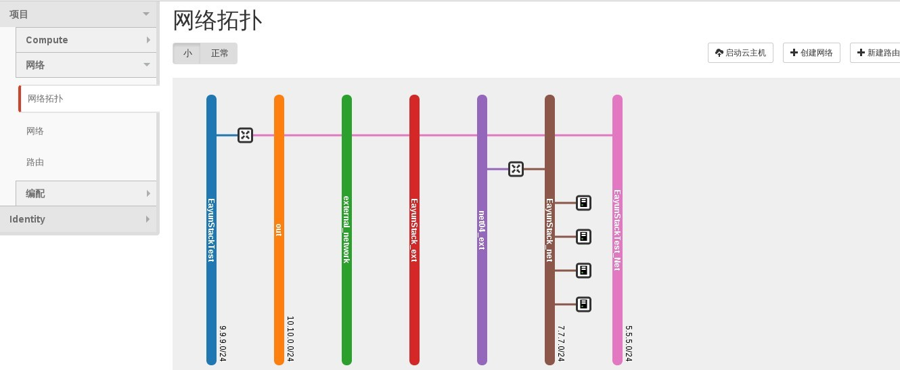
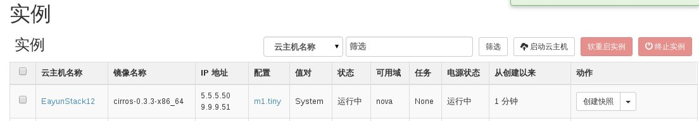

# 外部/内部网络与路由器之间的操作

### 通过Web horizon配置外部/内部网络与路由器之间操作

* 登录Web horizon点击项目----网络---路由---选择路由----设置网关

> 外部网络选择已建好的外部网络或者外部子网名称，用来提供外部网络访问云主机的网络

* 路由与外部网络配置完成

* 选择路由----点击新增接口---选择内部网络

> 当租户网络连接路由器时需要在路由器上点击新增接口接口选择创建的租户网络

* 点击增加接口，路由与内部网络连接配置完成

* 点击网络拓扑标签，查看网络与路由连接情况，此时路由器与新建内部，外部网络连接

* 可通过新建云主机来测试新建网络

