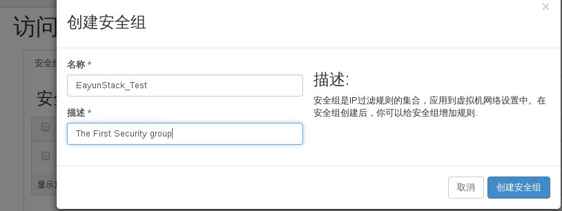
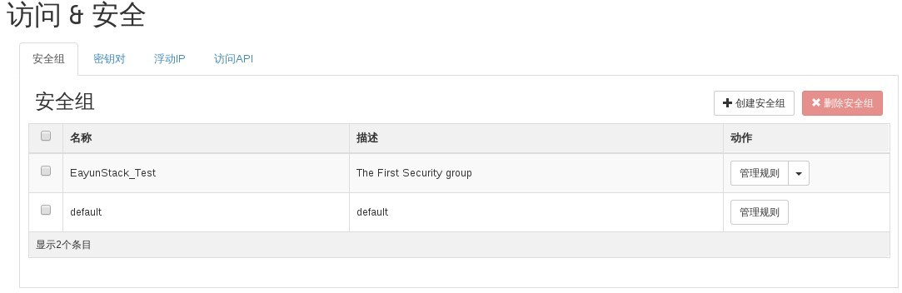

# 创建新的安全组


### 通过Web horizon创建安全组

* Web horizon登录，点击访问/安全----创建安全组---填写（名称，描述）---点击创建安全组，开始创建



* 创建完成后，在访问/安全下面发现新创建安全组，默认创建后无入口规则，外部网络无法进行云主机访问



### 通过命令创建安全组

* 创建安全组，执行如下命令

> ```nova secgroup-create <name> <description>```

### 示例

* 创建安全组
```
nova secgroup-create EayunStack "The Second Security group"
+--------------------------------------+------------+---------------------------+
| Id                                   | Name       | Description               |
+--------------------------------------+------------+---------------------------+
| 9de9aa92-092d-40ee-aa82-0803f97eaf68 | EayunStack | The Second Security group |
+--------------------------------------+------------+---------------------------+
```
