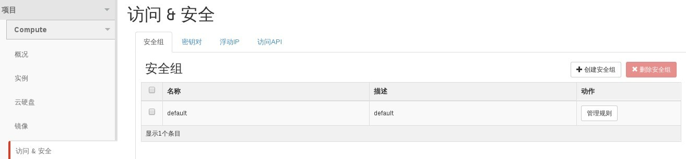
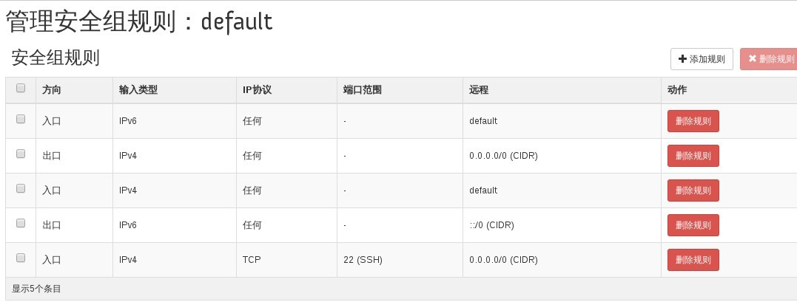

# 查看当前安全组

### 通过Web horizon创查看安全组

* 登录Web horizon界面，点击访问/安全，显示安全组信息。默认情况下只有一个安全组



* 查看安全组详细信息，点击管理规则，即可显示详细信息




### 通过命令查看安全组

* 查看安全组信息，执行如下命令

> ```nova secgroup list```

### 示例

* 查看安全组

```
nova secgroup-list
+--------------------------------------+----------+---------------+
| Id                                   | Name     | Description   |
+--------------------------------------+----------+---------------+
| a370d47f-142d-4022-826c-6b26985af630 | coffee_s | test, nothing |
| 56b83d6a-476f-4aec-b0c7-a2593266bcc2 | default  | default       |
+--------------------------------------+----------+---------------+
```
* 查看安全组详细信息

```
nova secgroup-list-rules default
+-------------+-----------+---------+-----------+--------------+
| IP Protocol | From Port | To Port | IP Range  | Source Group |
+-------------+-----------+---------+-----------+--------------+
| icmp        | -1        | -1      | 0.0.0.0/0 |              |
| tcp         | 22        | 22      | 0.0.0.0/0 |              |
|             |           |         |           | default      |
|             |           |         |           | default      |
+-------------+-----------+---------+-----------+--------------+
```
