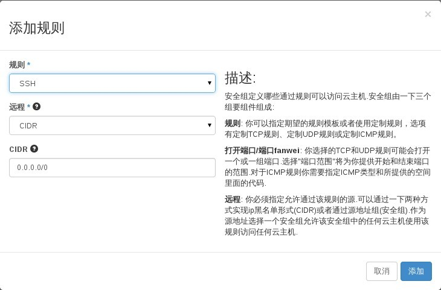
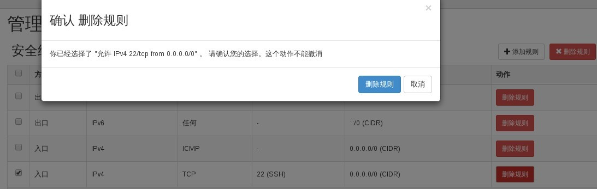
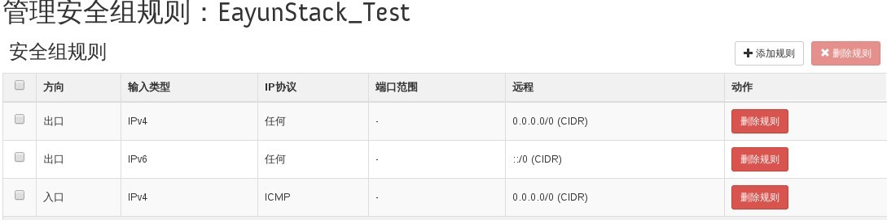

# 安全组规则管理

### 通过Web horizon安全组规则管理

* 登录Web horizon登录，点击访问/安全，管理规则
* 点击添加规则---配置规则---添加



* 删除规则，选择规则，点击删除



* 查看规则，发现删除的规则已经不存在




### 通过命令管理安全组规则

* 添加安全组规则
> ```nova secgroup-add-rule <secgroup> <ip-proto> <from-port> <to-port> <cidr>```

* 删除安全组规则
> ```nova secgroup-delete-rule <secgroup> <ip-proto> <from-port> <to_port><cidr>```

###示例
* 安全组添加规则

```
nova secgroup-add-rule EayunStack_Test tcp 443 443 0.0.0.0/0
+-------------+-----------+---------+-----------+--------------+
| IP Protocol | From Port | To Port | IP Range  | Source Group |
+-------------+-----------+---------+-----------+--------------+
| tcp         | 443       | 443     | 0.0.0.0/0 |              |
+-------------+-----------+---------+-----------+--------------+
```

* 安全组删除规则

```
nova secgroup-delete-rule EayunStack_Test tcp 443 443 0.0.0.0/0
+-------------+-----------+---------+-----------+--------------+
| IP Protocol | From Port | To Port | IP Range  | Source Group |
+-------------+-----------+---------+-----------+--------------+
| tcp         | 443       | 443     | 0.0.0.0/0 |              |
+-------------+-----------+---------+-----------+--------------+
```

