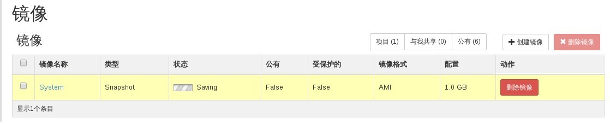
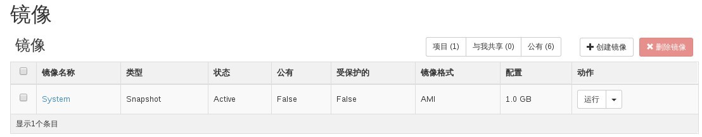

# 创建快照

### 通过Web horizon创建快照

* 登录Web horizon界面，点击实例----选择实例----创建快照，开始创建快照


* 快照创建过程中，处于保存状态



* 快照创建完成




### 通过命令创建快照

* 创建快照，执行如下命令

> ```nova image-create --poll INSTANCENAME SNAPNAME```

### 示例

```
#nova image-create --poll EayunStack_1 EayunStack_1Snap

Server snapshotting... 100% complete
Finished
```

```
# nova image-list
+--------------------------------------+---------------------+--------+--------------------------------------+
| ID                                   | Name                | Status | Server                               |
+--------------------------------------+---------------------+--------+--------------------------------------+
| 7c9ada94-ad90-453c-ba0b-c5e9ec77576d | EayunStack_1Snap    | ACTIVE | 1c3fc421-1429-48ae-b18c-16c0bcb9d00d |
| 736273f1-33f2-4edf-a98f-4c2f10ee9104 | System              | ACTIVE | 1c3fc421-1429-48ae-b18c-16c0bcb9d00d |
| b3ed9a61-dd1b-4933-9f6e-9fda0801ee32 | TestVM              | ACTIVE |                                      |
| b30f6d3b-04ee-4d62-b66f-f2ee80acfa21 | centos64            | ACTIVE |                                      |
| b6ad5913-d42c-49e7-a517-8716811ab766 | cirros-0.3.3-cloud  | ACTIVE |                                      |
| 82bff63e-62fa-4f6d-acca-97fdd58e4759 | cirros-0.3.3-x86_64 | ACTIVE |                                      |
| 832393e3-1676-4d28-853f-a7948d358555 | coffee_test_01      | ACTIVE |                                      |
| 58e9e316-31af-4318-bf0f-d576b70fedfe | ubuntu1404          | ACTIVE |                                      |
+--------------------------------------+---------------------+--------+--------------------------------------+

```
