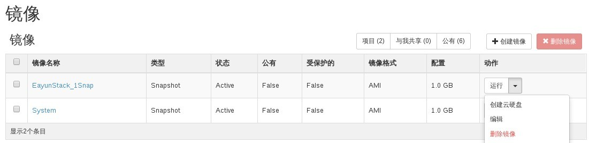
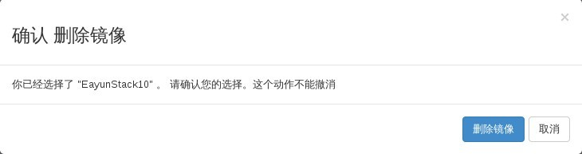

# 删除快照

### 通过Web horizon删除快照

* 登录Web horizon界面，点击镜像----选择镜像----删除镜像，来删除快照



* 确认删除镜像，点击删除镜像




* 删除完成后，镜像界面中快照已经删除

### 通过命令删除快照

* 删除快照，执行如下命令

> ```nova image-delete <image>```

### 示例

```
# nova image-delete EayunStack_1Snap
# nova image-list
+--------------------------------------+---------------------+--------+--------+
| ID                                   | Name                | Status | Server |
+--------------------------------------+---------------------+--------+--------+
| b3ed9a61-dd1b-4933-9f6e-9fda0801ee32 | TestVM              | ACTIVE |        |
| b30f6d3b-04ee-4d62-b66f-f2ee80acfa21 | centos64            | ACTIVE |        |
| b6ad5913-d42c-49e7-a517-8716811ab766 | cirros-0.3.3-cloud  | ACTIVE |        |
| 82bff63e-62fa-4f6d-acca-97fdd58e4759 | cirros-0.3.3-x86_64 | ACTIVE |        |
| 832393e3-1676-4d28-853f-a7948d358555 | coffee_test_01      | ACTIVE |        |
| 58e9e316-31af-4318-bf0f-d576b70fedfe | ubuntu1404          | ACTIVE |        |
+--------------------------------------+---------------------+--------+--------+

```


