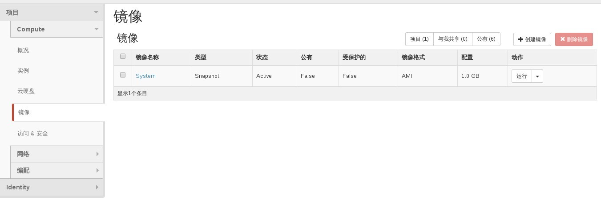

# 查看已有快照


### 通过Web horizon查看已有快照

* 登录Web horizon界面，点击镜像界面，显示镜像信息，其中类型为snapshot为快照镜像




### 通过命令查看快照

* 查看快照，执行如下命令

> ```nova image-list```

###示例

```
nova image-list
+--------------------------------------+----------------------------+--------+--------------------------------------+
| ID                                   | Name                       | Status | Server                               |
+--------------------------------------+----------------------------+--------+--------------------------------------+
| 66bab299-da85-45d4-941f-a316f28ce66e | EayunStack_Test            | ACTIVE |                                      |
| 736273f1-33f2-4edf-a98f-4c2f10ee9104 | System                     | ACTIVE | 1c3fc421-1429-48ae-b18c-16c0bcb9d00d |
| b3ed9a61-dd1b-4933-9f6e-9fda0801ee32 | TestVM                     | ACTIVE |                                      |
| 554913b8-35cb-41c5-92bf-3a9e4c65b9c0 | apporc_image_01-shelved    | ACTIVE | 5062f563-ede5-470c-ac16-6633ef135a43 |
| e4ff0834-2e50-45c2-943f-3409aa667c36 | apporc_snapshot_01         | ACTIVE |                                      |
| b30f6d3b-04ee-4d62-b66f-f2ee80acfa21 | centos64                   | ACTIVE |                                      |
| b6ad5913-d42c-49e7-a517-8716811ab766 | cirros-0.3.3-cloud         | ACTIVE |                                      |
| 8f40451d-2d0b-4038-aa2e-f87cd667d50c | cirros-0.3.3-p             | ACTIVE |                                      |
| 82bff63e-62fa-4f6d-acca-97fdd58e4759 | cirros-0.3.3-x86_64        | ACTIVE |                                      |
| 0efb0c30-3907-4172-9279-6c7cb6833cf3 | cirros-0.3.4-p             | ACTIVE |                                      |
| 70876246-63ba-4951-af96-2e55742fe890 | cirros_2015_04_16_08_52_15 | ACTIVE |                                      |
| c5fed651-0284-4259-8f4c-d90459ec329d | cirros_mm                  | ACTIVE |                                      |
| 692f35f5-404c-4d1e-a690-ddec125c074c | coffee-demo                | ACTIVE |                                      |
| 9e57fc28-5251-400b-ba7a-e3fdc8ed6bea | coffee_006_snp             | ACTIVE | a2ca5a65-e674-4ac6-b1a4-faf9e07ca0a5 |
| bffeb200-0e7f-4c56-967a-9a77585117cc | coffee_ami_snp             | ACTIVE | ac01c5e7-1d1e-4774-a1e0-dd74932d2b4c |
| 832393e3-1676-4d28-853f-a7948d358555 | coffee_test_01             | ACTIVE |                                      |
| 730da721-250a-4e45-9b1b-4f0b03b0b7a8 | coffee_upload              | ACTIVE |                                      |
| 29e229da-65d2-4127-8729-164ffdbaa5c4 | for_boot                   | ACTIVE | ea1ea3cd-a6f9-40e6-a9de-4e6115c33570 |
| ffce7947-04f3-4f70-a4de-677d316ada4b | from_url                   | ACTIVE |                                      |
| abcee9a8-a0c7-465b-a6e9-dc67666c480c | instance_snp               | ACTIVE |                                      |
| c46dfd0d-9407-4e58-a2fd-df0793037f6d | snp_coffee_000             | ACTIVE | b13479cb-2ee4-42e5-95a1-4c86b8b0ed55 |
| fd08bc63-e87e-405a-b0ab-d0e810786031 | test                       | ACTIVE |                                      |
| 1d495d51-7933-4173-8457-e23b8e9602e2 | test2                      | ACTIVE | 5062f563-ede5-470c-ac16-6633ef135a43 |
| af12edfe-63d7-488b-b715-ebe87183575f | test_cli                   | ACTIVE |                                      |
| b76cbf24-9f8d-476f-aadd-cc9ca634774c | test_cli_01                | ACTIVE |                                      |
| 0312908d-18ea-4c02-b31e-8687c5a424ee | test_ui                    | ACTIVE |                                      |
| 58e9e316-31af-4318-bf0f-d576b70fedfe | ubuntu1404                 | ACTIVE |                                      |
+--------------------------------------+----------------------------+--------+--------------------------------------+
```

其中server列有类似5062f563-ede5-470c-ac16-6633ef135a43为snapshot

