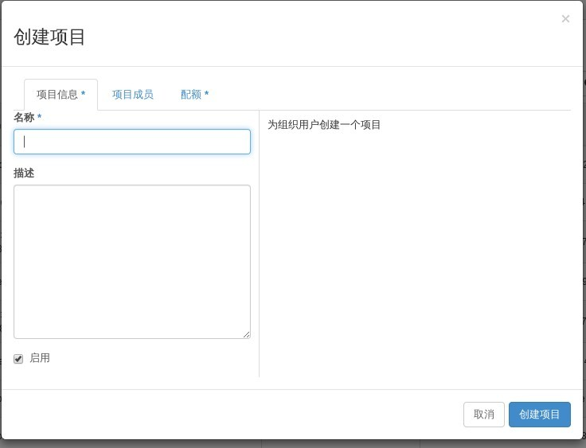
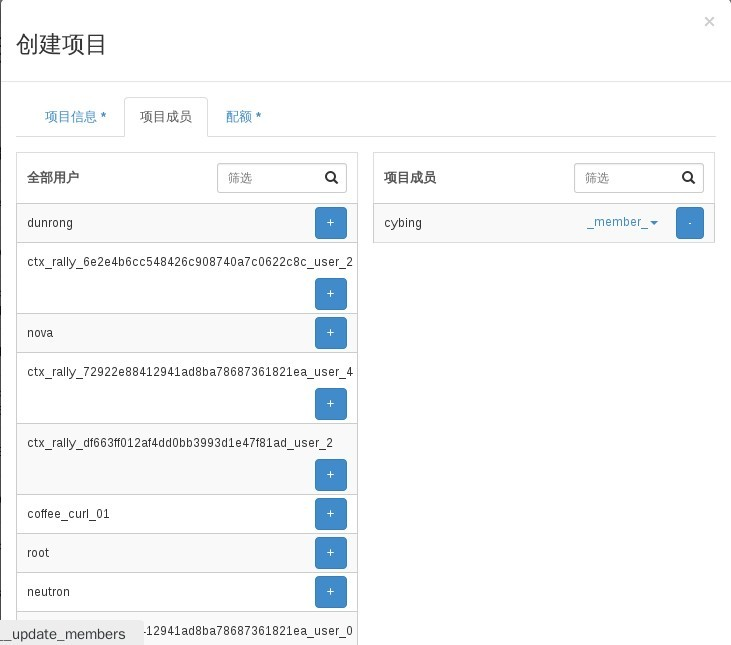
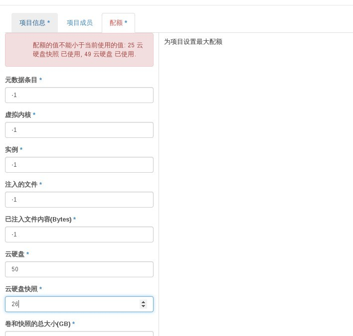

# 创建新项目

### 通过Web horizon查看项目

* 通过Web horizon界面登录，点击identity-----点击项目---点击创建项目



* 填写项目名称、项目成员选择（选择时点击列出成员旁边+号添加）



* 修改配额信息，点击创建项目，开始创建



> (如点击创项目时，提示云硬盘与云快照信息，需根据提示进行修改，修改云硬盘与云快照数大于提示数）

### 通过命令创建项目

* 创建项目，执行如下命令

> ```keystone tenant-create --name <tenant-name> --description <--description <tenant-description>>```

* 查看项目信息
> ``` keystone tenant-list```
> ```nova quota-show --tenant <tenant-name>```

### 示例

```
# keystone tenant-create --name new-project --description 'my new project'
+-------------+----------------------------------+
|   Property  |              Value               |
+-------------+----------------------------------+
| description |          my new project          |
|   enabled   |               True               |
|      id     | 77fb8d582bf54a6b8b840bdd75d55179 |
|     name    |           new-project            |
+-------------+----------------------------------+
```
```
 # nova quota-show --tenant new-project
+-----------------------------+-------+
| Quota                       | Limit |
+-----------------------------+-------+
| instances                   | -1    |
| cores                       | -1    |
| ram                         | -1    |
| floating_ips                | -1    |
| fixed_ips                   | -1    |
| metadata_items              | -1    |
| injected_files              | -1    |
| injected_file_content_bytes | -1    |
| injected_file_path_bytes    | -1    |
| key_pairs                   | -1    |
| security_groups             | -1    |
| security_group_rules        | -1    |
| server_groups               | -1    |
| server_group_members        | -1    |
+-----------------------------+-------+

```
