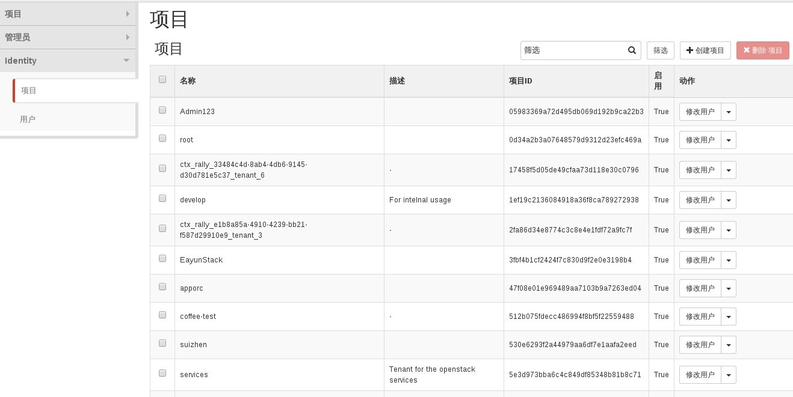
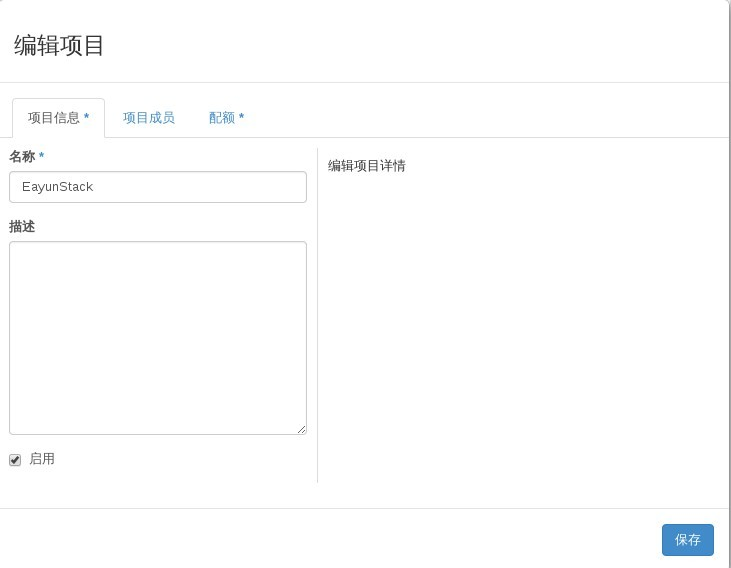
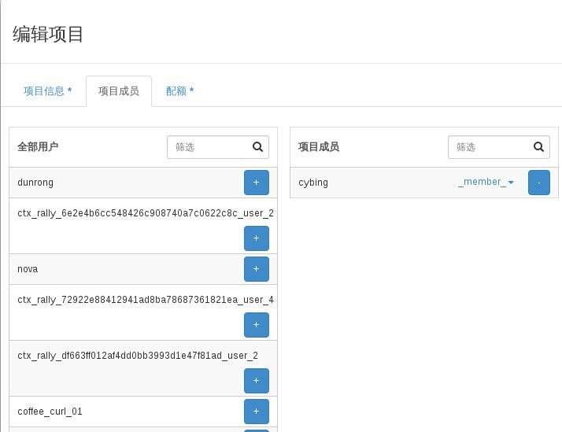
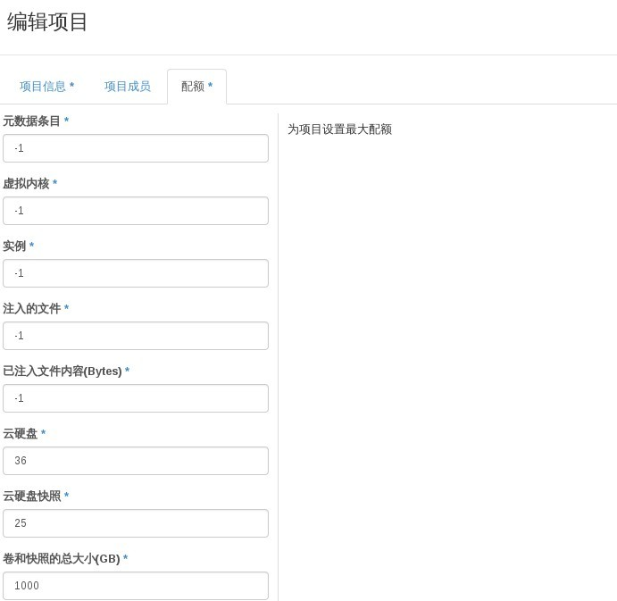

# 查看项目

### 通过Web horizon查看项目

* 登录Web horizon界面----点击identity-----点击项目



* 通过编辑项目，查看项目详细信息（项目信息、项目成员、配额）同时可以在编辑配额中进行修改，保存，进行项目信息调整

项目信息



项目成员



配额



### 通过命令查看项目

* 查看项目，执行下面命令

> ``` keystone tenant-list```

### 示例

```
# keystone tenant-list
+----------------------------------+---------------------------------------------------------+---------+
|                id                |                           name                          | enabled |
+----------------------------------+---------------------------------------------------------+---------+
| 05983369a72d495db069d192b9ca22b3 |                         Admin123                        |   True  |
| 3fbf4b1cf2424f7c830d9f2e0e3198b4 |                        EayunStack                       |   True  |
| f7376cdfe1804f1ab4c30c6c304bf25b |                          admin                          |   True  |
| 47f08e01e969489aa7103b9a7263ed04 |                          apporc                         |   True  |
| fa94029fe22c437195027f4d81de089d |                       coffee-demo                       |   True  |
| 512b075fdecc486994f8bf5f22559488 |                       coffee-test                       |   True  |
| b17a1ad3bf7a421a80681f2de31ca23a | ctx_rally_2cf93771-7ecc-47b5-bb48-643bd9380ef0_tenant_0 |   True  |
| d84ee019600a48d989df39eb244f8713 | ctx_rally_2cf93771-7ecc-47b5-bb48-643bd9380ef0_tenant_1 |   True  |
| a84e7c4e9be249f38d27fc4087388ef5 | ctx_rally_2cf93771-7ecc-47b5-bb48-643bd9380ef0_tenant_2 |   True  |
| c85cbdd1da7d43e2bcfa3239d95b6d37 | ctx_rally_33484c4d-8ab4-4db6-9145-d30d781e5c37_tenant_5 |   True  |
| 17458f5d05de49cfaa73d118e30c0796 | ctx_rally_33484c4d-8ab4-4db6-9145-d30d781e5c37_tenant_6 |   True  |
| 72922e88412941ad8ba78687361821ea | ctx_rally_497fab87-654c-43ef-864f-1ce73292ca8a_tenant_8 |   True  |
| a7005c528d3c4b209b954aa0c6589eb3 | ctx_rally_497fab87-654c-43ef-864f-1ce73292ca8a_tenant_9 |   True  |
| df663ff012af4dd0bb3993d1e47f81ad | ctx_rally_e1b8a85a-4910-4239-bb21-f587d29910e9_tenant_0 |   True  |
| 2fa86d34e8774c3c8e4e1fdf72a9fc7f | ctx_rally_e1b8a85a-4910-4239-bb21-f587d29910e9_tenant_3 |   True  |
| a6759c10b10d472c90b36fd375ebd6b4 | ctx_rally_e1b8a85a-4910-4239-bb21-f587d29910e9_tenant_6 |   True  |
| 6e2e4b6cc548426c908740a7c0622c8c | ctx_rally_e1b8a85a-4910-4239-bb21-f587d29910e9_tenant_7 |   True  |
| 956b2cffd99849ebb88019cd334dc935 | ctx_rally_e1b8a85a-4910-4239-bb21-f587d29910e9_tenant_9 |   True  |
| a41d5cfdc44a4a99886e9d36cc87618b |                          cybing                         |   True  |
| 1ef19c2136084918a36f8ca789272938 |                         develop                         |   True  |
| 0d34a2b3a07648579d9312d23efc469a |                           root                          |   True  |
| 5e3d973bba6c4c849df85348b81b8c71 |                         services                        |   True  |
| 530e6293f2a44979aa6df7e1aafa2eed |                         suizhen                         |   True  |
+----------------------------------+---------------------------------------------------------+---------+

```
