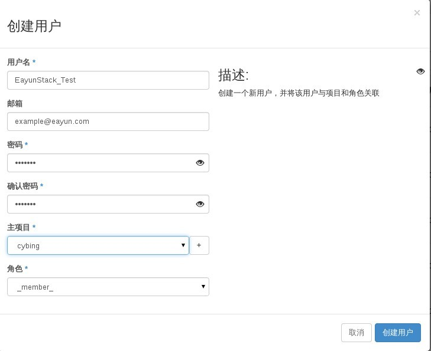
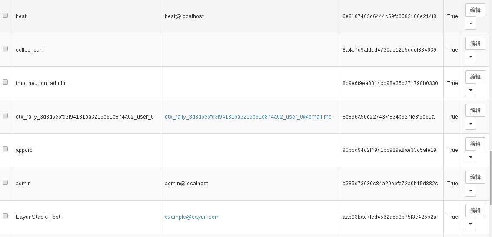

# 创建用户

### 通过Web horizon创建用户

* 登录Web horizon界面----点击identity-----点击用户----创建用户



* 查看创建用户，用户已经创完成



### 通过命令创建用户

* 创建用户，执行如下命令

> ```keystone user-create --name name --pass PASS --email example@eayun.com```

### 示例

```
# keystone user-create --name EayunStack --pass 123.com --email eayunstack@example.com
+----------+----------------------------------+
| Property |              Value               |
+----------+----------------------------------+
|  email   |      eayunstack@example.com      |
| enabled  |               True               |
|    id    | 094e16ff6c69467093c46c8f9228b769 |
|   name   |            EayunStack            |
| username |            EayunStack            |
+----------+----------------------------------+
```


