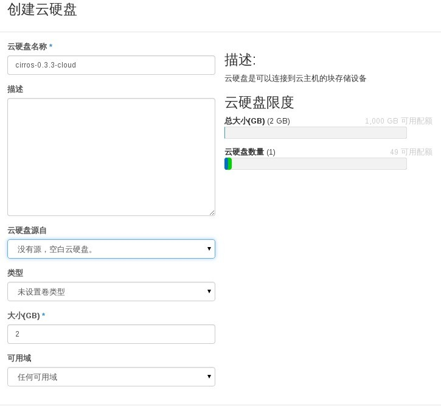
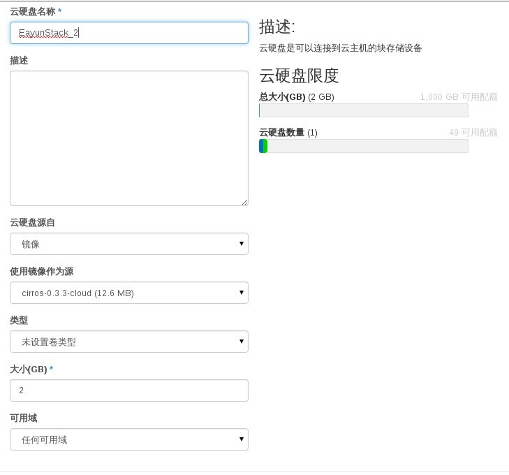
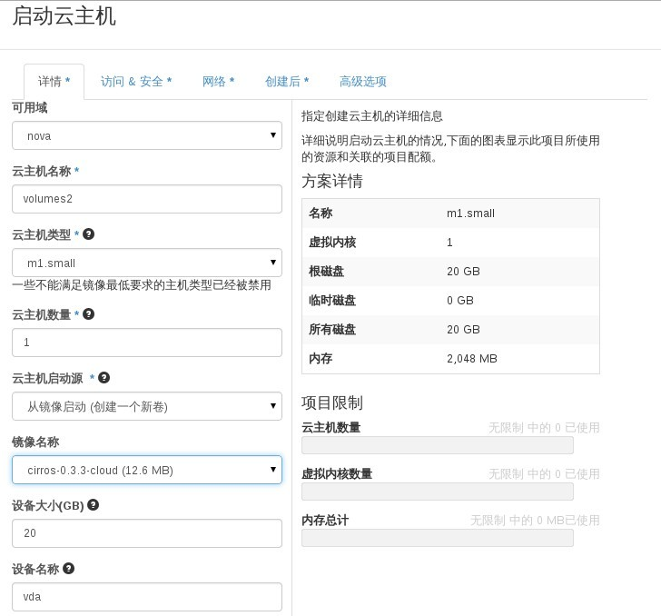
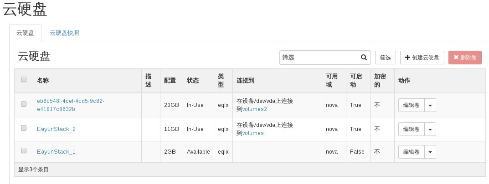

# 创建磁盘卷

### 通过Web horizon创建磁盘卷

* 登录Web horizon点击云硬盘，创建云硬盘，填写名称，创建空白云硬盘（云硬盘源自选空白云硬盘），大小根据实际情况填写，点击创建云硬盘



* 创建带镜像源云硬盘，点击创建云硬盘，填写名称，云硬盘源自（选择镜像），大小根据实际情况填写，点击创建云硬盘



* 通过云主机创建时，选择```从镜像启动创建一个新卷```也能创建一个磁盘卷



* 创建完成后，查看云硬盘



### 通过命令创建磁盘卷

* 创建磁盘卷，执行如命令

> ``` cinder create [--snapshot-id <snapshot-id>]
  [--source-volid <source-volid>] [--image-id <image-id>]
  [--display-name <display-name>]
  [--display-description <display-description>]
  [--volume-type <volume-type>]
  [--availability-zone <availability-zone>]
  [--metadata [<key=value> [<key=value> ]]]
  <size>```


### 示例

* 创建空白磁盘卷

```
# cinder create --display-name myvolume 1
+---------------------+--------------------------------------+
|       Property      |                Value                 |
+---------------------+--------------------------------------+
|     attachments     |                  []                  |
|  availability_zone  |                 nova                 |
|       bootable      |                false                 |
|      created_at     |      2015-04-28T09:36:55.249160      |
| display_description |                 None                 |
|     display_name    |               myvolume               |
|      encrypted      |                False                 |
|          id         | 34b601b1-f1d6-42f0-b270-7ef7f8c4f854 |
|       metadata      |                  {}                  |
|         size        |                  1                   |
|     snapshot_id     |                 None                 |
|     source_volid    |                 None                 |
|        status       |               creating               |
|     volume_type     |                 eqlx                 |
+---------------------+--------------------------------------+

```

* 创建带镜像磁盘卷

```
# cinder create --image-id 82bff63e-62fa-4f6d-acca-97fdd58e4759  --display-name EayunTest 10
+---------------------+--------------------------------------+
|       Property      |                Value                 |
+---------------------+--------------------------------------+
|     attachments     |                  []                  |
|  availability_zone  |                 nova                 |
|       bootable      |                false                 |
|      created_at     |      2015-04-28T13:58:57.942159      |
| display_description |                 None                 |
|     display_name    |              EayunTest               |
|      encrypted      |                False                 |
|          id         | 07b5a60a-6a99-4156-8dad-01f38c82e651 |
|       image_id      | 82bff63e-62fa-4f6d-acca-97fdd58e4759 |
|       metadata      |                  {}                  |
|         size        |                  10                  |
|     snapshot_id     |                 None                 |
|     source_volid    |                 None                 |
|        status       |               creating               |
|     volume_type     |                 eqlx                 |
+---------------------+--------------------------------------+

```
* 查看创建磁盘卷

```
# cinder list
+--------------------------------------+-----------+--------------+------+-------------+----------+--------------------------------------+
|                  ID                  |   Status  | Display Name | Size | Volume Type | Bootable |             Attached to              |
+--------------------------------------+-----------+--------------+------+-------------+----------+--------------------------------------+
| 07b5a60a-6a99-4156-8dad-01f38c82e651 | available |  EayunTest   |  10  |     eqlx    |   true   |                                      |
| 34b601b1-f1d6-42f0-b270-7ef7f8c4f854 | available |   myvolume   |  1   |     eqlx    |  false   |                                      |
| 7f84317e-e247-4c0c-aca7-0c1466f168ca | available | EayunStack_1 |  2   |     eqlx    |  false   |                                      |
| e4dd0d07-58b1-4b5a-a097-402246691e7a |   in-use  | EayunStack_2 |  11  |     eqlx    |   true   | 1f5d8953-724f-44af-943b-06956644f419 |
| eb6c548f-4cef-4cd5-9c82-e41817c8632b |   in-use  |              |  20  |     eqlx    |   true   | 5a2256a7-7a68-4f79-9a29-1006b353d046 |
+--------------------------------------+-----------+--------------+------+-------------+----------+--------------------------------------+
```

> （bootable 为true 代表可作为启动磁盘卷）
