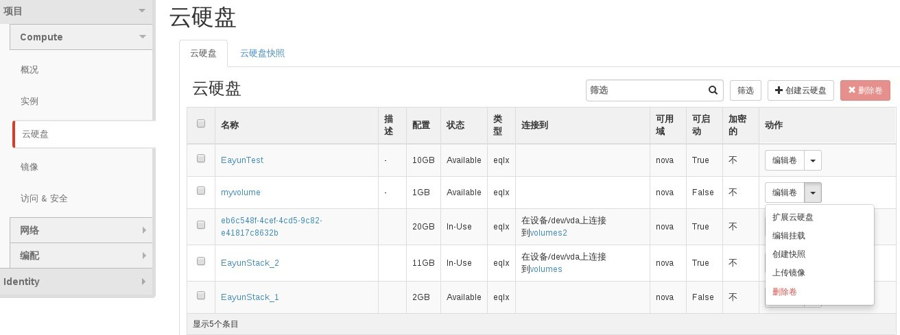
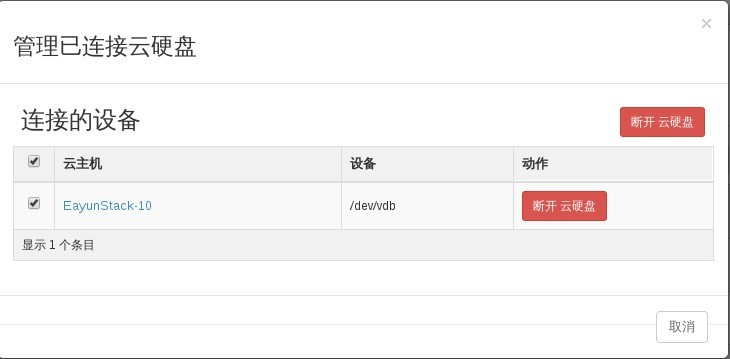
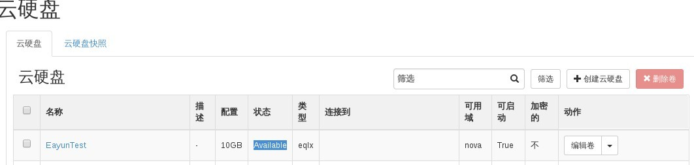

# 卸载磁盘卷

### 通过Web horizon卸载磁盘卷

* 登录Web horizon点击云硬盘，选择云硬盘，点击编辑旁边小三角，编辑挂载



* 连接的设备，点击断开云硬盘，断开云硬盘



* 卸载云硬盘后，该云硬盘处于Available状态，连接到项为空



### 通过命令卸载磁盘卷

* 卸载磁盘卷，执行如命令

> ```nova volume-detach <server> <volume>```

(server 为云主机ID，volume 为磁盘卷ID)

### 示例

```
# nova volume-detach 1c3fc421-1429-48ae-b18c-16c0bcb9d00d 34b601b1-f1d6-42f0-b270-7ef7f8c4f854
# cinder list
+--------------------------------------+-----------+--------------+------+-------------+----------+--------------------------------------+
|                  ID                  |   Status  | Display Name | Size | Volume Type | Bootable |             Attached to              |
+--------------------------------------+-----------+--------------+------+-------------+----------+--------------------------------------+
| 07b5a60a-6a99-4156-8dad-01f38c82e651 | available |  EayunTest   |  10  |     eqlx    |   true   |                                      |
| 34b601b1-f1d6-42f0-b270-7ef7f8c4f854 | available |   myvolume   |  1   |     eqlx    |  false   |                                      |
| 7f84317e-e247-4c0c-aca7-0c1466f168ca |   in-use  | EayunStack_1 |  2   |     eqlx    |  false   | 1f5d8953-724f-44af-943b-06956644f419 |
| e4dd0d07-58b1-4b5a-a097-402246691e7a |   in-use  | EayunStack_2 |  11  |     eqlx    |   true   | 1f5d8953-724f-44af-943b-06956644f419 |
| eb6c548f-4cef-4cd5-9c82-e41817c8632b |   in-use  |              |  20  |     eqlx    |   true   | 5a2256a7-7a68-4f79-9a29-1006b353d046 |
+--------------------------------------+-----------+--------------+------+-------------+----------+--------------------------------------+
```
