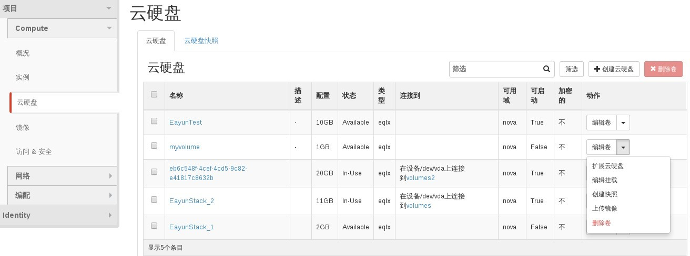

# 挂载磁盘卷

### 通过Web horizon创建磁盘卷

* 登录Web horizon点击云硬盘，选择云硬盘，点击编辑旁边小三角，编辑挂载



* 在连接到云主机界面，选择云主机，然后点击连接到云硬盘


* 云硬盘连接过程处于attach状态


* 云硬盘完成挂载，状态变为In use


* 挂载到云主机中的磁盘需要通过磁盘管理工具进行磁盘管理后，系统才能正常挂载使用，挂载的云硬盘做为云主机的第二块磁盘

### 通过命令挂载磁盘卷

* 挂载磁盘卷，执行如命令

> ```nova volume-attach <server> <volume>```

(server 为云主机的Name 或ID）
(volume 为磁盘卷的ID)


### 示例

```
# nova volume-attach volumes 7f84317e-e247-4c0c-aca7-0c1466f168ca
+----------+--------------------------------------+
| Property | Value                                |
+----------+--------------------------------------+
| device   | /dev/vdb                             |
| id       | 7f84317e-e247-4c0c-aca7-0c1466f168ca |
| serverId | 1f5d8953-724f-44af-943b-06956644f419 |
| volumeId | 7f84317e-e247-4c0c-aca7-0c1466f168ca |
+----------+--------------------------------------+
```
```
# cinder list
+--------------------------------------+-----------+--------------+------+-------------+----------+--------------------------------------+
|                  ID                  |   Status  | Display Name | Size | Volume Type | Bootable |             Attached to              |
+--------------------------------------+-----------+--------------+------+-------------+----------+--------------------------------------+
| 07b5a60a-6a99-4156-8dad-01f38c82e651 | available |  EayunTest   |  10  |     eqlx    |   true   |                                      |
| 34b601b1-f1d6-42f0-b270-7ef7f8c4f854 |   in-use  |   myvolume   |  1   |     eqlx    |  false   | 1c3fc421-1429-48ae-b18c-16c0bcb9d00d |
| 7f84317e-e247-4c0c-aca7-0c1466f168ca |   in-use  | EayunStack_1 |  2   |     eqlx    |  false   | 1f5d8953-724f-44af-943b-06956644f419 |
| e4dd0d07-58b1-4b5a-a097-402246691e7a |   in-use  | EayunStack_2 |  11  |     eqlx    |   true   | 1f5d8953-724f-44af-943b-06956644f419 |
| eb6c548f-4cef-4cd5-9c82-e41817c8632b |   in-use  |              |  20  |     eqlx    |   true   | 5a2256a7-7a68-4f79-9a29-1006b353d046 |
+--------------------------------------+-----------+--------------+------+-------------+----------+--------------------------------------+
```
