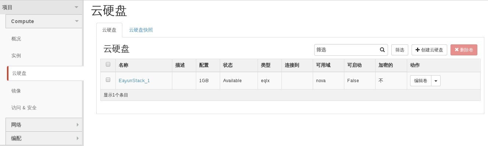
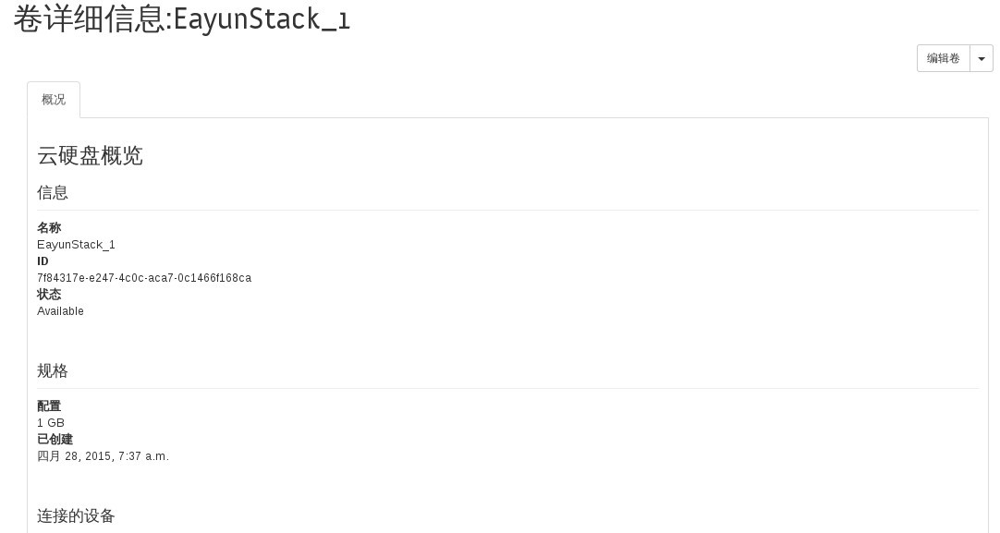
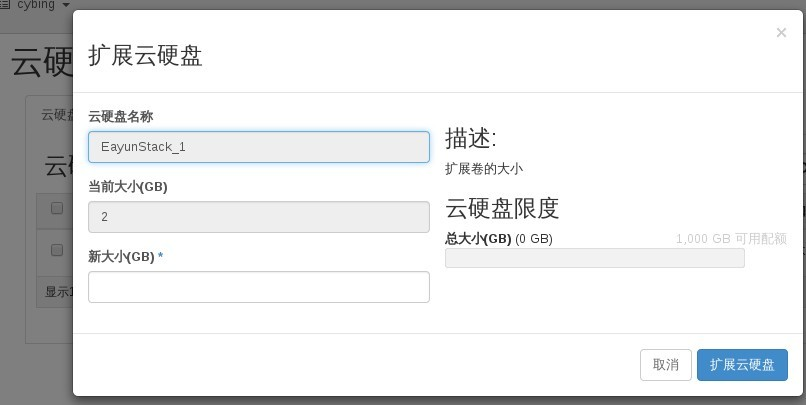

# 查看磁盘卷

### 通过Web horizon查看磁盘卷

* 登录Web horizon界面，点击云硬盘，查看云硬盘



* 查看云硬盘详信息



* 通过编辑卷旁边小三角，可以调整云硬盘大小



### 通过命令查看磁盘卷

* 查看磁盘卷，执行如命令
> ```cinder list```
* 查看磁盘卷详细信息，执行如下命令
> ```cinder show CINDERNAME```
* 查看磁盘卷已配置类型（平台默认配置了两种类型，分别是Dell Eq存储与Ceph存储）
> ```cinder type-list```

### 示例

* 查看磁盘卷

```
# cinder list
+--------------------------------------+-----------+--------------+------+-------------+----------+-------------+
|                  ID                  |   Status  | Display Name | Size | Volume Type | Bootable | Attached to |
+--------------------------------------+-----------+--------------+------+-------------+----------+-------------+
| 7f84317e-e247-4c0c-aca7-0c1466f168ca | available | EayunStack_1 |  2   |     eqlx    |  false   |             |
+--------------------------------------+-----------+--------------+------+-------------+----------+-------------+
```
* 查看磁盘卷详细信息

```
# cinder show EayunStack_1
+---------------------------------------+--------------------------------------+
|                Property               |                Value                 |
+---------------------------------------+--------------------------------------+
|              attachments              |                  []                  |
|           availability_zone           |                 nova                 |
|                bootable               |                false                 |
|               created_at              |      2015-04-28T07:37:39.000000      |
|          display_description          |                                      |
|              display_name             |             EayunStack_1             |
|               encrypted               |                False                 |
|                   id                  | 7f84317e-e247-4c0c-aca7-0c1466f168ca |
|                metadata               |                  {}                  |
|      os-vol-tenant-attr:tenant_id     |   2a227021234d4067a0e5c631d940edf4   |
|   os-volume-replication:driver_data   |                 None                 |
| os-volume-replication:extended_status |                 None                 |
|                  size                 |                  2                   |
|              snapshot_id              |                 None                 |
|              source_volid             |                 None                 |
|                 status                |              available               |
|              volume_type              |                 eqlx                 |
+---------------------------------------+--------------------------------------+
```

* 查看磁盘卷已配置类型

```
# cinder type-list
+--------------------------------------+------+
|                  ID                  | Name |
+--------------------------------------+------+
| 7e41f495-e7f2-47c6-a00e-3008cbd7c97b | eqlx |
| 8c971ae5-cbf4-4d32-a2c8-0df4b0dd6d5a | rbd  |
+--------------------------------------+------+

```
