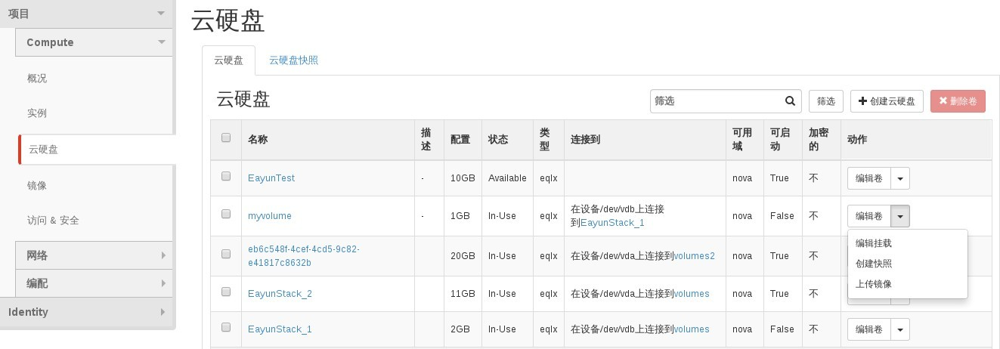
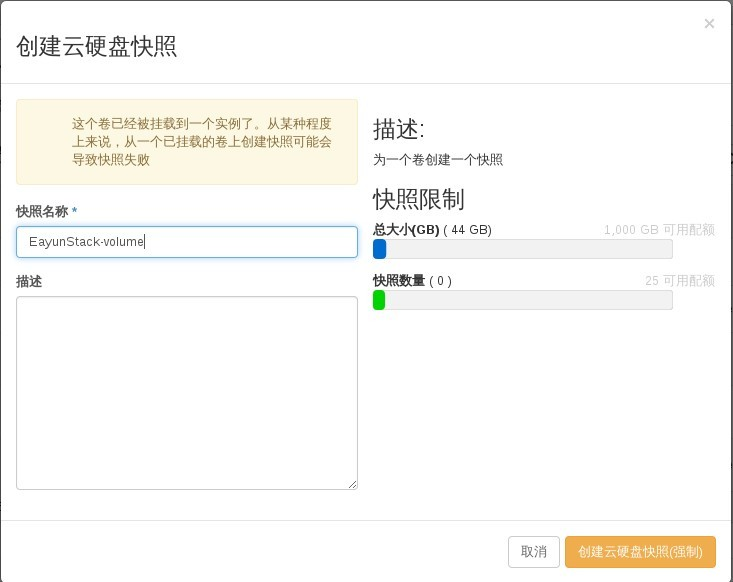
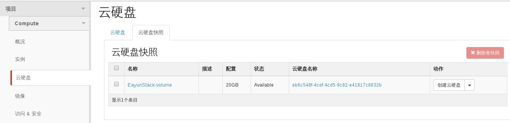

# 创建磁盘卷快照

### 通过Web horizon创建磁盘卷快照

* 登录Web horizon点击云硬盘，选择云硬盘，点击编辑旁边小三角，创建快照



 * 创建云硬盘快照，输入快照名称，点击创建云硬盘快照



* 创建完成后，云硬盘，云硬盘快照界面显示



(可通过云硬盘快照来创建云硬盘，挂载到云主机）

### 通过命令创建磁盘卷快照

* 创建磁盘卷快照，执行如命令

> ```nova volume-snapshot-create [--force <True|False>][--display-name <display-name>][--display-description <display-description>]<volume-id>
```

(nova 调用volume创建快照）

> ```cinder snapshot-create [--force <True|False>][--display-name <display-name>][--display-description <display-description>]<volume-id>
```
(cinder 创建快照）

### 示例

通过nova创建磁盘卷快照

* 查看磁盘卷快照

```
# nova volume-snapshot-list
+--------------------------------------+--------------------------------------+-----------+-------------------+------+
| ID                                   | Volume ID                            | Status    | Display Name      | Size |
+--------------------------------------+--------------------------------------+-----------+-------------------+------+
| 84738d09-6a0c-43a8-bcba-d6f56b26e6d5 | eb6c548f-4cef-4cd5-9c82-e41817c8632b | available | EayunStack-volume | 20   |
+--------------------------------------+--------------------------------------+-----------+-------------------+------+

```
* 创建磁盘卷快照

```
# nova volume-snapshot-create --force=True --display-name=EayunStack_2-bak e4dd0d07-58b1-4b5a-a097-402246691e7a
+---------------------+--------------------------------------+
| Property            | Value                                |
+---------------------+--------------------------------------+
| created_at          | 2015-04-29T04:36:06.619695           |
| display_description | -                                    |
| display_name        | EayunStack_2-bak                     |
| id                  | eeb568b2-e65f-4f95-bc6f-2b69b3483a2b |
| metadata            | {}                                   |
| size                | 11                                   |
| status              | creating                             |
| volume_id           | e4dd0d07-58b1-4b5a-a097-402246691e7a |
+---------------------+--------------------------------------+
```
* 创建完成后，磁盘卷信息

```
# nova volume-snapshot-list
+--------------------------------------+--------------------------------------+-----------+-------------------+------+
| ID                                   | Volume ID                            | Status    | Display Name      | Size |
+--------------------------------------+--------------------------------------+-----------+-------------------+------+
| 84738d09-6a0c-43a8-bcba-d6f56b26e6d5 | eb6c548f-4cef-4cd5-9c82-e41817c8632b | available | EayunStack-volume | 20   |
| eeb568b2-e65f-4f95-bc6f-2b69b3483a2b | e4dd0d07-58b1-4b5a-a097-402246691e7a | available | EayunStack_2-bak  | 11   |
+--------------------------------------+--------------------------------------+-----------+-------------------+------+
```
