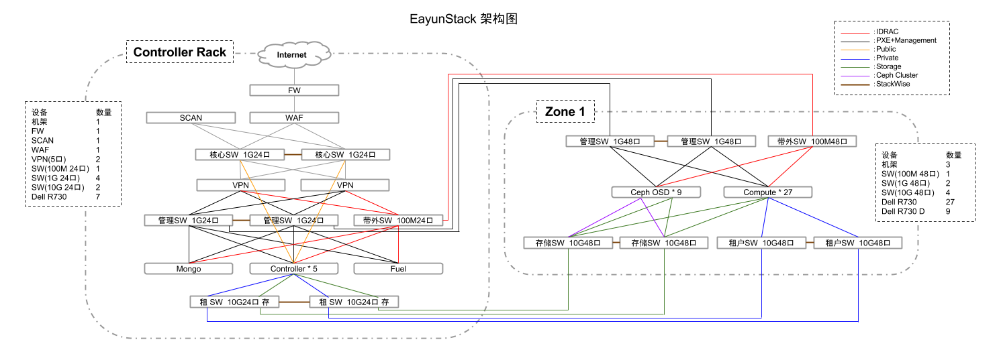

# 硬件环境

### 硬件配置表

根据下表所示内容准备硬件

* 机架（RACK）

  |设备|型号|配置|数量|备注|
|----|----|----|----|----|
|机架|||4||

* 防火墙（FW）

 |设备|型号|配置|数量|备注|
|----|----|----|----|----|
|防火墙|||1||

* Web应用防护系统（WAF）

 |设备|型号|配置|数量|备注|
|----|----|----|----|----|
|WAF|||1||

* 漏洞扫描（SCAN）

 |设备|型号|配置|数量|备注|
|----|----|----|----|----|
|SCAN|||1||

* VPN

 |设备|型号|配置|数量|备注|
|----|----|----|----|----|
|VPN||5口|2||

* 交换机（SW）

  |设备|型号|配置|数量|备注|
|----|----|----|----|----|
|交换机||100M 24口|1||
|交换机||100M 48口|1||
|交换机||1G 24口|4||
|交换机||1G 48口|2||
|交换机||10G 24口|2||
|交换机||10G 48口|4||

* 服务器（SERVER）

  |设备|型号|CPU|MEM|DISK|NIC|数量|备注|
|----|----|----|----|----|----|----|----|
|服务器|||||1G*2|1|fuel|
|服务器|||||1G\*4 10G\*4|5|controller|
|服务器|||||1G\*2 10G\*4|27|compute|
|服务器|||||1G\*2 10G\*4|9|ceph-osd|
|服务器|||||1G*2|1|mongo|

* 网线/光纤

  若干

### 架构图

根据下图所示架构进行环境搭建

 
