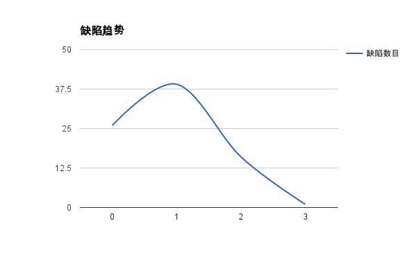

# 缺陷汇总和趋势分析

## 缺陷汇总

|版本号|缺陷数目|解决数目|验证通过数目|退回数目|未解决数目|解决率(%)|
|------|--------|--------|------------|--------|----------|------|
|0|26|-|-|-|-|-|
|1|39|26|21|0|0|100%|
|2|16|27|23|2|10|74.36%|
|3|1|12|5|1|3|81.25%|
|总计|80|65|49|3|13|85%|

> ###### 注：
> * **缺陷数目**：指此版本中产生或发现的缺陷数目；
> * **修复数目**：指此版本中所修复的上个版本或更早版本中的缺陷的数目。
> * **解决率** = (解决数目 + 退回数目)/上个版本的缺陷数目 * 100%

> ###### 说明：
> * 此处的缺陷统计来自 [Redmin](http://192.168.14.5/projects/eayun_eayunstack/issues)。
> * 此统计包含了所有的缺陷：Fuel, OpenStack, Eayunstack-tools。

## 缺陷趋势

通过缺陷趋势图可以看到，随着版本的变更，出现和发现的缺陷呈减少的趋势。

## 版本变更日志

* 请参考 [Eayunstack 版本变更日志](https://github.com/eayunstack/EayunStack-building/blob/master/EayunStack-ISO-ChangeLog)。
