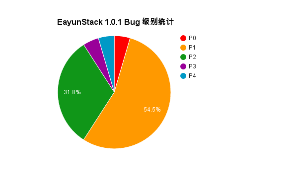
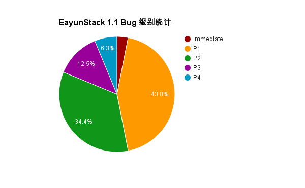

# 缺陷严重程度

> ###### 注：
> 缺陷等级描述如下：
>
> * **Immediate**: 非常严重，严重影响功能使用；
> * **P0**: 很严重，功能无法使用，通过手动解决比较麻烦；
> * **P1**: 比较严重，影响功能的使用，但可以通过手动方式解决；
> * **P2**: 严重，影响功能使用，但该功能不是常用功能；
> * **P2**: 一般，有相应的出现条件，在使用过程中不一定遇到；
> * **P4**: 不严重，不会影响功能的使用。

## EayunStack 1.0.1 版本缺陷等级统计

|缺陷等级|缺陷数目|修复数目|验证数目|
|--------|--------|--------|--------|
|Immediate|0|0|0|
|P0|1|1|1|
|P1|12|12|10|
|P2|7|7|7|
|P3|1|1|1|
|P4|1|1|1|

<i>
EayunStack 1.0.1 缺陷级别分布
</i>

## EayunStack 1.1 版本缺陷等级统计

|缺陷等级|缺陷数目|修复数目|验证数目|
|--------|--------|--------|--------|
|Immediate|1|0|0|
|P0|0|0|0|
|P1|14|10|8|
|P2|11|5|3|
|P3|4|1|1|
|P4|2|1|1|

<i>
EayunStack 1.1 缺陷级别分布
</i>
