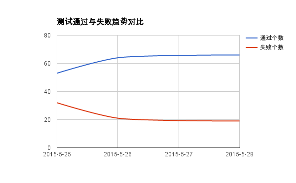
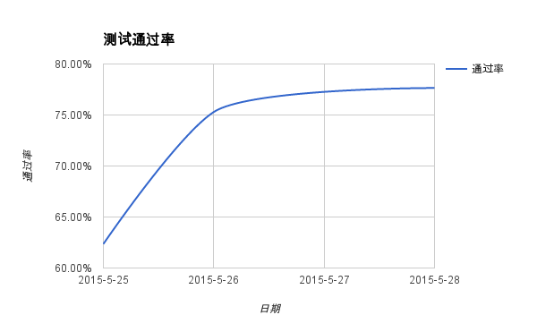
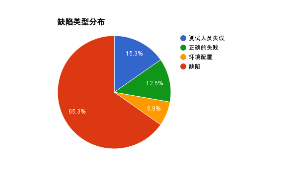

# 版本三

## Rally 测试

|序号|执行时间|用例个数|用例通过个数|失败个数|用例通过率(%)|备注|
|----|--------|--------|------------|--------|-------------|----|
|1|2015-05-25|85|53|32|63.35%||
|2|2015-05-26|85|64|21|75.29%||
|3|2015-05-27|-|-|-|-|未进行测试|
|4|2015-05-28|85|66|19|77.65%||

## 手工测试

|序号|执行时间|用例个数|用例通过个数|缺陷个数|用例通过率(%)|备注|
|----|--------|--------|------------|--------|-------------|----|
|1|-|-|-|-|-|未进行测试|
|2|-|-|-|-|-|未进行测试|
|3|-|-|-|-|-|未进行测试|
|4|-|-|-|-|-|未进行测试|

> ###### 说明：
> 相对于版本1、版本2，版本3 中新增了 Neutron 模块几个高级功能的测试，使用手工测试方法。详情请参考测试用例手册。

# 对 Rally 失败测试的说明

> 失败汇总：

|失败类型|失败个数|
|--------|--------|
|测试人员失误|11|
|正确的失败|9|
|环境配置|5|
|缺陷|47|

> 2015-05-25 失败结果说明：

|失败类型|失败个数|失败原因|
|--------|--------|--------|
|测试人员失误|5|没有考虑配额的问题导致失误|
|正确的失败|3|设计预期结果为错误的测试，测试失败表示测试通过|
|环境配置|5|由于仅有 1 台 Compute 节点，迁移相关的测试失败|
|缺陷|19|功能缺陷，其中：<ul><li>12 个失败与 Neutron 相关，暂时不解决，可查看上游相关 bug:<ul><li>[1] https://bugs.launchpad.net/mos/+bug/1454421</li><li>[2] https://bugs.launchpad.net/neutron/+bug/1382064</li></ul></li><li>4 个失败与 DNS 服务器有关</li><li>3 个失败与 Cinder 的 eqlx 存储相关</ul>|

> 2015-05-26 失败结果说明：

|失败类型|失败个数|失败原因|
|--------|--------|--------|
|测试人员失误|3|没有考虑配额导致的失误|
|正确的失败|3|设计预期结果为错误的测试，测试失败表示测试通过|
|缺陷|15|功能缺陷，其中：<ul><li>12 个失败与 Neutron 相关，暂时不解决，可查看上游相关 bug:<ul><li>[1] https://bugs.launchpad.net/mos/+bug/1454421</li><li>[2] https://bugs.launchpad.net/neutron/+bug/1382064</li></ul></li><li>2 个与 Glance 组件相关，保存镜像超时</li><li>1 个与 Quota 相关</li></ul>|

> 2015-05-28 失败结果说明：

|失败类型|失败个数|失败原因|
|--------|--------|--------|
|测试人员失误|3|没有考虑配额导致的失误|
|正确的失败|3|设计预期结果为错误的测试，测试失败表示测试通过|
|缺陷|13|功能缺陷，其中：<ul><li>12 个失败与 Neutron 相关，暂时不解决，可查看上游相关 bug:<ul><li>[1] https://bugs.launchpad.net/mos/+bug/1454421</li><li>[2] https://bugs.launchpad.net/neutron/+bug/1382064</li></ul></li><li>1 个与 Glance 组件相关，保存镜像超时</li></ul>|
