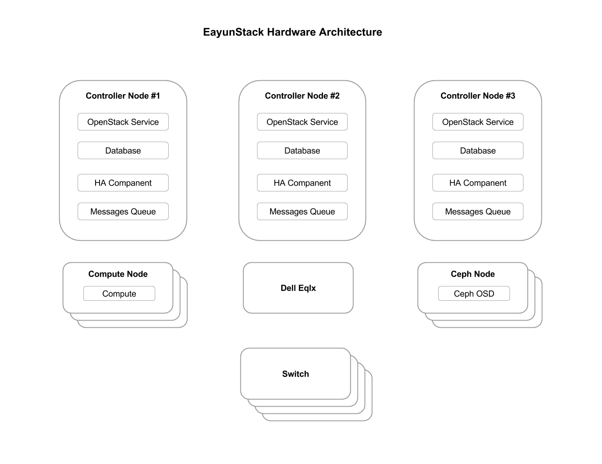

# 硬件环境

## 硬件需求
目前测试环境的硬件架构如下:

| 资源 |数量 | 规格型号 | 功能 | 其它 |
| ---- | ----| -------- | ---- | ---- |
| 部署服务器 | 1 | CPU： \>= 1 \* 4 cores  内存： \>= 8 GB  硬盘： \>= 300 GB （可用空间） | 部署服务 | 至少一块千兆网卡 |
| 控制(网络)节点服务器 | \>=3 | 服务器： R720  CPU： \>= 2 \* 6 cores  内存： \>= 64 GB  硬盘： \>= 1TB （可用空间，RAID5 ）| <ul><li>控制和网络服务</li><li>ceph monitor 服务</li></ul> | 至少四块网卡,　两块万兆两块千兆 |
| 计算节点服务器 | \>=2 | 服务器： R720  CPU： \>= 2 \* 8 cores  内存： \>= 128 GB  硬盘： \>= 500GB （可用空间， RAID5 ）  **本栏参数需根据虚拟机数目进行调整** | 计算服务 | 至少3块网卡,一块千兆,两块万兆, 节点数量可按需扩展 |
| 分布式存储服务器 | \>=3 | 服务器： R720  CPU： \>= 1 \* 4 cores  内存： \>= 32 GB  硬盘： <ul><li>系统盘， \>= 500 GB （可用空间， RAID5 ）</li><li>ceph journal ， \>= 2 \* 64GB （可选配置，使用 SSD ，可以提高性能)</li><li>ceph osd ，\>= 6 \* 3 TB</li></ul> **本栏参数需根据存储量进行调整** | 高性能, 可扩展的分布式存储ceph | 至少两块网卡,一个千兆,一个万兆 |
| 高性能存储服务器 | 1 | Dell eqlx ps6210 | 高性能的存储 | 至少两块万兆网卡 |
| 千兆交换机 | \>=2 || 整合eayunstack提供HA的网络||
| 万兆交换机 | \>=2 || 整合eayunstack提供HA的存储网络|||

部分说明如下:

* 控制服务和网络服务包含在一起, 不单独使用物理主机用于网络服务
* 控制服务器最少需要四块网卡, 管理网络(包含PXE网络), 租户网络, 外网, 存储网(用于ceph), 考虑到未来增加监控功能, 最好把 PXE 网络独立出来
* 计算服务器至少三块网卡, 用于管理网络, 租户网络, 存储网络
* 千兆和万兆交换机至少各需要两个用于结合openstack做交换机的 HA
* 计算节点虚拟机数目与CPU性能有关联关系, 构建两者关系的为overcommit ratio值, 具体取决于虚拟机的负载情况
* ceph存储服务器至少要两块网卡, 用于内部数据同步服务和对外存储服务
* ceph存储服务器, 每1TB的ceph osd空间需有1GB内存, 每有一个ceph osd进程需有0.5个CPU核心

## 部署规划

对控制节点和计算节点的硬件资源除了上述要求, 具体实施的时候需要参考以下说明:

* 除 ceph 节点外, 其他节点的硬盘都做 RAID 5
* ceph 节点系统盘做 RAID 5, osd 盘不做任何 RAID
* 交换机采用混接的方式配合 openstack 的 HA 方式做高可用, 不采用全网冗余的方式
