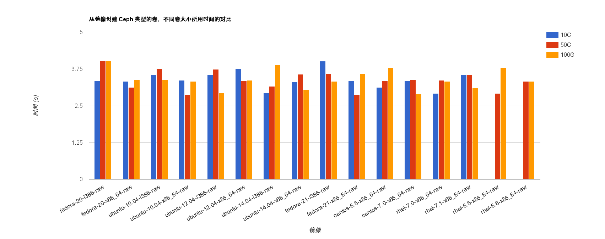

# EayunStack 环境性能

## 创建云主机的性能

### 从镜像创建云主机

* 从镜像启动并使用不同的类型创建云主机，结果如下：

<i>从镜像启动云主机，不同 Flavor 所用时间对比</i>

> ###### 说明：
> * 创建时使用了不同的 Flavor，详细信息请参考[创建云主机的性能](../test_statistic/nova.md)章节中对 Flavor 的说明。

### 从卷创建云主机

<i>从 Ceph 类型的卷创建不同 Flavor 的云主机</i>

<i>从 Eqlx 类型的卷创建不同 Flavor 的云主机</i>

> ###### 说明：
> * 虽然在测试时指定了云主机的规格，实际通过卷创建云主机与所指定的规格**无关**。

### 不同创建方式的对比

<i>不同创建方式所用时间的对比</i>

> ###### 说明：
> * 上图中的数据选择了 m1.small 的云主机规格进行比较；
> * m1.small 中磁盘的大小为 20G，从卷创建云主机时，指定卷的大小为 20G，具有可比性。

## 创建卷的性能

### 创建空卷

创建 Ceph 和 Eqlx 类型的空卷，结果如下图所示：

> #### 结果：
> * 由上图提供的信息可知：
>   * 创建空卷时，创建两种类型的卷使用的时间差别不大，大约在 2.7s 左右；
>   * 创建不同大小的卷所用的时间差别不大（最大仅仅相差 0.2s 左右）。

### 从镜像创建卷

#### 创建不同大小的卷所用时间对比

* Ceph 测试数据：

<i>创建不同大小的 Ceph 卷所用时间</i>

> ###### 说明：
> * 图中的数据对镜像的大小进行了排列；
> * 图中 *rhel-6.5-x86_64-raw* 和 *rhel-6.6-x86_64-raw* 镜像创建 10G 大小的卷失败，原因是此两个镜像大小为 16G，无法创建小于镜像大小的卷；
> * 测试失败，则将时间设置为 0。

* Eqlx 测试数据：

<i>创建不同大小的 Eqlx 卷所用时间</i>

> ###### 说明：
> * 图中的数据对镜像的大小进行了排列；
> * 图中 *rhel-6.5-x86_64-raw* 和 *rhel-6.6-x86_64-raw* 镜像创建 10G 大小的卷失败，原因是这两个镜像大小为 16G，无法创建小于镜像大小的卷；
> * 测试失败，则将时间设置为 0。

> #### 结果：
> * 由上图中数据，可以知道：
>   * 当镜像大于所要创建的卷的大小时，创建失败；
>   * 当镜像小于或等于所需要创建的卷的大小时，所要创建的卷的大小对创建时间差别不大；

#### 创建不同类型的卷所用时间对比

由上述结果可知，所要创建的卷的大小对创建时间并无明显影响，因此，对创建不同类型的卷的对比仅选取创建 50G 的卷进行比较：

> ###### 说明：
> * 图中的数据对镜像大小进行了排序；

> #### 结果：
> * Ceph 建卷所用的时间远远小于 Eqlx 卷所用的时间。

### 两种创建方式所用时间对比

选取创建 **10G** 大小的卷为例，选取 **rhel-7.0-x86_64-raw** 镜像的上传时间与空卷对比，对比两种创建方式（即**创建空卷**和**从镜像创建卷**）所用时间：

> ###### 说明：
> * **rhel-7.0-x86_64-raw** 镜像的大小刚好为 **10G**，因此选择通过该镜像创建卷的时间与创建空卷进行对比；
> * 从镜像创建 Eqlx 卷时与卷的大小有关（后面将作分析），因此选择 *【镜像大小=卷大小】* 的测试进行对比是最佳的。

> #### 结果：
> * 由上图提供的信息可知：
>   * 对于 Ceph 类型的卷，创建空卷与从镜像创建卷所用的时间基本相等；
>   * 对于 Eqlx 类型的卷，从镜像创建卷所用的时间远远超过创建空卷所用的时间；
>   * 创建空卷时，Ceph 类型的卷与 Eqlx 类型的卷所用时间基本相等。

## 上传镜像的性能

Glance 上传镜像的测试结果如下图所示：

> ###### 说明：
> * 为了方便显示测试结果，对镜像大小进行了排序。
> * 上图中的【小三角】为各个测试结果，对测试结果作了一条趋势线，该线的斜率即表示 glance 的上传速度。

