# 云主机性能

## 云主机存储性能

### IOPS 和带宽变化趋势

* Ceph 测试数据：

  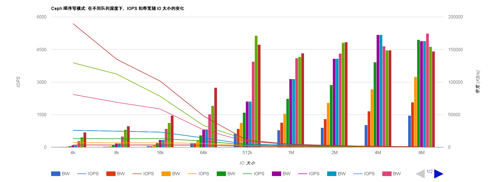
  
<i>Ceph 顺序写</i>

  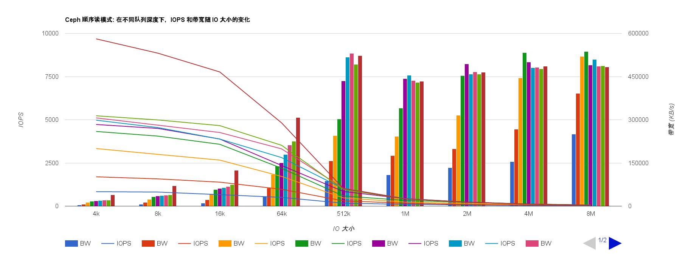
  
<i>Ceph 顺序读</i>

  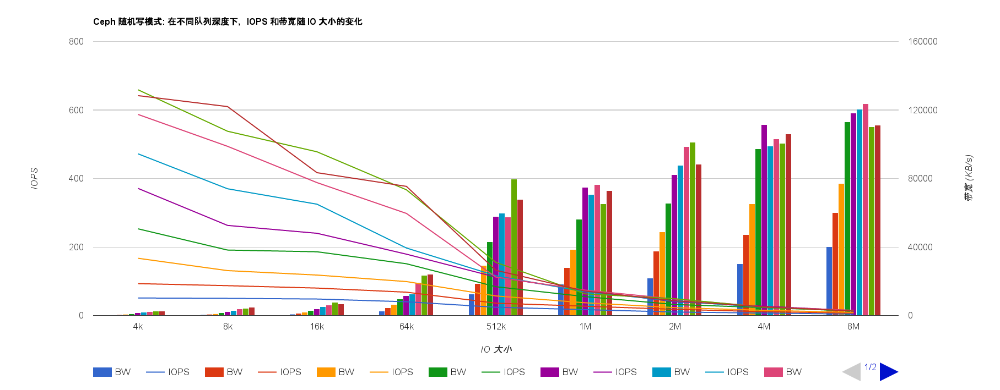
  
<i>Ceph 随机写</i>

  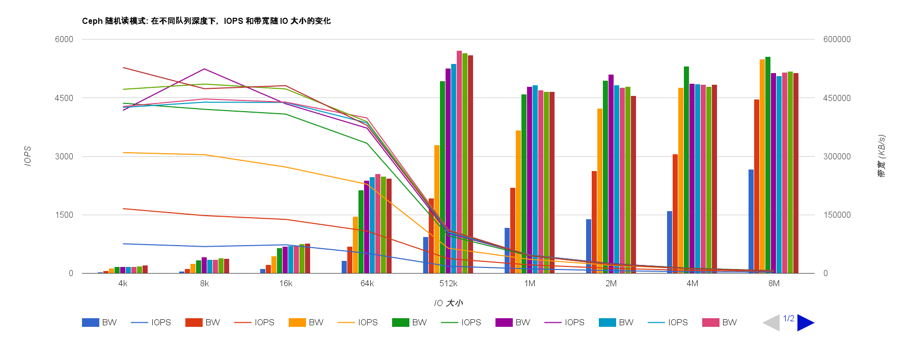
  
<i>Ceph 随机读</i>

  上图中，以列表示的是 Ceph 带宽的变化，以线表示的是 Ceph 的 IOPS 变化。

  不同的列表示不同的队列深度，依次为 1, 2, 4, 8, 16, 32, 64, 128, 256。

  根据上述测试结果，可以知道：

  > * 在各种模式下，Ceph 存储的 IOPS 随 IO 大小的减小而呈现减小趋势，但带宽随着 IO 大小的增加而呈现增大趋势；
  > * IO 大小超过 512k 后，对带宽的影响不大，而 IOPS 仍然呈现减小趋势，但幅度较小；

* Eqlx 测试数据：

  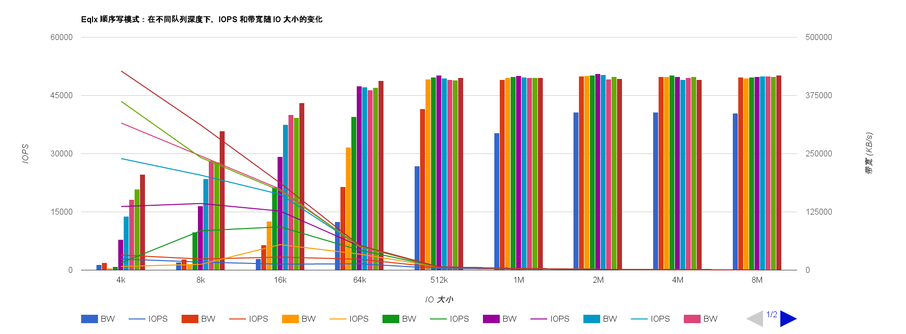
  
<i>Eqlx 顺序写</i>

  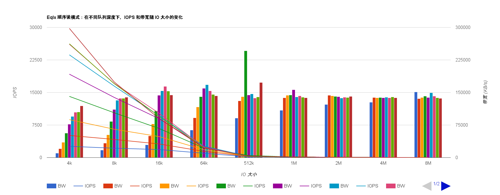
  
<i>Eqlx 顺序读</i>

  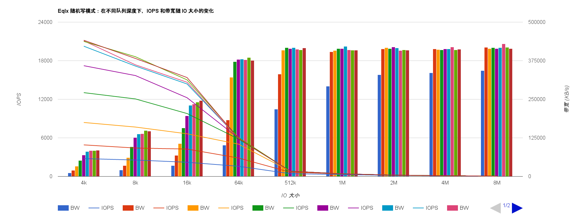
  
<i>Eqlx 随机写</i>

  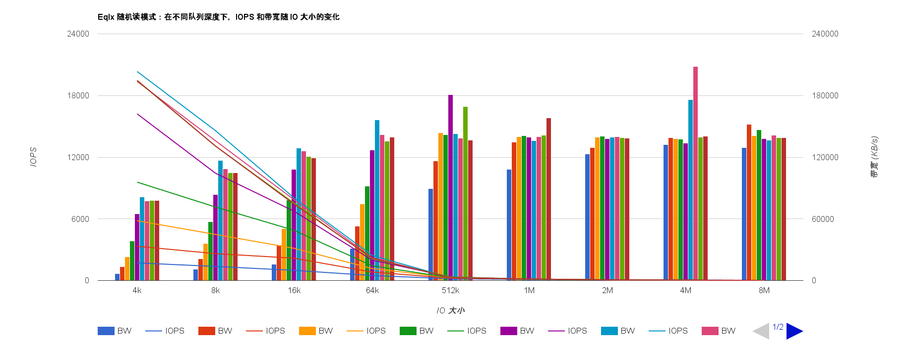
  
<i>Eqlx 随机读</i>

  上图中，以列表示的是 Eqlx 带宽的变化，以线表示的是 Eqlx 的 IOPS 变化。

  不同的列表示不同的队列深度，依次为 1, 2, 4, 8, 16, 32, 64, 128, 256。

  根据上述测试结果，可以知道：

  > * 在各种模式下，Eqlx 存储的 IOPS 随 IO 大小的减小而呈现减小趋势，但带宽随着 IO 大小的增加而呈现增大趋势；
  > * IO 大小超过 64k 后，对带宽的影响不大，而 IOPS 仍然呈现减小趋势，但幅度较小；

> ###### IOPS 和带宽变化趋势：
> 综上所述：存储的 IOPS 会随着 IO 大小的减小而呈现减小趋势，但带宽随着 IO 大小的增加而呈现增大趋势。

### 不同模式下的比较

比较不同模式时，仅选取其中 2 种队列深度(16 和 32)来进行比较：

* Ceph 测试数据：

  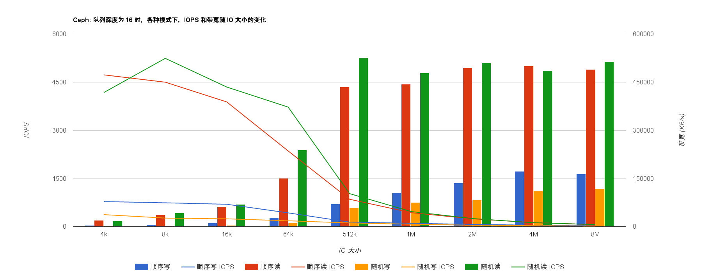
  
<i>队列深度为 16 时，Ceph 的测试数据</i>

  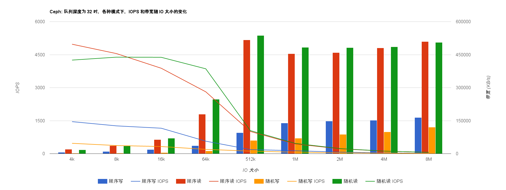
  
<i>队列深度为 32 时，Ceph 的测试数据</i>

  上图中，以列表示的是 Ceph 的带宽变化，以线表示的是 Ceph 的 IOPS 变化。

  不同的列表示不同的模式，依次为：顺序写、顺序读、随机写、随机读。（图中有说明）

  根据上述测试结果，可以知道：

  > * Ceph 写数据的速度远远小于读数据的速度：**写 < 读**；
  > * Ceph 顺序写的速度稍大于随机写的速度，而顺序读的速度稍小于随机读的速度。

* Eqlx 测试数据：

  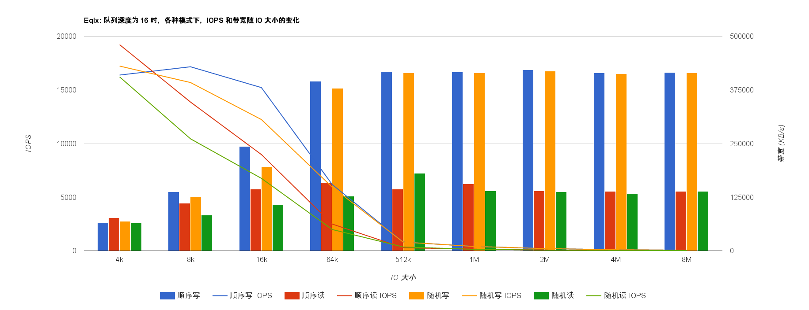
  
<i>队列深度为 16 时，Eqlx 的测试数据</i>

  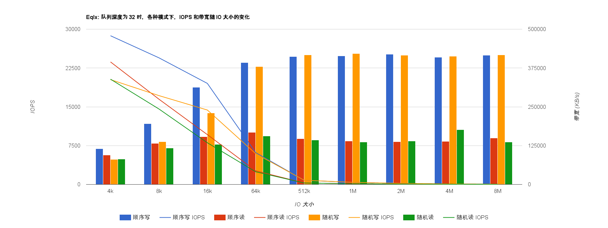
  
<i>队列深度为 32 时，Eqlx 的测试数据</i>

  上图中，以列表示的是 Eqlx 的带宽变化，以线表示的是 Eqlx 的 IOPS 变化。

  不同的列表示不同的模式，依次为：顺序写、顺序读、随机写、随机读。（图中有说明）

  根据上述测试结果，可以知道：

  > * Eqlx 写数据的速度远远大于读数据的速度：**写 > 读**；
  > * Eqlx 顺序写稍大于随机写的速度，顺序读的速度稍大于随机读的速度。

> ###### 不同模式的比较：
> 综上所述：Ceph 存储的**读性能**较好，Eqlx 存储的**写性能**较好。

### Ceph 和 Eqlx 的比较

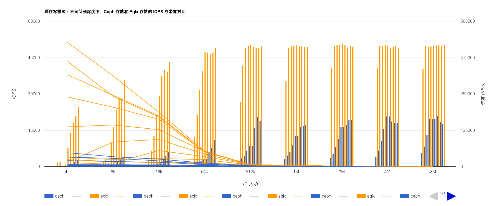

<i>顺序写模式的比较</i>

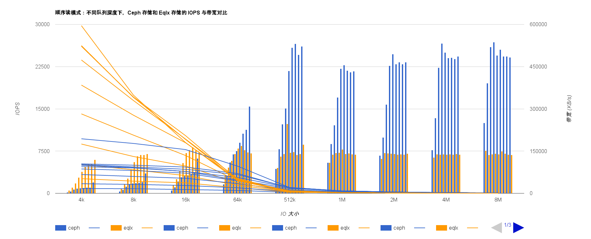

<i>顺序读模式的比较</i>

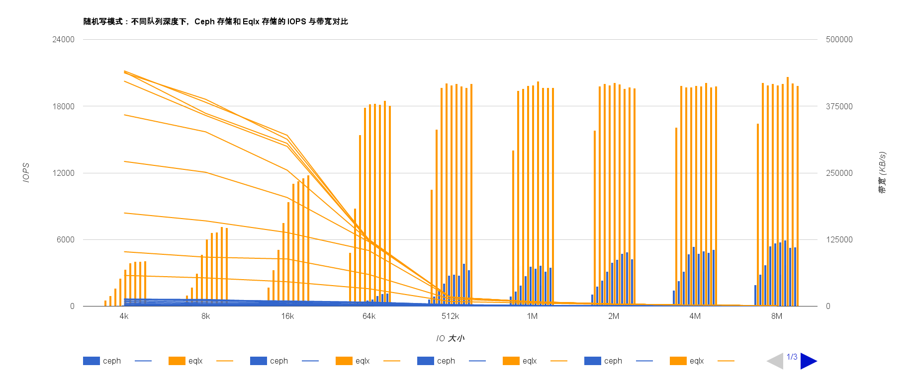

<i>随机写模式的比较</i>

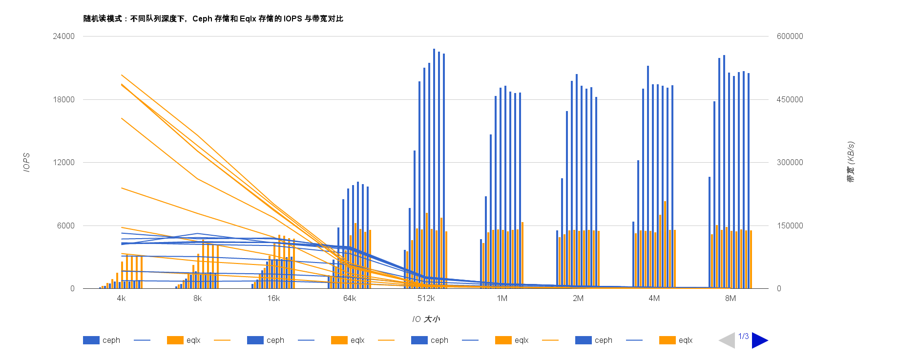

<i>随机读模式的比较</i>

图中蓝色表示 Ceph 的测试数据，黄色表示 Eqlx 的测试数据。

以列表示的是带宽，以线表示的是 IOPS。

图中包含了所测试的队列深度，在带宽数据中，由左到右依次为：1, 2, 4, 8, 16, 32, 64, 128, 256。

根据上述测试数据，可以知道：

> ###### Ceph 和 Eqlx 的比较：
> * 相比 Ceph 和 Eqlx，读数据时 Ceph 的带宽远远大于 Eqlx 的带宽，写数据时，Eqlx 的带宽则远远大于 Ceph 的带宽；
> * 整体上，Eqlx 的 IOPS 大于 Ceph 的 IOPS；
> * 不同队列深度对 Ceph 的 IOPS 影响不大，但在 IO 大小小于 64k 时，不同队列深度对 Eqlx 的 IOPS 影响较大。

> #### 注：
> 要获取完整测试结果，请查看[云主机存储性能测试结果](http://192.168.1.4/rally_report/vm/disk_output/)。

## 云主机网络性能

通过 iperf 工具进行测试，得到以下带宽数据：

|测试内容|最高带宽(Gbps)|最低带宽(Gbps)|平均带宽(Gbps)|丢包率(%)|
|--------|--------------|--------------|--------------|------|
|TCP|2.18|1.5|1.642|-|
|UDP|4.45|3.87|4.213|29.445|

> ###### 说明：
> 进行 UDP 测试时，使用参数 `-b 10000M`，即设置测试带宽为 10000M。

同时启动 2N 台云主机进行测试：

**由于没有合适的测试环境，暂时未执行测试。**

> #### 注：
> 要获取完整的测试结果，请查看[云主机网络性能测试结果](http://192.168.1.4/rally_report/vm/network_output/)。
