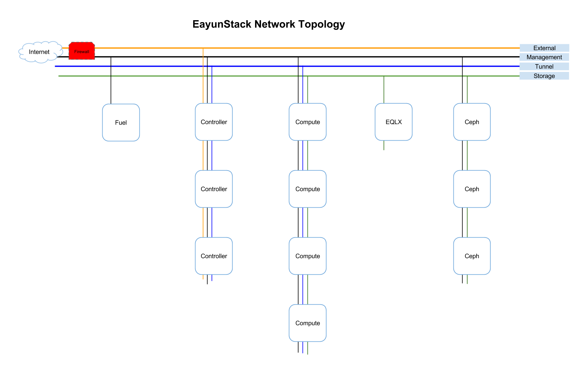

# 网络架构

整体的物理节点网络连接如上图，在 EayunStack 环境中，部署前，我们最少要定义四个物理网段：

| 类型 | 规格 |
| ---- | ---- |
| 管理网 | 1GB |
| 内网 | 10GB |
| 外网 | 1GB |
| 存储网 | 10GB |

正如上表所言，存储网和内网需要万兆带宽，因为一个承载着云主机的 IO，另外一个承载着内部云主机的通信，所以必须要有足够的带宽来确保业务的正常运行。

## 租户网络后端

为了性能和稳定方便的考虑，使用 vlan 作为租户网络的后端。

## 高可用

在 HA 规划一节会提到网络节点的 HA 实现，这里就几个部分说明如下：

* neutron-api 以及 neutron 的各个agents (包括 metadata-agents, l3-agents 等) 全部交由 pacemaker 实现多活；
* 对关于 l3-agents 来讲，在有多个 l3-agents 的情况下，neutron 会将租户创建的路由，根据相应的负载均衡策略将其分布到多个l3-agents；
* Icehouse 版本在多活的情况下，一个l3-agents出现问题会导致其上的 qrouter 丢失，在 juno 版本中会将故障的 l3-agents上的 qrouter 自动迁移到其它活着的 l3-agents 上，所以这里不需要做额外的开发工作。

## 关于网络节点是否需要独立

这里还需要重点考虑的一个问题是网络节点是否需要独立出来，基于以下考虑，我们采取不独立的结构。
